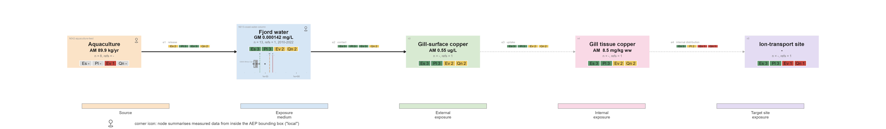

# Introduction

```{r}
#| label: setup-intro
#| include: false
library(targets)
# figures/fig02-reach-products.png is a file target; this tar_read() is the
# dependency edge so render_index rebuilds it first (CLAUDE.md 4.4.2).
# Commented out 2026-09-08 (Sam): the reach_product_* targets are commented out
# in _targets.R to save build time, and the figure is parked in _02-methods.qmd.
# invisible(tar_read(reach_product_figure_file))
```

Copper is a vital nutrient across a broad variety of taxa and biomolecules [@wrightBacterialEvolutionaryPrecursors2021; @tangMolecularEvolutionCu2025; @lutsenkoMammalianCopperHomeostasis2025], a mainstay of electronics manufacturing, a potent biocide [@weberMarineBiofoulingRole2023], and a potentially serious environmental pollutant. Since the 1900s, global copper mining has grown by more than 900% [@pietrzykTrendsGlobalCopper2018a], and demand is predicted to grow substantially further by 2100 [@schipperEstimatingGlobalCopper2018]. At the time of writing, a number of projects aim to exploit Arctic resources to meet this demand, most notably the planned reopening of the Nussir/Ulveryggen copper deposits in Finnmark, northern Norway [@eilertsenNussirGetsOperating2019]. Concurrently, aquaculture, traditionally an important source of copper emissions to the marine environment, is predicted to grow substantially [@dnvOceansFuture20502021]. Brake wear, soil loss, and copper-based pesticide applications, all important sources of copper emissions to water [@comberSourcesCopperEuropean2023], may also grow as populations and resource exploitation grow in the Arctic, and changing climates enable new forms of agriculture in formerly colder regions.

The Arctic landscape itself is predicted to undergo significant climatic and ecological changes in the coming century. Receding sea ice will open new shipping routes [@smithNewTransArcticShipping2013] (which may also increase copper emissions in the region from transport antifoulants). Warmer temperatures may make resource extraction easier and more economical, although reduced permafrost may also place existing and new infrastructure at risk [@krogerSocioecologicalCrisesGlobal2023]. Terrestrial, marine, and freshwater ecosystems are highly likely to undergo shifts in species, structure, and phenology, while human populations, ecosystems, and economies may be vulnerable to extreme and unpredictable weather [@ipccClimateChange20222023].

## Aggregate Exposure Pathways

The Aggregate Exposure Pathway (AEP) [@teeguardenCompletingLinkExposure2016; @tanAggregateExposurePathways2018] concept was developed in 2016 as an exposure-based counterpart to the Adverse Outcome Pathway (AOP). AOPs assemble evidence to causally link the biological effects of stressors in organisms. AEPs do the same for the emission, transport and fate of stressors in the environment, up until the point they reach sensitive tissues or organs in selected organisms.

An AEP is a directed graph: Nodes are Key Exposure States (KESs), which represent the qualitative (i.e. presence) or quantitative state of a stressor(s) in space and time. KES are linked by Key Transitional Relationships (KTR), the transport or transformation of said stressor(s). An AEP has two specialised types of KES, a stressor Source and a Target Site Exposure (TSE), representing the state of a stressor at its origin and site of action respectively [@tanAggregateExposurePathways2018]. The TSE corresponds to the initiating Key Event of an AOP (the Molecular Initiating Event or MIE). Thus, an AEP and AOP that cover the same stressor are integrated to create a full Source-to-Outcome Pathway (STOP). AOPs have seen a rapid uptake in the ecotoxicological community: at the time of writing, 561 AOPs have been drafted or published [@societyforadvancementofaopsAOPwikiV272026]. Conversely, AEPs have seen less adoption (26 hits for "aggregate exposure pathway" in Web of Science's Core Collection [@clarivateCitationReportAggregate2026]), which is perhaps due to the significantly larger scale of AEPs compared to AOPs, as in any ecotoxicological setting they may have to deal with geographically massive and kinetically homogeneous KESs and KTRs.

The conceptual papers describing the AEP [@teeguardenCompletingLinkExposure2016; @tanAggregateExposurePathways2018; @tanRefiningAggregateExposure2018] state that both the AEP and AOP are "supported by [...] weight of evidence", although no specific approach is laid out. Consensus and standards have emerged in the AOP community on how Weight of Evidence (WoE) should be assessed, and @beckerIncreasingScientificConfidence2015 has proposed the use of a modified form of the Bradford-Hill epidemiological criteria [@hillEnvironmentDiseaseAssociation1965] to assess the biological plausibility, empirical support, and essentiality of an AOP's Key Events (KERs). @pengAggregateExposurePathways2022, which represents the most sophisticated and relevant (that is, it focuses on pollution of the environment and wildlife) AEP of which we are aware, adapts OECD guidance on AOP development [@oecdUsersHandbookSupplement2018] as a basis for developing principles of WoE assessment applicable to AEPs.

## Copper Exposure

Copper is one of the most studied pollutants both in the laboratory and the field [@grandjeanMatthewEffectEnvironmental2011]. Methods for analysis and quantification of copper are mature, and the metal is routinely measured in Norway in a variety of sites and matrices as part of ongoing monitoring programmes. However, as a lower-priority pollutant it has received less attention in the Arctic Monitoring and Assessment Programme's monitoring, with the last report on heavy metals in general (including copper) conducted in 2002 [@arcticmonitoringandassessmentprogrammeAMAPAssessment20022005]. In general, copper's occurrence and bioavailability are highly spatially specific, and the highest concentrations of dissolved copper (generally the most bioavailable and toxic fraction [@anzgToxicantDefaultGuideline2026]) tend to be found in areas with substantial local emissions and limited water turnover (e.g. marinas, inner fjords) [@steinnesEvidenceLargeScale1997; @grosvikKunnskapsstotteOmMiljoeffekter2023; @sternalImpactSubmarineCopper2017; @lagerstromFlawedRiskAssessment2020].

Copper's toxicity to marine organisms is remarkably complex, depending both on its presence in bioavailable forms, and environmental factors such as local pH, temperature, the presence of organic matter to bind to, and the presence of other ions competing to bind to this material [@raderFateCopperAdded2019; @mebaneBioavailabilityToxicityModels2023; @nysDerivationBioavailabilitybasedEnvironmental2026]. Copper uptake and exposure in fish and aquatic invertebrates is primarily by the gill (waterborne, dissolved copper), and also via the digestive system (dietary copper) and epidermis [@carvalhoEffectCopperLiver2008; @casado-martinezAssessingMetalBioaccumulation2013; @ahearnMechanismsHeavymetalSequestration2004], the relative magnitude of these routes depending on the habitat, feeding strategy, and life stage of an organism, as well as local conditions.

In fish and aquatic invertebrates, acute toxicity is driven by disruption of ionoregulation (largely of sodium) [@mebaneBioavailabilityToxicityModels2023a; @anzgToxicantDefaultGuideline2026, @vernonAssessingRelativeSensitivity2019], which principally occurs via the gill and gut tissue. Damage to sensory organs - which induces maladaptive behaviour - by sub-chronic copper conentrations is also well-attested in the literature for fish[@mebaneBioavailabilityToxicityModels2023a; @liaoToxicityMechanismsBioavailability2023] and appears to also be a relevant site of exposure in aquatic invertebrates [@pyleCopperimpairedChemosensoryFunction2007; @lahmanSublethalCopperToxicity2015]. Beyond ionoregulation, copper toxicity in fish organism is also mediated by generation of Reactive Oxygen Species (ROS), alterations to the electron-transfer chain within mitochondria, endrocrine disruption, and disruption to ammonia excretion and acid-base balance [@liaoToxicityMechanismsBioavailability2023]. Chronic exposure to copper is also suspected to result in an elevated "energy cost" of responding to extended cellular and organic stress, which impairs the survival, lifespan, and reproduction of affected populations [@mebaneBioavailabilityToxicityModels2023a].

All organisms have mechanisms for maintaining copper homeostasis: in fish, the liver, where it copper both used as an essential nutrient and excreted to bile [@mebaneBioavailabilityToxicityModels2023a], while in invertebrates, the hepatopancreas both uptakes dietary copper and sequesters excess copper [@ahearnMechanismsHeavymetalSequestration2004]; excess copper may also be stored in hard tissues [@martinsCopperUptakeBlue2026]. In many molluscs (chitons, gastropods, cephalopods, a minority of bivalves excluding better-studied species such as mussels [@morseHemocyaninRespiratoryPigment1986]) and many crustaceans, copper plays an additional role as a component of hemocyanin, an oxygen-transport metalloprotein analogous to hemoglobin[@banaeeAssessingMetalToxicity2024].

<!-- @mebaneBioavailabilityToxicityModels2023a notes that diet is the principle source of bioaccumulated copper in freshwater aquatic invertebrates (in low-Cu environments), but that it is unclear whether dietary copper is an important mediator of adverse effects in most species/ecosystems. @campanaSubLethalEffectsCopper2012 study of sediment-based exposure to marine benthic organisms' found that dietary exposure's importance as a route depends substantially on the sediment composition and feeding strategy of individual species.  -->

In algae, copper ions are actively transported by one or more systems across the cell membrane [@kongCopperRequirementAcquisition2022a], to maintain an optimal balance. Responses to excess ambient copper may include downregulation of copper uptake systems, or even the synthesis of extracellular ligands to reduce Cu-binding to the cell [@kongCopperRequirementAcquisition2022a], and both algal sensitivity to copper and relevant modes of action vary considerably species groups [@stauberUseLimitationsMicrobial2011]. Copper toxicity to algae is believed to occur externally via effects to the cell membrane [@anzgToxicantDefaultGuideline2026] and internally via disruption of photosynthesis, cellular pH, or enzyme formation [@stauberUseLimitationsMicrobial2011; @connanImpactsAmbientSalinity2011].

{alt="Fig 1"}

All in all, the modelling and prediction of copper toxicity in marine ecosystems are challenging [@pedersenImpactsClimateChange2022]. It is suggested that increases in marine temperatures and acidity will drive an increase in both leaching of copper from marine occurrences (both natural and anthropogenic) [@pedersenImpactsClimateChange2022] and species sensitivity to copper [@cuiComprehensiveAssessmentCoppers2024]. Should the demand for and use of copper increase concurrently with species' sensitivity to copper, its importance as a stressor may grow substantially.

In this paper, We develop theoretical, non-spatial AEPs for copper exposure to fish/mussels/algae/etc. We review of available Arctic copper exposure and emissions data. From these data, we construct spatially explicit AEPs to describe and evaluate how copper from multiple natural and anthropogenic sources is transported to and within two case study Arctic marine environments. We assess the weight of evidence for emissions, occurrence, and exposure of organisms to copper.