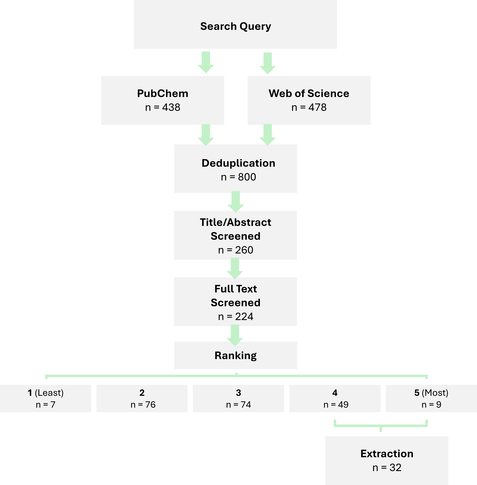

# Materials and Methods

```{r}
#| label: setup-methods
#| include: false
#| warning: false
#| message: false

# Lets this section render on its own (`quarto render _02-methods.qmd`). When the
# file is spliced into index.qmd via , index.qmd's own `setup`
# chunk has already loaded these and defined docx_flex(); re-running library()
# and redefining the function is harmless.
library(targets)
library(here)
library(tidyverse)
library(flextable)

# Identical to the helper in index.qmd's setup chunk. Change one, change both
# (or promote it to an R/ function).
docx_flex <- function(ft, widths = NULL) {
  ft <- ft |>
    flextable::theme_vanilla() |>
    flextable::bold(part = "header") |>
    flextable::fontsize(size = 9, part = "all") |>
    flextable::padding(padding = 2, part = "all")
  if (is.null(widths)) {
    flextable::set_table_properties(ft, layout = "autofit", width = 1)
  } else {
    flextable::set_table_properties(
      flextable::width(ft, width = widths),
      layout = "fixed"
    )
  }
}
```

## Study Area

Hammerfest is a municipality ("kommune") and town in Finnmark, Norway's northernmost county. The area is a dense archipelago of islands and peninsulas riven with fjords and valleys. To the north-east the municipality opens into the Norwegian Barents Sea, which supports both a thriving fishing industry and multiple oil and gas wells. To the south-west, the municipality encompasses an area of the mainland which includes the Nussir mountain and Repparfjord [@dalfestHammerfest2026]. Hammerfest municipality has a population of 11,000 (2025, expected to remain stable to 2050 [@statisticsnorwayFaktaOmKommunen2025]), of which roughly 8,000 live in the town itself, 2,000 in the southerly village of Rypefjord, and 300 in the mainland village of Kvalsund. Many of Hammerfest's population are employed in natural resource-based industries (@tbl-hammerfest-employment), and relative to its population (roughly 0.2% of mainland Norway's working population) the municipality hosts a sizable share of these sectors [@statisticsnorway08536EmployedPersons2026]. 


```{r}
#| label: tbl-hammerfest-employment
#| tbl-cap: "Approximate statistics for copper emissions-relevant sector employment for a) Norway and b) Hammerfest municipality (2025, Q4, by place of residence), and Hammerfest's share of total national jobs per-sector. Source: SSB table 08536 [@statisticsnorway08536EmployedPersons2026]. "
#| echo: false
emp <- read_csv(
  "data/clean/derived/ssb_employment_hammerfest.csv",
  show_col_types = FALSE
)

fmt_n <- function(n) formatC(n, format = "d", big.mark = ",")
emp |>
  transmute(
    Sector = paste0(sector, " (", nace_codes_display, ")"),
    `Employees by sector (Norway)` = if_else(
      is.na(norway_pct_of_total),
      fmt_n(norway),
      paste0(
        fmt_n(norway),
        " (",
        formatC(norway_pct_of_total, format = "f", digits = 1),
        "%)"
      )
    ),
    `Employees by sector (Hammerfest)` = if_else(
      is.na(hammerfest_pct_of_total),
      fmt_n(hammerfest),
      paste0(
        fmt_n(hammerfest),
        " (",
        formatC(hammerfest_pct_of_total, format = "f", digits = 1),
        "%)"
      )
    ),
    `Hammerfest share of national` = paste0(
      formatC(hammerfest_share_of_national_pct, format = "f", digits = 2),
      "%"
    )
  ) |>
  flextable::flextable() |>
  flextable::align(j = 2:4, align = "right", part = "all") |>
  docx_flex()
```


The municipality contains 18 PRTR-registered facilities [@norwegianenvironmentagencyNorwegianPRTRNorske2026], the most notable of which is the Melkøya Liquid Natural Gas plant, which receives gas from the Snøhvit and marine field to the north. Other notable facilities include Hammerfest Airport, several active and former landfills and submarine disposal areas in the vicinity (including the Repparfjord Submarine Tailing Disposal (STD)), a handful of industrial installations, and the Wastewater Treatment Plant at Rossmolla, Hammerfest (online 2016, primary treatment), which serves both Hammerfest town and Rypefjord and discharges into the Sørøysundet [@fylkesmannenifinnmarkTillatelseEtterForurensningsloven2014]. Of these 18 facilities, 5 have reported copper emissions to the environment. Hammerfest town harbour has a long history of heavy metal and organic pollution [@vannportalenProsjektHammerfestRen2022], and was identified as a priority site ("Norway most polluted harbour" [@svendsenVarNorgesMest2024]) for cleanup under the project *Ren Havn* (Clean Harbour). The project aimed to reduce concentrations of lead, PAH16, and PCB7 to below Norwegian status class III (i.e. good or background levels of pollution with no adverse effects expected) by dredging polluted sediments and depositing them inside harbour infrastructure, and was successfully completed in 2023/2024 [@norwegiancoastaladministrationHammerfestRenHavn2019; @nccNCCHarOverlevert2023].

The Nussir and Ulveryggen mountains in the mainland to Hammerfest town's south are copper-rich, and were mined intermittently in the early 20th century and then intensively between 1972 and 1978 by the firm Folldal Verk [@sternalImpactSubmarineCopper2017]. During this period, roughly 1 million tonnes of copper-rich tailings were processed and discharged to the inner Repparfjord [@sternalImpactSubmarineCopper2017; @kvassnesWasteSitesMines2013]. In 2019, the firm Nussir ASA was licensed to conduct mining operations at Nussir/Ulveryggen [@eilertsenNussirGetsOperating2019]. In 2021 it received permission to discharge tailings to the Repparfjord, and in 2025 its waste handling plan was approved by the Norwegian Environment Agency (NEA), subject to a public hearing [@norwegianenvironmentagencyNussirCopperProject2025]. The resumption of mining at the Nussir/Ulveryggen site has been the subject of both legal cases at the national and EU level, and direct action [@garvikGruvekonfliktenRepparfjorden2026]. Mining is planned to begin in late 2027 [@olaussenSisteBrikkePa2026] and continue for 13 years, and is estimated to release at most 30 million tonnes of tailings to the Repparfjord over its period of operation.

<!-- TODO: P4: How to cite tileset properly? -->
<!-- TODO: P4: Text still not big enough on map. -->

![Maps of study area: a) Finnmark county (in white) is Norway's northernmost county. Hammerfest municipality is located coastally near to the Norwegian Barents Sea. b) Hammerfest municipality encompasses the island Halvøya and its surrounding water body Sorøysundet, as well as an area of the mainland to the south, including Repparfjord. In the Barents Sea, the Snøhvit field supplies natural gas which is processed at the city's harbour. c) Halvøya and Hammerfest are home to several industrial and aquaculture facilities. Repparfjord is the historical site of submarine disposal of copper mine tailings, as well as the site of a new mine planned to begin operation in 2027. All feature coordinates approximate. Base maps: [@massicotteRnaturalearthWorldMap2026]; Adminstrative boundaries:  [@whiteCsmapsPreformattedMaps2026]; Map tiles [@geonorgeTopographicMapNorway2023].](figures/fig03-study-area.png){#fig-repparfjorden-locator}

Aquaculture is also an important industry in Hammerfest, with just under 5% of the municipality's population employed in fishing and aquaculture [@tbl-hammerfest-employment]. Norway's aquaculture registry reports 29 (22 active, 7 inactive) licensed aquaculture facilities in the municipality that raise Atlantic salmon (*Salmo salar*), Rainbow trout (*Oncorhynchus mykiss*), and Brown trout (*Salmo trutta*) [@norwegiandirectorateoffisheriesAquacultureLocationsNorway2025]. Copper is used in aquaculture both as an essential nutrient present in feed, and as an antifouling coating on fish cages [@grosvikKunnskapsstotteOmMiljoeffekter2023].

## Lines of Evidence

Multiple Lines of Evidence (LoE) were gathered in order to construct AEPs. Each LoE represents a largely homogenous data type and provides evidence (directly or indirectly) for the presence of copper one or more KES or movement of copper across one or more KTR.

Key lines and their characteristics are summarised in  @tbl-lines-of-evidence, and reviewed in detail below.

<!-- TODO: P3: give a better overview of the scope and purpose of each of these datasets. -->

```{r}
#| label: tbl-lines-of-evidence
#| tbl-cap: "Table of key Lines of Evidence (LoE) used in the construction of AEPs. Includes dominant data types and the Key Exposure States (KES) and Key Transitional Relationships (KTR) of which they provide evidence."
#| echo: false
tibble::tribble(
  ~`Line of Evidence`                                        , ~`Data Type`                                          , ~`AEP Element`                                  , ~Notes                                                                                                                                                                                                                                   ,
  "Systematic Literature Review"                             , "Exposure (concentrations)"                           , "Exposure Medium, Target Site Exposure"         , "Primary data source, extracted structured data and processed using exposure data pipeline."                                                                                                                                             ,
  "Ad hoc literature"                                        , "Exposure (concentrations), Mass Balance (mass/time)" , "Source, Exposure Medium, Target Site Exposure" , "Used to gap-fill AEPs where KES/KTR were suspected, but no relevant evidence was found in existing lines of evidence"                                                                                                                   ,
  "Vannmiljø Database"                                       , "Exposure (concentrations)"                           , "Exposure Medium, Target Site Exposure"         , "Processed using exposure data pipeline."                                                                                                                                                                                                ,
  "Norwegian Product Register"                               , "Embedded Mass Balance (mass/year)"                   , "Source KTR"                                    , "Self-reported import - export of copper, per product/industry. Available only at whole-Norway scale."                                                                                                                                   ,
  "Norwegian Pollutant Release and Transfer Register (PRTR)" , "Mass Balance (mass/time)"                            , "Source KES"                                    , "Measured/modelled emissions of copper to air/water (kg/per) self-reported by individual industrial, aquaculture, WWTP, and other facilities. Methodology not available. Published under website Norske utslipp ('Norwegian Emissions')" ,
  "Aquaculture Registry"                                     , "Facility location and size"                          , "Source KES"                                    , "Registry of aquaculture facilities, including size, name, and coordinates. Partial matches to facility names in PRTR all"                                                                                                               ,
  "Copper Toxicity/Safety Thresholds"                        , "Thresholds (concentration)"                          , ""                                              , "Various EU and Norwegian quality standards were used to provide an assessment of which samples showed probable pollution."
) |>
  flextable::flextable() |>
  flextable::compose(
    i = 2,
    j = "Line of Evidence",
    value = flextable::as_paragraph(flextable::as_i("Ad hoc"), " literature")
  ) |>
  docx_flex(widths = c(1.15, 1.35, 1.05, 2.72))
```

## Key Exposure States Dataset

### Literature Review Protocol

A systematic literature review framework was adapted from elements of the PRISMA2020 framework (@pagePRISMA2020Statement2021). As PRISMA2020 is primarily concerned with intervention-based studies, some work was required to adapt to the scope and exigencies of an environmental exposure assessment. A full PRISMA2020 checklist is available in the Suppementary Information.

Web of Science (Core Collection) and PubMed were searched for material relevant to copper occurrence, behaviour and ecotoxicology in the Arctic. Returned papers were deduplicated, screened at the abstract and full text levels, and ranked subjectively from 1-5 based on the quantity and relevance of reported data to the research question. A subset of 32 of the highest scored papers (ranking of 4+) were selected for data extraction. 

<!-- TODO: Update numbers on diagram to reflect inclusion of Sternal paper. Add more description to what happens at diff steps  -->

{#fig-prisma width="500"}

#### Data Extraction & Validation

Concentration data were extracted from study full texts using the eData application and structured data format following the principles outlined by  [@welchEDataToolFormat2026]. In short, data were extracted by a reviewer from PDFs using the Claude Sonnet 4 LLM into a structured format [@anthropic2024extracting_json], visually inspected and validated by the same reviewer, and exported as a collection of comma-separated values. Data were subsequently checked for internal consistency and correctness to format with the eData format's validation functions, and combined into a single data table.

### *Ad hoc* literature

Where data gaps were identified, or where relevant Lines of Evidence were suspected or known to exist but were not captured by the existing data set, ad hoc searches were performed to locate potentially relevant literature. The following pieces of evidence were captured by ad hoc searches (@tbl-adhoc-literature). Where these pieces of evidence contained data deemed relevant, they were reviewed and data extracted (using the eData application if containing exposure data; otherwise, by hand).


```{r}
#| label: tbl-adhoc-literature
#| tbl-cap: "Placeholder caption. Ad hoc literature sources. TODO: Add proper citations, etc. in same style as Vannmiljø. Date Range and Measurements (sum of `MEASURED_N`) are read live from the joined literature dataset."
#| echo: false
kogel_lit <- tar_read(load_literature_pqt) |>
  filter(REFERENCE_ID == "2026KogelUsingAtlanticHaddock")

kogel_date_min <- format(min(kogel_lit$SAMPLING_DATE, na.rm = TRUE), "%b %Y")
kogel_date_max <- format(max(kogel_lit$SAMPLING_DATE, na.rm = TRUE), "%b %Y")
kogel_dates <- if (kogel_date_min == kogel_date_max) {
  kogel_date_min
} else {
  paste(kogel_date_min, kogel_date_max, sep = " - ")
}
kogel_n <- formatC(
  sum(kogel_lit$MEASURED_N, na.rm = TRUE),
  format = "d",
  big.mark = ","
)

tibble::tribble(
  ~Study                , ~Topic                                                                                                                               , ~`Date Range` , ~Measurements , ~Comments                                                                                                                 ,
  "Kögel et al (2026)"  , "Analysis of copper in fish and other marine species in inner Repparfjord, mid-Repparfjord, and Revsbotn (reference fjord to North)" , kogel_dates   , kogel_n       , "Published February 2026 and thus not captured in initial selection of study. Highly relevant to Repparfjord case study." ,
  "Comber et al (2023)" , ""                                                                                                                                   , ""            , ""            , ""                                                                                                                        ,
) |>
  flextable::flextable() |>
  flextable::align(
    j = c("Date Range", "Measurements"),
    align = "right",
    part = "all"
  ) |>
  docx_flex(widths = c(1.15, 2.75, 0.85, 0.85, 1.7))
```

### Vannmiljø

In addition to data from literature, monitoring data were extracted from the Norwegian Environmental Agency database Vannmiljø [@norwegianenvironmentagencyVannmiljo2026] based on the following search criteria (@tbl-vm-search):

```{r}
#| label: tbl-vm-search
#| tbl-cap: "Table of Norwegian/English search terms used in Vannmiljø database query."
#| echo: false
tibble::tribble(
  ~`Norwegian Term` , ~`English Translation` , ~`Selected Options`                                                                                         , ~Comments                                                              ,
  "Nedlastingsdato" , "Download Date"        , "2025-12-05"                                                                                                , ""                                                                     ,
  "Datoperiode"     , "Date Period"          , "2010-01-01 to 2025-12-05"                                                                                  , ""                                                                     ,
  "Kommune"         , "Municipality"         , "All municipalities"                                                                                        , "Data from mainland Norway and Svalbard"                               ,
  "Medium"          , "Medium/Matrix"        , "All media"                                                                                                 , "All natural compartments, organism tissues, man-made materials, etc." ,
  "Kampanje"        , "Campaign"             , "All campaigns"                                                                                             , ""                                                                     ,
  "Stressorer"      , "Stressors/Parameters" , "All copper-containing substances listed by database: Kobber (Copper) & Kobberpyrition (Copper pyrithione)" , "No hits for Copper pyrithione in output data"
) |>
  flextable::flextable() |>
  flextable::compose(
    i = 6,
    j = "Comments",
    value = flextable::as_paragraph(
      "No hits for ",
      flextable::as_i("Copper pyrithione"),
      " in output data"
    )
  ) |>
  docx_flex(widths = c(1.15, 1.3, 2.3, 1.52))

# Defined here, before the inline `r vm_val(...)` calls in the next paragraph;
# tbl-vm-dataset below redefines these harmlessly.
vm_sum <- tar_read(vm_dataset_summary)
vm_val <- function(m) vm_sum$scale$value[vm_sum$scale$metric == m]
```


These search criteria returned 90,115 rows of copper concentrations and 24,684 unique sites at which copper was monitored, across `r vm_val("Monitoring campaigns")` campaigns. `r vm_val("Censored (< LOD / < LOQ)")` rows reported values below an LOD or LOQ. In addition, descriptive tables of method IDs, measurement units, measured matrix IDs, and monitoring campaigns were compiled. Extracted data were processed and converted to the eData format, and checked for internal consistency and correctness to format with the eData format's validation functions.

<!-- TODO: Move this table to SI -->

```{r}
#| include: false
#| label: tbl-vm-dataset
#| tbl-cap: "Composition of the cleaned Vannmiljø copper dataset by environmental compartment. Measurements are the sum of `MEASURED_N`; the record count is given alongside because one Vannmiljø record is one measurement. Site counts do not sum to the total because a site may host more than one compartment. Aquatic biota span 72 species across fish, molluscs, crustaceans, birds and algae."
#| echo: false
#| 
vm_sum <- tar_read(vm_dataset_summary)
vm_val <- function(m) vm_sum$scale$value[vm_sum$scale$metric == m]

vm_sum$composition |>
  dplyr::transmute(
    Compartment = subcompartment,
    Matrix = as.character(matrix),
    Measurements = measurements,
    Records = rows,
    Sites = sites
  ) |>
  dplyr::bind_rows(dplyr::tibble(
    Compartment = "Total",
    Matrix = "",
    Measurements = vm_sum$totals$measurements,
    Records = vm_sum$totals$rows,
    Sites = vm_sum$totals$sites
  )) |>
  dplyr::mutate(dplyr::across(
    c(Measurements, Records, Sites),
    ~ formatC(.x, format = "d", big.mark = ",")
  )) |>
  rename(`Matrix (Vm)` = Matrix) |>
  flextable::flextable() |>
  flextable::align(j = 3:5, align = "right", part = "all") |>
  flextable::bold(i = ~ Compartment == "Total") |>
  docx_flex()
```


### Exposure Data Post-Processing

Once literature review and Vannmiljø data were joined, data processing and cleaning were performed. Units and values were standardised to mg/L (concentrations) for waterborne copper or mg/kg (dry or wet weights) for sediment and biota as appropriate. Values reported as below LOD/LOQ were not used in further processing of the data.

Exposure data were then grouped by *Environmental compartment* (e.g. Aquatic, Terrestrial, Biota), *environmental subcompartment* (e.g. Aquatic: sediment, freshwater, marine/salt water), *Site geographical feature* (e.g. Coastal, fjord; River, stream, canal; Ocean, sea) and *sub-feature* (e.g. water column, water benthos). Additionally, biota samples were classified by *species* and *tissue* (e.g. muscle, liver), and standardised unit (i.e. dry and wet weights, where both units were present for a single group). Any remaining invalid (i.e. value = NA) rows of data were excluded, and the proportion of excluded rows recorded. Each group was given a sequentially-numbered ID (GXXX); these Group IDs are used as shorthand to refer to specific groups.


An overview of the combined (Vannmiljø and literature) dataset by environmental compartment is given below (@tbl-literature-dataset).

```{r}
#| label: tbl-literature-dataset
#| tbl-cap: "Composition of the combined (Vannmiljø and literature) copper dataset by environmental compartment and subcompartment. Measurements are the sum of `MEASURED_N`; the record count is given alongside because a literature row can aggregate more than one measurement. Site counts do not sum to the total because a site may host more than one compartment."
#| echo: false
lit_all <- tar_read(load_literature_pqt)

lit_composition <- lit_all |>
  dplyr::group_by(ENVIRON_COMPARTMENT, ENVIRON_COMPARTMENT_SUB) |>
  dplyr::summarise(
    measurements = sum(MEASURED_N, na.rm = TRUE),
    rows = dplyr::n(),
    sites = dplyr::n_distinct(SITE_CODE),
    .groups = "drop"
  ) |>
  dplyr::arrange(ENVIRON_COMPARTMENT, dplyr::desc(measurements))

lit_totals <- dplyr::tibble(
  measurements = sum(lit_all$MEASURED_N, na.rm = TRUE),
  rows = nrow(lit_all),
  sites = dplyr::n_distinct(lit_all$SITE_CODE)
)

lit_composition |>
  dplyr::transmute(
    Compartment = ENVIRON_COMPARTMENT,
    Subcompartment = ENVIRON_COMPARTMENT_SUB,
    Measurements = measurements,
    Records = rows,
    Sites = sites
  ) |>
  dplyr::bind_rows(dplyr::tibble(
    Compartment = "Total",
    Subcompartment = "",
    Measurements = lit_totals$measurements,
    Records = lit_totals$rows,
    Sites = lit_totals$sites
  )) |>
  dplyr::mutate(dplyr::across(
    c(Measurements, Records, Sites),
    ~ formatC(.x, format = "d", big.mark = ",")
  )) |>
  flextable::flextable() |>
  flextable::align(j = 3:5, align = "right", part = "all") |>
  flextable::bold(i = ~ Compartment == "Total") |>
  docx_flex()
```

For each sample grouping, sample size, mean, median, standard deviation, number of outliers meeting *both* Tukey Fences ($Z >= 1.5$) [@hoaglinPerformanceResistantRules1986] and Robust-Modified Z-Score ($Z >= 3.5$) [@iglewiczHowDetectHandle1993], and Hartigan's dip test statistics ($P <= 0.05$) [@hartiganDipTestUnimodality1985; @maechlerDiptestHartigansDip2025] were calculated. Sample groups were ordered based on sample size and flagged for inspection where they met one of the following criteria:

1.  The group represented a matrix that was essential for the construction of aquatic Arctic AEPs (e.g. matrices that are both receiving compartments for copper and habitats for organisms of interest, such as marine and freshwater water columns and sediment, or algae (due to their trophic position)
2.  The group's distribution was flagged as potentially multimodal
3.  Over 5% of the group's total sample size (based on `MEASURED_N`) was double-flagged as an outlier based on Tukey fences and Robust-Modified Z-Score

Where any of these criteria were met, distributions and outliers were inspected manually for potential causes. Where errors were identified as being introduced during extraction/conversion, affected data points were excluded.

## Source Key Exposure States

Data specifically on copper sources were procured from national reporting resources where available.

### European-scale Copper Sources Assessment

@comberSourcesCopperEuropean2023 provides a comprehensive overview of copper sources to freshwater and transitional waters in EU member states (and in some cases Norway). Direct applicability to the Hammerfest and Repparfjorden study areas was limited as these areas deviate substantially from the European norm (highly limited agriculture, few emissions to freshwater compartment, etc.). Thus, the study was used to identify gaps in Norway/Hammerfest-specific lines of evidence. Where a copper source was believed to exist (from @comberSourcesCopperEuropean2023 or local evidence), but no more specific data were available, data from this study were used to construct putative source KESs without a magnitude estimate.

### Norwegian PRTR and REACH Product Register

The Norwegian Pollutant Release and Transfer Register (PRTR) is a repository for self-reported emissions data in Norway, and is freely available under an open government data license [@NorwegianPRTRPollutants]. Discharges of specific pollutants, including copper, to air and water by licensed facilities (wastewater treatment plants, landfills, land-based industries, and offshore installations) are reported, typically as kg/year. Facility locations are recorded to the municipality level, and it is frequently possible to geolocate these facilities from other records.

Concurrently, the NEA maintains a Product Register (REACH PR) under the REACH and CLP directives [@norwegianenvironmentagencyProductRegisterDeclaration2024]. Imports and exports of hazardous substances (including copper) are self-reported to the NEA by firms. As this information is considered commercially sensitive, it is not openly available. However, the NEA makes available on request an aggregated version where imports and exports are reported by industry sector and/or product type. By subtracting exported copper from imported copper values, a mass-balance estimate of embedded copper in Norway can be calculated per sector or per product.

Data from these registers were assessed following the weight of evidence framework below, and are included as source KES (REACH PR) and KTR (PRTR) (@fig-hammerfest-emissions). Within the Hammerfest municipality, 5 of the 18 PRTR-registered facilities report copper emissions to air or water for at least one year.

```{=html}
<!-- Commented out 2026-09-08 (Sam) to save build time; the reach_product_* targets
in _targets.R and the tar_read() edge in _01-introduction.qmd are commented out to
match. Un-comment all together to bring the figure back.

(@fig-reach-products).

![Net copper declared to Norway's Product Register, 2018--2023, by use category: the seven largest by total quantity, with all others pooled as "Other". **(a)** Mean annual net copper per category; each y-axis label gives the number of reporting years and whiskers are $\pm$ 1 SD across those years where more than one was reported. **(b)** The same categories over time. Both panels use a log scale and share colours. Categories are the register's Norwegian *anvendelseskategorier*, translated here; some (e.g. "process control agents") are broad in the source. "Net" is imported plus produced minus exported; category-years with only net exports are omitted. Source: Miljødirektoratet, personal communication, 2 May 2025.](figures/fig02-reach-products.png){#fig-reach-products}
-->
```

![**(a)** REACH product register net copper (imported plus produced, minus exported) scaled to Hammerfest by each NACE section's share of Hammerfest-resident employment; complete reporting years only (2018-2021); sectors above 1 kg/yr implied; log scale. **(b)** Copper released to air and water by PRTR-licensed facilities in Hammerfest municipality, by facility; reported zeros omitted (log scale). Panel a is copper in commerce (tonnes-scale), panel b is copper released (kg); the two are not comparable.](figures/fig05-hammerfest-emissions.png){#fig-hammerfest-emissions}

### Aquaculture

Aquaculture feed/faecal matter and antifoulant net treatment both represent potentially important sources of copper pollution to the environment, typically most obvious in sediment in a 0-300m distance from a given facility [@grosvikKunnskapsstotteOmMiljoeffekter2023]. Copper is released from feed and faecal matter over time, and on nets both gradually (the release of copper ions mediates their toxicity to fouling organisms), and in spikes when nets are washed to remove fouling.

Aquaculture represents a significant portion of Norway's agricultural (73.5%) and overall GDP (1.3%, statistics for 2024) [@faoNorwayFisheriesAquaculture2024], and is expected to double in volume by 2050 [@dnvOceansFuture20502021].

```{r}
#| label: aquaculture-biocide-use
#| fig-width: 5.2
#| fig-height: 3.4
#| fig-cap: "Sales (tonnes) of copper, tralopyril and zinc pyrithione in antifouling applications in aquaculture in Norway, 2018-2024. Data from [@norwegianenvironmentagencyBiociderSomBrukes2025]"
# Active ingredient sold nationally for aquaculture net antifouling, tonnes/year.
# Source: Norwegian Environment Agency, "Biocider som brukes ..." 2025
# (@norwegianenvironmentagencyBiociderSomBrukes2025).
biocide_use <- tibble::tribble(
  ~year , ~series                        , ~tonnes ,
   2018 , "Copper"                       , 1626    ,
   2019 , "Copper"                       , 1698    ,
   2020 , "Copper"                       , 1539    ,
   2021 , "Copper"                       , 1097    ,
   2022 , "Copper"                       ,  440    ,
   2023 , "Copper"                       ,  306    ,
   2024 , "Copper"                       ,  564    ,
   2018 , "Tralopyril + zinc pyrithione" ,   46.3  ,
   2019 , "Tralopyril + zinc pyrithione" ,   63.5  ,
   2020 , "Tralopyril + zinc pyrithione" ,   87.8  ,
   2021 , "Tralopyril + zinc pyrithione" ,  112    ,
   2022 , "Tralopyril + zinc pyrithione" ,  108    ,
   2023 , "Tralopyril + zinc pyrithione" ,  127    ,
   2024 , "Tralopyril + zinc pyrithione" ,  119    ,
   2021 , "Tralopyril"                   ,   84.2  ,
   2022 , "Tralopyril"                   ,   98    ,
   2023 , "Tralopyril"                   ,  116    ,
   2024 , "Tralopyril"                   ,  108    ,
   2021 , "Zinc pyrithione"              ,   27.9  ,
   2022 , "Zinc pyrithione"              ,    9.8  ,
   2023 , "Zinc pyrithione"              ,   11.4  ,
   2024 , "Zinc pyrithione"              ,   10.8
)

ggplot2::ggplot(biocide_use, ggplot2::aes(year, tonnes, colour = series)) +
  ggplot2::geom_line(linewidth = 0.9) +
  ggplot2::geom_point(size = 2) +
  ggplot2::scale_colour_manual(
    values = c(
      "Copper" = "#B87333",
      "Tralopyril + zinc pyrithione" = "#3B7A9E",
      "Zinc pyrithione" = "#aca9a7",
      "Tralopyril" = "#b140a7"
    ),
    name = NULL
  ) +
  ggplot2::scale_x_continuous(breaks = 2018:2024) +
  ggplot2::scale_y_continuous(
    limits = c(0, NA),
    expand = ggplot2::expansion(mult = c(0, 0.05))
  ) +
  ggplot2::labs(x = NULL, y = "Active ingredient sold (tonnes/year)") +
  ggplot2::theme_minimal(base_size = 11) +
  ggplot2::theme(
    legend.position = "bottom",
    panel.grid.minor = ggplot2::element_blank()
  )
```

Although use of copper-based antifoulants on nets remains legal in Norway, their use in tonnes has dropped substantially, to be replaced with use of tralopyril and/or zinc pyrithione [@aquaculture-biocide-use]. Both the legal and market-based outlook for aquaculture antifoulants as a source of pollution is thus rather uncertain. However, as copper is an essential component of fish feed [@wangDietaryCopperFish2024a] feed's relevance as a copper source is likely to prove of continued importance.

Modelled copper emissions (kg/year) per aquaculture facility are reported for 8 of the facilities in Hammerfest municipality. Although no methodology was made available for the calculation of these figures, they represent a spatially and temporally specific dataset for copper inputs in the Sørøysundet. Reported copper emissions were summed across registered facilities within the bounding box ([@fig-aquaculture-emissions]) and an average calculated across the period (89.9 kg/year). Because it is unknown how much these aquaculture facilities may grow (which is expected to drive both feed use and antifoulant use), and how patterns of antifoulant use will evolve in the future, the decision was made to use the 89.9 kg/year figure but assign it a low degree of evidence quality.

![Reported modelled copper emissions (kg/year) to water from registered aquaculture facilities within the AEP 1 bounding box (Hammerfest town coast) (a) [@norwegianenvironmentagencyNorskeUtslippCopper2026a]. Farm species and licensed capacity (tonnes Maximum Total Biomass) appended from Norwegian Aquaculture Registry [@norwegiandirectorateoffisheriesAquacultureLocationsNorway2025]. Sum of facility emissions (b, last panel) averaged to 89.9 kg/year.](figures/fig12-aquaculture-emissions.png){#fig-aquaculture-emissions}

### Wastewater Sources

Hammerfest municipality's Wastewater Treatment Plant (WWTP) at Rossmolla began operation in 2016 and serves 10,488 (95% of the municipality's population, the remainder using septic tanks). Hammerfest operates a combined sewer system [@krogsethUnderstandingCyclicVolatile2016].

Waste is subject to primary/mechanical treatment and discharged via pipe into the Sørøysundet at a depth of 50-60m [@norwegianenvironmentagencyNorskeUtslippRenseanlegg2026]. No reporting or estimation of copper discharge to the environment is provided for Rossmolla, nor indeed for any similarly-sized WWTPs anywhere in Finnmark or Nordland. Consequently, the decision was made to use data for Kvalvikodden WWTP in Bodø, also a primary treatment plant discharging to marine receiving waters. Kvalvikodden reports copper emissions for 2021 - 2025. 2025's data were discarded as apparently incomplete at the time of reporting, and a mean (80.15 kg) calculated for 2021-2024. This mean was then adjusted for the population differential (10,488 / 49,780 connected population), giving an average yearly emission from WWTP of 16.89 kg/year [@statisticsnorway13144WastewaterPipelines2026]. Given the geography of the area and primary treatment, it seems likely that much of the copper deposited in Hammerfest municipality quickly reaches marine receiving waters, but without more specific assessment WWTP emissions provide a first-order estimate.

### Other Runoff Sources

@comberSourcesCopperEuropean2023 identify a number of other sources of copper emissions to water bodies at the European Union level: agricultural inputs to land (manure, sewage sludge application to fields, copper-based pesticides and fertilisers), atmospheric deposition, transport emissions (principally brake wear but also rail and road), natural emissions from soil loss, antifoulants on marine transport, and septic tank emissions to water. Because most source mass values are calculated for EU member states (and some are not relevant to Hammerfest municipality, which has no trains, minimal land-based agriculture, but a proportionally larger aquaculture sector), it was not practical to estimate their contributions to aquatic copper loads within the AEP systems. Consequently, these sources were included (where relevant) as source KES with unquantified embedded copper or copper emissions.

### Weight of Evidence Assessment

Construction of the AEP required the quantitative assessment and comparison of diverse lines of evidence on copper occurrence, emissions, and dynamics [@hardyGuidanceUseWeight2017].

Evidence quality for each KES and KTR was assessed against the hypothesis that copper was present at a KES, or flowed along a KTR. Each KES and KTR was scored according to the Essentiality, Plausibility, Evidence, and Quantitative Understanding (abbreviated to EPEQ) of copper presence/flows, based on the AOP WoE assessment guidelines [@oecdUsersHandbookSupplement2018] adapted by @pengAggregateExposurePathways2022. These criteria are summarised in @tbl-woe-criteria.

In some cases, KESs and KTRs were given high EPEQ scores despite a lack of evidence in the available data due to the extreme degree of consensus on occurrence. For example, the natural occurrence of copper in the Earth's crust and sea water are both considered axiomatic, and were thus scored as highly essential, plausible, and evidence-based despite the absence of e.g. geological data in this paper's LoE.

::: landscape
```{r}
#| label: tbl-woe-criteria
#| tbl-cap: "Weight of Evidence assessment criteria for Key Exposure States (KES) and Key Transitional Relationships (KTR) adapted from @pengAggregateExposurePathways2022, @oecdGuidingPrinciplesKey2019, and @dipaoloImplementationCREEDApproach2024."
#| echo: false
tibble::tribble(
  ~Criterion, ~`Key Exposure State (KES)`, ~`Key Transitional Relationship (KTR)`, ~Score, ~Comments,
  "Essentiality",
  "Copper presence in downstream KES will be reduced/stopped if copper presence in this KES reduced/stopped",
  "Copper presence in downstream KES will be reduced/stopped if this KTR reduced/stopped",
  "3: Diverse, consistent evidence
2: Some, potentially inconsistent evidence
1: Weak or no evidence",
  "Due to wide range of copper emissions sources and variety of uptake routes, most KES/KTR are less essential.",
  "Plausibility",
  "Theoretical knowledge supports dependent and sequential change of two adjacent KESs",
  "Theoretical knowledge supports KTR as mechanism of sequential change between KESs",
  "3: Diverse, consistent evidence
2: Some, potentially inconsistent evidence
1: Weak or no evidence",
  "Environment-level occurrence and transport of stressors is far more intuitively and widely understood than metabolic processes. Most copper KESs and KTRs will be scored as highly plausible.",
  "Evidence",
  "Empirical data showing occurrence of copper at KES.",
  "Empirical data on transfer along KTR between KESs",
  "3: Diverse, consistent evidence, including contaminated and non-contaminated examples.
2: Some, potentially inconsistent evidence
1: Weak or no evidence",
  "Vast majority of available evidence is occurrence rather than transport/flows. CREED Reliability score (1-5) and quantity of relevant evidence used in calculation of Evidence score.",
  "Quantitative Understanding",
  "Quantitative models exist permitting prediction of downstream KESs from upstream KESs",
  "Quantitative models exist permitting prediction KTR rates of transfer based on KESs and environmental parameters",
  "3: High-quality quantitative prediction of downstream KESs occurrence from upstream KES occurrence
2: Limited or only partially applicable prediction
1: Qualitative predictions only",
  "A full-scale review of available models has not been carried out. KES and KTR will be scored based on expert knowledge of available models."
) |>
  flextable::flextable() |>
  docx_flex(widths = c(1.2, 2.6, 2.6, 1.6, 1.69))
```
:::

## Target Site Exposure States

Copper uptake and potential toxicity to organisms is mediated by complex speciation, uptake, regulation, and excretion mechanics. For example, in both fish and mussels, copper uptake occurs via both gill-based and dietary pathways [@caiReducedCopperUptake2024; @beyerBlueMusselsMytilus2017; @wangHomeostaticRegulationCopper2016], both of which are up or down-regulated depending on the degree of exposure via the other pathway and the organism's overall need for copper. However, available biota monitoring data tends to focus on copper concentrations tissues such as livers and muscle (in fish) and entire soft tissue (in mussels), rather than those organs which are most sensitive to copper toxicity (in fish, the gills and sensory organs [@liaoToxicityMechanismsBioavailability2023]). 

<!-- TODO: Justify not doing chosing TSEs better -->

### Environmental Quality Standards and Reference Concentrations

In order to assess the degree of contamination a given concentration in a given matrix represented, a selection of published threshold levels for copper concentrations was assessmbled. The NEA publishes both chemical quality standards derived from SSDs and PROREF, *provisional high reference contaminant concentrations* for specific organism tissues which represents the 95th percentile of concentrations found at reference (i.e. sites selected for comparison based on their lack of contamination) stations in the NEA's marine pollutant monitoring programme [@schoyenContaminantsCoastalWaters2025, 94-95]. Copper PROREFs are published for cod, (*Gadus morhua*) and Blue mussel (*Mytilius edulis*). Quality standards ("Tilstandsklasser") are set for freshwater, sediment (fine-grained, consisting of clay and/or silt), and coastal water [@tbl-copper-thresholds]. 

<!-- TODO: Finish talking about this -->

Measured copper concentrations were compared against a small set of published background and classification values (@tbl-copper-thresholds). 


::: landscape
```{r}
#| label: tbl-copper-thresholds
#| tbl-cap: "Copper background and classification values used as comparators. Each value is the upper bound of the named class; the open-ended top class (Very Poor, V) is omitted. Sources: PROREF from the MILKYS coastal monitoring programme [@schoyenContaminantsCoastalWaters2025]; Norwegian M-608 classification boundaries [@norwegianenvironmentagencyThresholdsClassificationWater2020];"
#| echo: false
tar_read(copper_toxicity_thresholds) |>
  filter(
    !is.na(THRESHOLD_VALUE),
    THRESHOLD_TYPE %in% c("PROREF", "Classification boundary")
  ) |>
  transmute(
    Source = REFERENCE_ID,
    Type = THRESHOLD_TYPE,
    Matrix = coalesce(ENVIRON_COMPARTMENT_SUB, ENVIRON_COMPARTMENT),
    `Species / tissue` = if_else(
      is.na(SAMPLE_SPECIES),
      "",
      paste0(
        SAMPLE_SPECIES,
        if_else(is.na(SAMPLE_TISSUE), "", paste0(", ", SAMPLE_TISSUE))
      )
    ),
    Class = replace_na(THRESHOLD_CLASS, ""),
    `Upper bound` = THRESHOLD_VALUE,
    Unit = MEASURED_UNIT,
    Fraction = THRESHOLD_FRACTION
  ) |>
  flextable::flextable() |>
  docx_flex(widths = c(1.1, 1.5, 1.4, 1.9, 1.3, 0.8, 0.8, 0.9))
```
:::

### AEP Construction

Based on exploration of copper pollution sources and dynamics in the study area, the decision was made to construct two AEPs: one representing the inner-Repparfjord submarine tailing disposal area, and another the Hammerfest coastal area [@tbl-aeps]. For each case study, a bounding box was set based on the physical extend of the relevant environmental system, and the distribution of sampling and emissions points. For each sample group with at least one sampled point inside the bounding box.

::: landscape
```{r}
#| label: tbl-aeps
#| tbl-cap: "Table of AEPs. 

Bounding box coordinates (WGS84) scope node data to each AEP. Sample, group and reference counts and the date range are pooled across that AEP's empirical (data-derived) nodes only, excluding external (independently-assessed) source nodes, whose data are not drawn from this project's sample/literature pool."


#| echo: false

manifest <- tar_read(aep_manifest)
aep_nodes_tbl <- tar_read(aep_nodes)
cards <- tar_read(aep_node_cards)
members <- tar_read(aep_node_members)
membership <- tar_read(aep_membership)

emp_cards <- cards |> filter(node_type == "empirical")

samples_dates_per_aep <- emp_cards |>
  group_by(aep_id) |>
  summarise(
    n_samples = sum(n, na.rm = TRUE),
    data_date_min = suppressWarnings(min(date_min, na.rm = TRUE)),
    data_date_max = suppressWarnings(max(date_max, na.rm = TRUE)),
    .groups = "drop"
  )

groups_per_aep <- membership |>
  inner_join(aep_nodes_tbl |> select(node_id, node_type), by = "node_id") |>
  filter(node_type == "empirical") |>
  # many-to-many is genuine here: a node shared by >1 AEP contributes one row
  # per (aep_id, node_id), and each of those fans out to that node's group_id
  # rows in `members`. The result is one row per aep_id/node_id/group_id
  # triple, which is what n_distinct(group_id) below needs.
  inner_join(members, by = "node_id", relationship = "many-to-many") |>
  group_by(aep_id) |>
  summarise(n_groups = n_distinct(group_id), .groups = "drop")

refs_per_aep <- emp_cards |>
  filter(!is.na(references), nzchar(references)) |>
  group_by(aep_id) |>
  summarise(
    n_references = length(unique(unlist(str_split(references, ",\\s*")))),
    .groups = "drop"
  )

manifest |>
  left_join(samples_dates_per_aep, by = "aep_id") |>
  left_join(groups_per_aep, by = "aep_id") |>
  left_join(refs_per_aep, by = "aep_id") |>
  transmute(
    Label = label,
    # Strips the leading "Bounding box <lon> E, <lat> N." sentence, now
    # redundant with the four bbox columns. [^.]+ alone stops at the first
    # decimal point inside the coordinates (e.g. "23.40"), so the pattern is
    # anchored on the literal "N." that always closes this sentence instead.
    `Scope note` = str_remove(
      scope_note,
      "^Bounding box [0-9.]+-[0-9.]+ E, [0-9.]+-[0-9.]+ N\\.\\s*"
    ),
    `Lat min (S)` = sprintf("%.2f", lat_min),
    `Lat max (N)` = sprintf("%.2f", lat_max),
    `Lon min (W)` = sprintf("%.2f", lon_min),
    `Lon max (E)` = sprintf("%.2f", lon_max),
    `N samples` = formatC(n_samples, format = "d", big.mark = ","),
    `N groups` = n_groups,
    `N references` = n_references,
    `Date range` = paste0(
      format(data_date_min, "%Y"),
      "-",
      format(data_date_max, "%Y")
    )
  ) |>
  flextable::flextable() |>
  flextable::set_header_labels(Label = "Label", `Scope note` = "Scope note") |>
  docx_flex(widths = c(1.2, 2.1, 0.7, 0.7, 0.7, 0.7, 0.9, 0.7, 0.9, 0.9))
```
:::

For AEP-002 (Repparfjorden), the river water column and river bed sediment nodes (N027-river-water-column, N028-river-benthic-sed) draw on data from outside the AEP's own bounding box. In-box river data for each is a single station carrying an implausibly high value (a water column geometric mean of 0.299 mg/L versus 0.0014 mg/L across Arctic rivers generally, and a single 1,600 mg/kg sediment point), so these two nodes instead use a regional proxy of Arctic river data (all sites at or above 66.5 N), with the AEP's date scope still applied. This is recorded per node in `aep_membership_A002.csv` via `geo_scope = arctic`, and is excluded from the bounding box shown in @tbl-aeps for those two nodes.

For each AEP, KES were selected based on both empirical and putative sources, receiving matrices, and sensitive organisms in the study area. Where relevant sampling group(s) were available, these were filtered to the site bounding box, and summary statistics calculated for group members in the relevant geographical area. This methodology was developed based on the earlier work of @pengAggregateExposurePathways2022.

How were AEPs constructed:

1.  Review groups where n \>= 100, generate KES
2.  Where appropriate (due to sample sizes, ecological/matrix similarity, etc.), put multiple groups into one KES
3.  Assemble a "whole-system" AEP from all available KES (from above)
4.  

Nodes are based on available evidence. What counts as a node is slightly arbitrary - depending on what data we have and what makes sense, we may use coarser or finer resolution.

Putative edges are created between nodes based on expert opinion rather than individual pieces of evidence. In general we have a lot less direct evidence for edges (as opposed to general/plausible stuff), and a lot less quantification.
