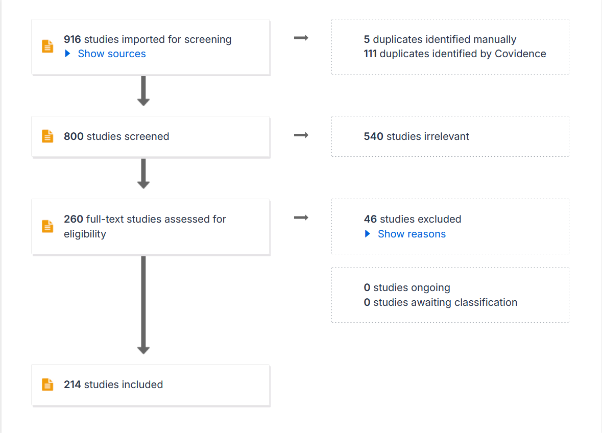

# Materials and Methods

```{r}
#| label: setup-methods
#| include: false
#| warning: false
#| message: false

# Lets this section render on its own (`quarto render _02-methods.qmd`). When the
# file is spliced into index.qmd via , index.qmd's own `setup`
# chunk has already loaded these and defined docx_flex(); re-running library()
# and redefining the function is harmless.
library(targets)
library(here)
library(tidyverse)
library(flextable)

# Identical to the helper in index.qmd's setup chunk. Change one, change both
# (or promote it to an R/ function).
docx_flex <- function(ft, widths = NULL) {
  ft <- ft |>
    flextable::theme_vanilla() |>
    flextable::bold(part = "header") |>
    flextable::fontsize(size = 9, part = "all") |>
    flextable::padding(padding = 2, part = "all")
  if (is.null(widths)) {
    flextable::set_table_properties(ft, layout = "autofit", width = 1)
  } else {
    flextable::set_table_properties(
      flextable::width(ft, width = widths),
      layout = "fixed"
    )
  }
}
```

## Study Area

Hammerfest is a kommune (municipality) and town in Finnmark, Norway's northernmost county. The area is a dense archipelago of islands and peninsulas riven with fjords and valleys. To the north-east the kommune opens into the Norwegian Barents sea, which supports both a thriving fishing industry and multiple oil and gas wells. To the south-west, the kommune encompasses an area of the mainland which includes the Nussir mountain and Repparfjord [@dalfestHammerfest2026]. Hammerfest kommune has a population of 11,000 (2025), of which roughly 8,000 live in the town itself, 2,000 in the southerly village of Rypefjord, and 300 in the mainland village of Kvalsund. Many of Hammerfest's population are employed in natural resource-based industries (@tbl-hammerfest-employment), and relative to its population (roughly 0.2% of mainland Norway's working population) the kommune hosts a sizable share of these sectors. 

```{r}
#| label: tbl-hammerfest-employment
#| tbl-cap: "Approximate statistics for Cu-relevant sector employment for a) Norway and b) Hammerfest kommune (2025, Q4, by place of residence), and Hammerfest's share of total national jobs per-sector. Source: SSB table 08536 [@statisticsnorway08536EmployedPersons2026]. "
#| echo: false
emp <- read_csv(
  "data/clean/derived/ssb_employment_hammerfest.csv",
  show_col_types = FALSE
)

fmt_n <- function(n) formatC(n, format = "d", big.mark = ",")
emp |>
  transmute(
    Sector = paste0(sector, " (", nace_codes_display, ")"),
    `Employees by sector (Norway)` = if_else(
      is.na(norway_pct_of_total),
      fmt_n(norway),
      paste0(
        fmt_n(norway),
        " (",
        formatC(norway_pct_of_total, format = "f", digits = 1),
        "%)"
      )
    ),
    `Employees by sector (Hammerfest)` = if_else(
      is.na(hammerfest_pct_of_total),
      fmt_n(hammerfest),
      paste0(
        fmt_n(hammerfest),
        " (",
        formatC(hammerfest_pct_of_total, format = "f", digits = 1),
        "%)"
      )
    ),
    `Hammerfest share of national` = paste0(
      formatC(hammerfest_share_of_national_pct, format = "f", digits = 2),
      "%"
    )
  ) |>
  flextable::flextable() |>
  flextable::align(j = 2:4, align = "right", part = "all") |>
  docx_flex()
```

The kommune contains 18 REACH-registered facilities [@NorwegianPRTRFrontpage], the most notable of which is the Melkøya Liquid Natural Gas plant, which recieves gas from the Snøhvit and Goliat marine fields to the north [@SnohvitField]. Other notable facilities include Hammerfest Airport, several active and former landfills and submarine disposal areas in the vicinity (including the Repparfjord Submarine Tailing Disposal (STD)), a handful of industrial installations, and the Wastewater Treatment Plant at Rossmolla, Hammerfest (constructed 2016, primary treatment), which serves both Hammerfest town and Rypefjord  and discharges into the Sørøysundet [@fylkesmannenifinnmarkTillatelseEtterForurensningsloven2014].

The Nussir and Ulveryggen mountains in the mainland to Hammerfest town's south are copper-rich, and were mined intermittently in the early 20th century and then intensively between 1972 and 1978 by the firm Folldal Verk [@sternalImpactSubmarineCopper2017]. During this period, roughly 1 million tonnes of copper-rich tailings were processed and discharged to the inner Repparfjord [@sternalImpactSubmarineCopper2017; @kvassnesWasteSitesMines2013]. In 2019, the firm Nussir ASA was licensed to conduct mining operations at Nussir/Ulveryggen [@eilertsenNussirGetsOperating2019], and in 2021 it recieved permission to discharge tailings to the Repparfjord [@NussirKobberprosjektGodkjenning]. The resumption of mining at the Nussir/Ulveryggen site has been the subject of both legal cases at the national and EU level, and direct action [@garvikGruvekonfliktenRepparfjorden2026]. Mining is planned to begin in late 2027 [@olaussenSisteBrikkePa2026] and continue for 13 years, and is estimated to release at most 30 million tonnes of tailings to the Repparfjord.

![Study area. (a) The Hammerfest / Repparfjorden region in western Finnmark: kommune boundaries (`csmaps`, 2024 division), Hammerfest kommune shaded, the red box the combined extent of the two Hammerfest-area AEPs. (b) The Hammerfest coastal system on Kartverket's colour topographic base map, showing reported point-source (PRTR) facilities (black stars), licensed aquaculture locations (blue circles), the Ulveryggen processing plant (black square), the historic (1970s Folldal Verk) submarine tailings disposal area (orange circle), and the Snøhvit and Goliat oil/gas fields (amber circles, sized to their footprints). Feature coordinates are approximate.](figures/fig-study-area.png){#fig-repparfjorden-locator}


## Lines of Evidence

Multiple lines of evidence were gathered in order to construct AEPs. Key lines and their characteristics are summarised below (@tbl-lines-of-evidence)

```{r}
#| label: tbl-lines-of-evidence
#| tbl-cap: "Table of key lines of evidence used in the construction of AEPs. Includes dominant data types, coverage (spatial, temporal), and downstream Key Exposure States and Key Transitional Relationships."
#| echo: false
tibble::tribble(
  ~`Line of Evidence`            , ~`Data Type`                                          , ~Coverage , ~`AEP Class`                    , ~Notes                                                                                                                                                                                                                                    ,
  "Systematic Literature Review" , "Exposure (concentrations)"                           , ""        , "Matrix KES, Tissue KES"        , "Big dataset, hence many sub-notebooks"                                                                                                                                                                                                   ,
  "Ad hoc literature"            , "Exposure (concentrations), Mass Balance (mass/time)" , ""        , "Matrix KES, Tissue KES, more?" , "Used to gap-fill AEPs where KES/KTR were suspected but no relevant evidence was found in existing lines of evidence"                                                                                                                     ,
  "Vannmiljø Database"           , "Exposure (concentrations)"                           , ""        , "Matrix KES, Tissue KES"        , "Folded into SLR, as data of same type."                                                                                                                                                                                                  ,
  "Copper Emissions"             , "Emissions (mass/time)"                               , ""        , "Emissions Edge"                , "Data resolution/quality generally lower than matrix concentrations"                                                                                                                                                                      ,
  "Copper PRTR"                  , "Mass Balance (mass/time)"                            , ""        , "Source Node"                   , "As above"                                                                                                                                                                                                                                ,
  "Aquaculture Registry"         , "Facility location and size"                          , ""        , "Source Node"                   , "Variation in size units make comparison difficult. No direct evidence of copper emission from aquaculture, but co-location of aquaculture facilities and data from aquaculture monitoring campaigns considered as evidence of pollution"
) |>
  flextable::flextable() |>
  flextable::compose(
    i = 2,
    j = "Line of Evidence",
    value = flextable::as_paragraph(flextable::as_i("Ad hoc"), " literature")
  ) |>
  docx_flex(widths = c(1.15, 1.35, 0.55, 1.05, 2.17))
```

## Exposure Dataset

### Literature Review Protocol

A systematic literature review framework was developed from the PRISMA2020 framework (@pagePRISMA2020Statement2021). As PRISMA2020 is primarily concerned with intervention-based studies, some work was required to adapt to the scope and exigencies of an ecotoxicological exposure assessment.

#### Databases and Search Terms

The following search string was used in all open literature sources. The \* character is a wildcard and is used to match against common prefixes. 

``` txt
(copper OR Cu OR cuprous OR cupric OR kobber OR coper OR 7440-50-8) 
AND (Barents OR Norwegian OR Arctic OR Svalbard OR North Atlantic OR Greenland*)
AND (wildlife OR ecotox* OR biota OR environment* OR animal OR ecosystem*) 
AND (emission OR exposure OR fate OR behaviour OR concentration OR dose OR chem* OR bioaccumul* OR trophic) 
AND (aqua* OR water* OR marine OR river OR lake OR fjord OR estuary OR sea OR ocean OR sediment* OR soil)
```

Web of Science returned 478 hits. PubMed returned 438 hits.

#### Inclusion, Exclusion, Deduplication and Screening

Once a dataset of potentially relevant papers was compiled, the web review platform Covidence [@veritashealthinnovationHowCanCite2025] was used to coordinate screening between the spatially separate reviewers.

1)  111 duplicates were automatically matched and removed
2)  5 duplicates were manually matched and removed
3)  800 studies were screened at the title and abstract level by two reviewers. 540 were excluded as irrelevant.
4)  260 studies were screened at the full text level by one of two reviewers. 46 were excluded as irrelevant.
5)  The remaining 214 studies were ranked informally from 1-5 (5 being highest) based on their perceived quality and relevance. The 58 papers given a score of 4 or 5 were selected as an initial batch of studies for extraction.
6)  Of these 58 papers, 32 had data extracted. 18 were rejected based on missing data or irrelevance. 8 papers remain in the progress of extraction at the time of writing.
7)  Extraction was carried out by one of three reviewers using the eData application. No blinding was conducted, and reviewers were free to discuss and reach consensus.

The full PRISMA flow is shown in @fig-prisma. Study screening was conducted using the following exclusion criteria. Where a study met multiple criteria for inclusion, only the first criterion was recorded. Some criteria were based on the Criteria for Reporting and Evaluating Exposure Datasets (CREED) Gateway Criteria [@dipaoloImplementationCREEDApproach2024]. These have been coded as CREED-n.

1)  CREED-1: sampling medium/matrix not specified
2)  CREED-2: copper-based analytes/chemistry parameters not specified
3)  CREED-3: spatial location not specified
4)  CREED-4: sampling period not specified
5)  CREED-5: measurement units not specified
6)  CREED-6: data source not specified
7)  out of geographical study area
8)  paper not in English
9)  full text not available

{#fig-prisma width="500"}

#### Screening

Of the 916 imported papers, 116 duplicates were removed, 540 studies marked as irrelevant based on abstract screening, and 46 studies were excluded after full text screening, resulting in a set of 214 manuscripts for data extraction. The decision was then taken to reduce this set of papers further to the most useful subset; papers were rated arbitrarily on a scale of 1 (least relevant) to 5 (most relevant) based on a single reviewer's holistic assessment of their relevance and utility to the research question. The reviewers then proceeded from the highest-ranked papers (ordered by score then alphabetically), began data extraction from all papers with a score of 4 or 5 (n in total, y% of ...).

#### Data Extraction & Validation

- Data were extracted from manuscripts using the *eData* shiny application (cite paper once ready)
- LLM extraction, human validation
- Raw data pointblank-validated to final version (cite eData MS), then manually QC'd by a review
- All tables merged together into single one
- organised as unique compartments and sites

### *Ad hoc* literature

Where data gaps were identified, or where relevant lines of evidence were suspected or known to exist but were not captured by the existing data set, ad hoc searches were performed to locate potentially relevant literature. The following pieces of evidence were captured by ad hoc searches (@tbl-adhoc-literature):

```{r}
#| label: tbl-adhoc-literature
#| tbl-cap: "Placeholder caption. Ad hoc literature sources."
#| echo: false
tibble::tribble(
  ~Col1                    , ~Col2                                                                                            , ~Col3 ,
  "Stearnal et al. (2017)" , "Sediment cores and historical reconstruction of sediment contamination patterns in Repparfjord" , ""    ,
  "Kogel et al (2016)"     , ""                                                                                               , ""    ,
  ""                       , ""                                                                                               , ""
) |>
  flextable::flextable() |>
  docx_flex(widths = c(1.5, 3.6, 1.17))
```

### Vannmiljø

In addition, data were extracted from the Norwegian Environmental Ministry (Miljødirektoratet, MD) database Vannmiljø ("Aquatic Environment", Vm) based on the following search criteria (@tbl-vm-search):

```{r}
#| label: tbl-vm-search
#| tbl-cap: "table of Vannmiljø search terms. How many raw hits?"
#| echo: false
tibble::tribble(
  ~`Norwegian Term` , ~`English Translation` , ~`Selected Options`                                    , ~Comments                                      ,
  "Nedlastingsdato" , "Download Date"        , "2025-12-05"                                           , ""                                             ,
  "Datoperiode"     , "Date Period"          , "2010-01-01 to 2025-12-05"                             , ""                                             ,
  "Kommune"         , "Municipality"         , "All municipalities"                                   , ""                                             ,
  "Medium"          , "Medium/Matrix"        , "All media"                                            , ""                                             ,
  "Kampanje"        , "Campaign"             , "All campaigns"                                        , ""                                             ,
  "Stressorer"      , "Stressors/Parameters" , "Kobber (Copper) & Kobberpyrition (Copper pyrithione)" , "No hits for Copper pyrithione in output data"
) |>
  flextable::flextable() |>
  flextable::compose(
    i = 6,
    j = "Comments",
    value = flextable::as_paragraph(
      "No hits for ",
      flextable::as_i("Copper pyrithione"),
      " in output data"
    )
  ) |>
  docx_flex(widths = c(1.15, 1.3, 2.3, 1.52))
```

- 138,615 rows of copper concentrations

- 30,541 rows of sites

- plus tables of methods, units, media, campaigns

Extracted data were processed and converted to the eData format (see [NB02-vannmiljø](docs/NB02-vannmiljo.qmd)), and validated against the format. Data from Vm covers a variety of monitoring campaigns conducted by a variety of contractors and sub-contractors across Norwegian territory. Metadata on the campaign goal (for example, monitoring reference rivers, or sites known to be contaminated) was retained and is used as a grouping variable in downstream analysis in order to understand observed variation.

```{r}
#| label: vm-summary-load
#| include: false
# Defined here, before the inline `r vm_val(...)` calls in the next paragraph;
# tbl-vm-dataset below redefines these harmlessly.
vm_sum <- tar_read(vm_dataset_summary)
vm_val <- function(m) vm_sum$scale$value[vm_sum$scale$metric == m]
```

After cleaning, the Vannmiljø extract contributes **`r vm_val("Measurements")`** copper measurements (`r vm_val("Rows")` records) from **`r vm_val("Sampling sites")`** sampling sites across **`r vm_val("Monitoring campaigns")`** monitoring campaigns, sampled over `r vm_val("Sampling period")`. `r vm_val("Censored (< LOD / < LOQ)")` were reported below a detection or quantification limit and substituted at that limit divided by $\sqrt{2}$. The record is dominated by freshwater and sediment, with marine water and biota contributing under a fifth between them (@tbl-vm-dataset). The rows removed at each cleaning step are reported in the Supplementary Information.

```{r}
#| label: tbl-vm-dataset
#| tbl-cap: "Composition of the cleaned Vannmiljø copper dataset by environmental compartment. Measurements are the sum of `MEASURED_N`; the record count is given alongside because one Vannmiljø record is one measurement. Site counts do not sum to the total because a site may host more than one compartment. Aquatic biota span 72 species across fish, molluscs, crustaceans, birds and algae; see [NB02-vannmiljø](docs/NB02-vannmiljo.qmd) for the campaign, method and per-species breakdown."
#| echo: false
vm_sum <- tar_read(vm_dataset_summary)
vm_val <- function(m) vm_sum$scale$value[vm_sum$scale$metric == m]

vm_sum$composition |>
  dplyr::transmute(
    Compartment = subcompartment,
    Matrix = as.character(matrix),
    Measurements = measurements,
    Records = rows,
    Sites = sites
  ) |>
  dplyr::bind_rows(dplyr::tibble(
    Compartment = "Total",
    Matrix = "",
    Measurements = vm_sum$totals$measurements,
    Records = vm_sum$totals$rows,
    Sites = vm_sum$totals$sites
  )) |>
  dplyr::mutate(dplyr::across(
    c(Measurements, Records, Sites),
    ~ formatC(.x, format = "d", big.mark = ",")
  )) |>
  rename(`Matrix (Vm)` = Matrix) |>
  flextable::flextable() |>
  flextable::align(j = 3:5, align = "right", part = "all") |>
  flextable::bold(i = ~ Compartment == "Total") |>
  docx_flex()
```

### Exposure Data Post-Processing

Samples were grouped by *Environmental compartment*, *environmental subcompartment*, *Site geographical feature* and *sub-feature*, (for biota) , *species* and *tissue*, and standardised unit (i.e. dry and wet weights, where both units were present for a single group). Any remaining invalid (i.e. value = NA) rows of data were dropped, and the proportion of dropped rows recorded. Each group was given a sequentially-numbered ID (GXXX); these IDs are used as shorthand to refer to specific groups.

For each sample grouping, sample size, mean, median, standard deviation, number of outliers meeting *both* Tukey Fences ($Z >= 1.5$) and Robust-Modified Z-Score ($Z >= 3.5$), and Hartigan's dip test statistics ($P <= 0.05$) were calculated (@tbl-groups-summary). For a more detailed description, please see [Supplementary Information](docs/NBXX-data-processing.qmd). Sample groups were ordered based on sample size and flagged for inspection where they met one of the following criteria:

1.  The group represented a matrix that was essential for the construction of aquatic Arctic AEPs (e.g. matrices that are both receiving compartments for copper and habitats for organisms of interest, such as marine and freshwater water columns and sediment, or algae (due to their trophic position)
2.  The group's distribution was flagged as potentially multimodal (see above)
3.  Over 5% of the group's total sample size (based on `MEASURED_N`) was double-flagged as an outlier based on Tukey fences and Robust-Modified Z-Score

In these cases,

- Outliers were visually inspected by constructing distributions/heatmaps
- Metadata and comments were reviewed
- Unless there was a convincing argument not to, outliers were removed
- We report both robust and non-robust summary statistics (median, mean ± sd) below, and use them for comparisons

## Norwegian PRTR and REACH Product Register

The Norwegian Product Release and Transfer Register (PRTR) is a repository for self-reported emissions data in Norway, and is freely available under an open government data license [@NorwegianPRTRPollutants]. Discharges of specific pollutants, including copper, to air and water by licensed facilities (wastewater treatment plants, landfills, land-based industries, and offshore installations) are reported, typically as kg/year. Facilities locations are recorded to the county level, and it is frequently possible to geolocate these facilities from other records.

Concurrently, the Norwegian Environmental Agency (EA) maintains a Product Register (REACH PR) under the REACH and CLP directives [@norwegianenvironmentagencyProductRegisterDeclaration2024]. Imports and exports of hazardous substances (including copper) are self-reported to the EA by firms. As this information is considered commercially sensitive, it is not openly available. However, the EA make available on request an aggregated version where imports and exports are reported by industry sector and/or product type. By subtracting exported copper from imported copper values, a mass-balance estimate of embedded copper in Norway can be calculated per sector or per product.

Data from these registers were assessed following the weight of evidence framework below, and are included as source KES (REACH PR) and KTR (PRTR) (@fig-hammerfest-emissions).

![**(a)** REACH product register net copper (imported plus produced, minus exported) scaled to Hammerfest by each NACE section's share of Hammerfest-resident employment; complete reporting years only (2018-2021); sectors above 1 kg/yr implied; log scale. **(b)** Copper released to air and water by PRTR-licensed facilities in Hammerfest kommune, by facility; reported zeros omitted (log scale). Panel a is copper in commerce (tonnes-scale), panel b is copper released (kg); the two are not comparable. Regenerate with `tar_make(hammerfest_emissions_plot)`.](figures/hammerfest_emissions.png){#fig-hammerfest-emissions}

TODO: Wrap legend text, move to bottom?

TODO: NACE Codes?

### Aquaculture

See notebook.

### WWTP

- 2014 - untreated WW direct to water (<https://www.ifinnmark.no/nyheter/fylkesmannen-har-godkjent-nytt-renseanlegg/s/1-47-7687993>)

- 2016 - Rossmolla WWTP online. Primary treatment, outflow at 50-60m depth in Sorøysundet

- However, frequent issues with monitoring and compliance

- Norske Utslipp entry (<https://www.norskeutslipp.no/no/Diverse/Virksomhet/?CompanyID=31924>)

<!-- -->

- Hammerfest has a WWTP, but it doesn't report emissions

  - (it does have a few available PDFs reporting that they're not doing their jobs properly, but useful details are hard to acquire)

- I don't believe there's any treatment currently, the plant *may* be being upgraded, but I'm not sure. anyway, it's copper, so it seems reasonable to assume that it's all reaching the environment

- At the national level, SSB reports an emission of roughly 10,000 kg copper per year for the whole country (<https://www.ssb.no/en/statbank/table/07081>)

- We can weight this by population proportion in Hammerfest again

There are 18 Hammerfest-based facilities identified on Norske utslipp, but only those in the graph above actually report copper emissions.

<!--# TODO: Notes on Hammerfest ren havn: https://hammerfest.kommune.no/tjenester/natur-klima-og-miljo/miljovern/ren-havn/prosjekt-ren-havn/ -->

### Weight of Evidence Assessment

Construction of the AEP required the quantitative assessment and comparison of diverse lines of evidence on copper occurrence, emissions, and dynamics [@hardyGuidanceUseWeight2017]. Evidence quality for both KESs and KTRs was assessed and scored according to the entity's Essentiality, Plausibility, Evidence, and Quantitative Understanding (abbreviated to EPEQ), based on the AOP WoE assessment guidelines [@oecdUsersHandbookSupplement2018] adapted by @pengAggregateExposurePathways2022.

In some cases, KESs and KTRs were given high EPEQ scores despite a lack of evidence in the available data due to the extreme degree of consensus on occurrence. For example, the natural occurrence of copper in the Earth's crust and sea water are both considered common knowledge and beyond all doubt, and were thus scored as highly essential, plausible, and evidence-based despite the absence of e.g. geological data in the lines of evidence.

CREED's in there somewhere, too. The criteria are summarised in @tbl-woe-criteria.

NB: Peng et al. concern themselves with the EPEQ of *relationships* between nodes, whereas the nodes themselves only get an Essentiality score. I don't think this would be appropriate here; in fact I have some issues with applying Essentiality to KES at all. But we'll do it anyway, for the time being:

::: {.landscape}

```{r}
#| label: tbl-woe-criteria
#| tbl-cap: "Weight of Evidence criteria adapted from Peng et al. (2022), OECD (2018), CREED, and Bradford Hill (1965). **Work in progress.**"
#| echo: false
tibble::tribble(
  ~Criterion, ~KES, ~KTR, ~Score, ~Comments,
  "Essentiality",
  "Copper presence in downstream KES will be reduced/stopped if copper presence in this KES reduced/stopped",
  "Copper presence in downstream KES will be reduced/stopped if this KTR reduced/stopped",
  "3: Diverse, consistent evidence
2: Some, potentially inconsistent evidence
1: Weak or no evidence",
  "Less applicable with copper than xenobiotic stressors.",
  "Plausibility",
  "Theoretical knowledge supports dependent and sequential change of two adjacent KESs",
  "Theoretical knowledge supports KTR as mechanism of sequential change between KESs",
  "3: Diverse, consistent evidence
2: Some, potentially inconsistent evidence
1: Weak or no evidence",
  "Environment-level occurrence and transport of stressors is far more intuitively and widely understood than metabolism. Most copper KESs and KTRs will be scored as highly plausible.",
  "Evidence",
  "Empirical data showing occurrence of copper at KES.",
  "Empirical data on transfer along KTR between KESs",
  "3: Diverse, consistent evidence, including contaminated and non-contaminated examples.
2: Some, potentially inconsistent evidence
1: Weak or no evidence",
  "Vast majority of available evidence is occurrence rather than transport/flows. CREED Reliability score (1-5) and quantity of relevant evidence used in calculation of Evidence score.",
  "Quantitative Understanding",
  "Quantitative models exist permitting prediction of downstream KESs from upstream KESs",
  "Quantitative models exist permitting prediction KTR rates of transfer based on KESs and environmental parameters",
  "3: High-quality quantitative prediction of downstream KESs occurrence from upstream KES occurrence
2: Limited or only partially applicable prediction
1: Qualitative predictions only",
  "A full-scale review of available models has not been carried out. KES and KTR will be scored based on expert knowledge of available models."
) |>
  flextable::flextable() |>
  docx_flex(widths = c(1.2, 2.6, 2.6, 1.6, 1.69))
```

:::

### AEP Construction

Based on exploration of copper pollution sources and dynamics in the study area, the decision was made to construct two AEPs: one representing the inner-Repparfjord submarine tailing disposal area, and another the Hammerfest coastal area [@tbl-aeps].

```{r}
#| label: tbl-aeps
#| tbl-cap: "Table of AEPs. Can be collapsed to text or moved to SI as needed."
#| echo: false
#| 
table <- read_csv("data/clean/aep/aep_manifest.csv")

table |>
  select(label, scope_note) |>
  flextable::flextable() |>
  flextable::set_header_labels(label = "Label", scope_note = "Scope note") |>
  docx_flex()
```

For each AEP, nodes were selected based on both empirical and putative sources, receiving matrices, and sensitive organisms in the study area. Where relevant sampling group(s) were available, these were filtered to the site bounding box, and summary statistics calculated for group members in the relevant geographical area.

How were AEPs constructed:

1.  Review groups where n \>= 100, generate nodes
2.  Where appropriate (due to sample sizes, ecological/matrix similarity, etc.), put multiple groups into one node
3.  Assemble a "whole-system" AEP from all available nodes (from above)
4.  

Nodes are based on available evidence. What counts as a node is slightly arbitrary - depending on what data we have and what makes sense, we may use coarser or finer resolution.

Putative edges are created between nodes based on expert opinion rather than individual pieces of evidence. In general we have a lot less direct evidence for edges (as opposed to general/plausible stuff), and a lot less quantification.
