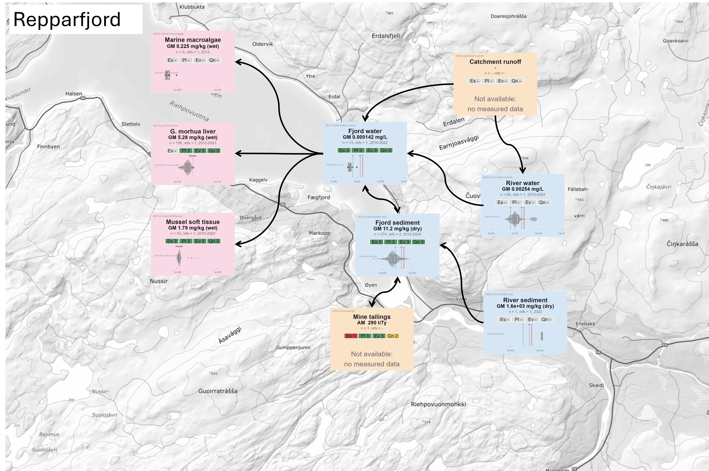

# Results

```{r}
#| label: setup-results
#| include: false
#| warning: false
#| message: false

# Lets this section render on its own (`quarto render _03-results.qmd`).
# Redundant when the file is spliced into index.qmd, which has already run its
# own setup.
library(targets)
library(here)
library(tidyverse)
library(flextable)

# summarise_groups(), build_sample_groups_table(), sample_groups_flextable() and
# node_report_flextable() are STOPAEP functions. Skip the reload when index.qmd
# already did it: load_all() is one of the slower steps in a render.
if (!"STOPAEP" %in% loadedNamespaces()) {
  pkgload::load_all(quiet = TRUE)
}
```

```{r}
#| label: dep-figures
#| include: false
# Dependency edges for figures this section embeds by path (CLAUDE.md 4.4.2).
# figures/fig02-study-area.png and figures/fig05-repparfjorden-concentrations.png come from
# docs/NBXX-rfjord-2.qmd via render_nbxx_rfjord; the two matrix time series are
# their own file targets. Values unused.
invisible(targets::tar_read(render_nbxx_rfjord))
invisible(targets::tar_read(aep_matrix_timeseries_a001))
invisible(targets::tar_read(aep_matrix_timeseries_a002))
```

TODO: Proref for biota

{#fig-repparfjorden-conc}

## Group Summary Statistics

<!-- TODO: n thresholds for Hartigans. Also dynamic update group/sample n slice reporting-->

<!-- TODO: Add cumulative proportion to this v of table, use that for filtering rather than n-->

@tbl-groups-summary displays all sample groups where $n \ge 100$ (regardless of measured unit), including summary statistics, date coverage, probability of multimodal distribution, number of distinct standardised units per group, and the proportion of dropped data points.

**Question: Since we're reducing the geographical scope to Repparfjorden, does it make sense to include a big table of all the groups. It *was* used quite heavily in the process of exploring and assessing individual group data, but it may raise more questions than it answers.**

```{r}
#| label: tbl-groups-summary
#| tbl-cap: "Placeholder caption. Sample-group summary statistics, groups with n >= 100."

# Same target as docs/NBXX-Sample-Groups.qmd, filtered to the large groups.
# Highlight indices are recomputed inside sample_groups_flextable(), so they
# stay aligned after this filter.
tar_read(sample_groups_table) |>
  filter(n >= 100) |>
  sample_groups_flextable() |>
  flextable::set_table_properties(layout = "autofit", width = 1)
```

@tbl-groups-a001 and @tbl-groups-a002 give the same summary restricted to sample groups with at least one measurement inside each AEP's bounding box (@fig-repparfjorden-conc; no $n$ threshold). Aggregation is re-run on the bounded rows only, so the statistics differ from the national table; the group `ID` and the `Dropped` percentage stay at their national values.

```{r}
#| label: tbl-groups-a001
#| tbl-cap: "Sample groups with at least one measurement inside the AEP-001 (Hammerfest coastal) bounding box (23.40-24.12 E, 70.45-70.78 N)."
#| warning: false
a001_box <- tar_read(aep_manifest) |> filter(aep_id == "A001")
tar_read(literature_analysis_ready) |>
  filter(
    !is.na(LONGITUDE),
    !is.na(LATITUDE),
    LONGITUDE >= a001_box$lon_min,
    LONGITUDE <= a001_box$lon_max,
    LATITUDE >= a001_box$lat_min,
    LATITUDE <= a001_box$lat_max
  ) |>
  summarise_groups(tar_read(literature_dropped_report)) |>
  build_sample_groups_table(ids = tar_read(group_ids)) |>
  sample_groups_flextable() |>
  flextable::set_table_properties(layout = "autofit", width = 1)
```

```{r}
#| label: tbl-groups-a002
#| tbl-cap: "Sample groups with at least one measurement inside the AEP-002 (Repparfjord inner) bounding box (24.13-24.42 E, 70.42-70.52 N)."
#| warning: false
a002_box <- tar_read(aep_manifest) |> filter(aep_id == "A002")
tar_read(literature_analysis_ready) |>
  filter(
    !is.na(LONGITUDE),
    !is.na(LATITUDE),
    LONGITUDE >= a002_box$lon_min,
    LONGITUDE <= a002_box$lon_max,
    LATITUDE >= a002_box$lat_min,
    LATITUDE <= a002_box$lat_max
  ) |>
  summarise_groups(tar_read(literature_dropped_report)) |>
  build_sample_groups_table(ids = tar_read(group_ids)) |>
  sample_groups_flextable() |>
  flextable::set_table_properties(layout = "autofit", width = 1)
```

1,600 mg/kg value for sediment is extremely suspect, but is correct to Vannmiljø. So we ought to find some other rivers.

## Distributions

- Overall top-down view of dataset and general distribution patterns
- More detailed, broken-down versions of plots will be in SI

## AEPs

AEPs for the two case study sites are shown in @fig-repparfjord-aep and @fig-hammerfest-aep.

@tbl-nodes-a001 and @tbl-nodes-a002 give the AEP nodes: one row per node, its level (source / medium / organism) and type (empirical measured data, or external hand-entered magnitude), summary statistics of its numerical aspect (weighted mean, per-row SD, median, geometric mean; `n` is $\sum$`MEASURED_N` with rows and distinct references in brackets), the date range, and the four EPEQ scores. A blank statistics row is a node hypothesised for the AEP but with no supporting data yet. Empirical statistics are pooled over the node's member sample groups after applying the AEP bounding box and any node-specific filters.

#### AEP 1: Hammerfest Inner Coastal System

{#fig-hammerfest-aep}

```{r}
#| label: tbl-nodes-a001
#| tbl-cap: "AEP-001 (Hammerfest coastal) nodes."
#| warning: false
tar_read(aep_node_cards) |>
  filter(aep_id == "A001") |>
  node_report_flextable(tar_read(aep_scoped)[["A001"]]) |>
  flextable::set_table_properties(layout = "autofit", width = 1)
```

![Measured copper in the AEP-001 bounding box (70.44--70.78 N, 23.40--24.12 E) over time, one panel per compartment (cod liver, blue mussel, coastal water, sediment) in native units with a free $y$-axis per panel; dry weight, wet weight and per-litre concentrations are not directly comparable. Water and sediment points carry their Norwegian M-608 quality class (Background / Good / Poor / Very Poor; copper has no M-608 Class III). Cod and mussel sit on a separate above-/below-PROREF colour scale, since M-608 has no copper class ladder for biota. The dashed grey line is a linear fit where $n \ge 6$ (a rough eyeball of trend, not a model; cod excluded). Faint horizontal lines mark PROREF (biota) or the M-608 class boundaries (water, sediment); the dotted vertical marks 2024. Strip text gives the compartment, its units, and the sample groups present. Coastal water is `ENVIRON_COMPARTMENT_SUB` "Marine/Salt Water" (total copper, mg/L); M-608 water classes are for dissolved copper, so treat them as indicative. **This figure and its caption are AI-generated placeholders and must be replaced before submission.**](figures/fig07-aep1-timeseries.png){#fig-a001-timeseries}

#### AEP 2: Inner Reppafjorden

{#fig-repparfjord-aep}

```{r}
#| label: tbl-nodes-a002
#| tbl-cap: "AEP-002 (Repparfjord inner) nodes."
#| warning: false
tar_read(aep_node_cards) |>
  filter(aep_id == "A002") |>
  node_report_flextable(tar_read(aep_scoped)[["A002"]]) |>
  flextable::set_table_properties(layout = "autofit", width = 1)
```

{#fig-a002-timeseries}
