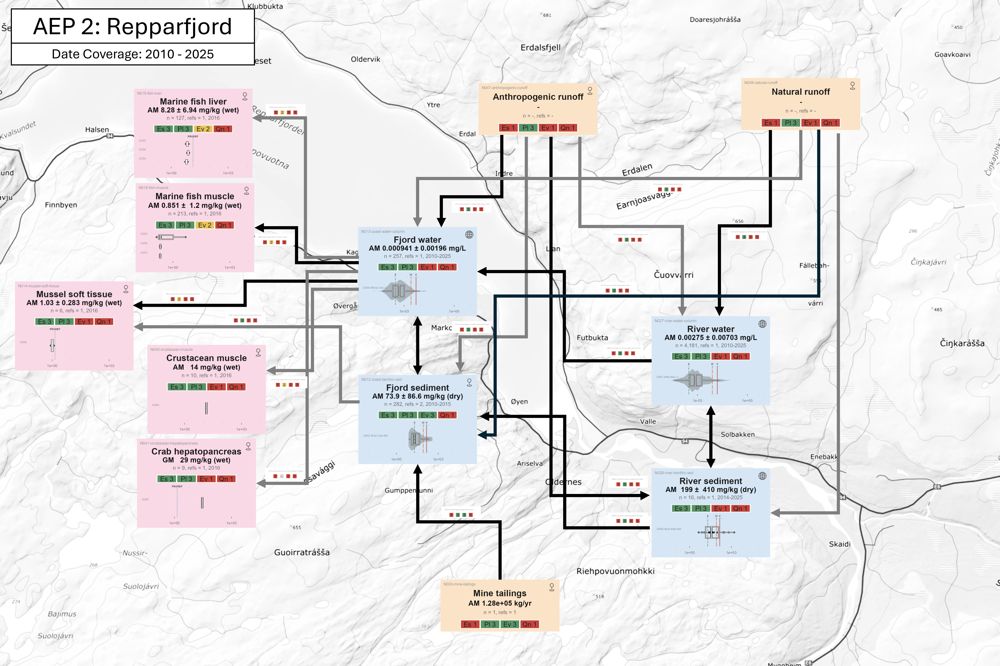

# Results

```{r}
#| label: setup-results
#| include: false
#| warning: false
#| message: false

# Lets this section render on its own (`quarto render _03-results.qmd`).
# Redundant when the file is spliced into index.qmd, which has already run its
# own setup.
library(targets)
library(here)
library(tidyverse)
library(flextable)

# summarise_groups(), build_sample_groups_table(), sample_groups_flextable() and
# node_report_flextable() are STOPAEP functions. Skip the reload when index.qmd
# already did it: load_all() is one of the slower steps in a render.
if (!"STOPAEP" %in% loadedNamespaces()) {
  pkgload::load_all(quiet = TRUE)
}
```

```{r}
#| label: dep-figures
#| include: false
# Dependency edges for figures this section embeds by path (CLAUDE.md 4.4.2).
# figures/fig03-study-area.png, figures/fig06-aep1-concentrations.png and
# figures/fig07-aep2-concentrations.png come from docs/NBXX-rfjord-2.qmd via
# render_nbxx_rfjord; the two matrix time series are their own file targets.
# Values unused.
invisible(targets::tar_read(render_nbxx_rfjord))
invisible(targets::tar_read(aep_matrix_timeseries_a001))
invisible(targets::tar_read(aep_matrix_timeseries_a002))
```

## Aggregate Exposure Pathways

### AEP 1: Hammerfest Inner Coastal System

#### AEP Sample Groups

Exposure data for the study area was filtered to the Hammerfest coastal area bounding box (insert coords here) . 13 groups were returned, with data dominated by national monitoring campaigns (See [@tbl-groups-a001], SI for more information). 

#### Concentration map

Mapping measured copper concentrations in the Hammerfest area (@fig-aep1-conc) revealed a highly localised pattern of both monitoring and exceedence of background/threshold levels. Most measurements were conducted at aquaculture facilities or in the Hammerfest harbour area. Marine sediment concentrations were largely at background/good levels across the area, although points in the vicinity of aquaculture facilities at Eidvåget and Kommagnes showed occasional poor or very poor concentrations. Copper concentrations in G. morhua livers and M. edulis above provisional reference levels (PROREF) were detected around Hammerfest harbour, and on the NW coast of Melkøya, home to Hammerfest LNG plant. No pattern of contamination from the Repparfjord to the south was observed. Occasional freshwater sampling sites (e.g. the site marked "lufthavn" to the East of Hammerfest, which despite the name is not an airport). These points were excluded from consideration, as freshwater lake ecosystems represent a considerably different system to Hammerfest's coast.

{#fig-aep1-conc}

#### Concentrations over time

<!-- TODO: Swap theming to minimal, remove double space after group name, use same group names as elsewhere. Add subticks for years -->

A simple assessment of copper concentrations in key sampling groups (G. morhua liver, Blue mussels, coastal water and marine sediment showed no obvious time trend. Cod liver concentrations only occasionally exceed PROREFs (in 2014, 2015 and 2024). Blue mussel whole body concentrations are orders of magnitude higher in 2011 and likely the result of a unit conversion error in the source data; however, measurements in 2019 and 2024 continue to show many PROREF exceedences. Measurements of copper in coastal water are few enough that no trend is detectable. Sediment concentrations appear roughly steady over the measured time period; a lack of Very Poor copper concentrations after 2022 is notable. 

{#fig-a001-timeseries}


#### Pathway Diagram

[@fig-hammerfest-aep] shows a proposed AEP for the Hammerfest coastal system. Copper flows to the environment from a variety of anthropogenic and natural sources, of which only WWTP discharge, aquaculture and emissions from industrial facilities are qualified to some degree. Flows of copper to receiving water and sediment are generally highly plausible but poorly evidenced, and insufficient information is available to assess their essentiality (i.e. if interrupting any specific source would change measured concentrations). Sediment concentrations are well-described by existing data and predominantly below adverse effect thresholds; water concentration data is sparse but also largely below thresholds (of 13 data points, a single falls within the Good-Moderate effect class). Tissue copper concentrations are available for G. morhua livers (largely below PROREF), M. edulis soft tissues (distributed around the PROREF boundary, but with some exceedences), and a handful of macroalgae (shoot tip) samples. 

![Hammerfest Coastal System Aggregate Exposure Pathway (AEP). This AEP represents emissions from a variety of copper sources (orange Key Exposure States (KES)) to receiving marine water and sediment (Blue (KES)), and eventually to Target Sites of Exposure (pink KES), linked by Key Transitional Relationships (black and grey lines) Each KES reports a mean concentration emission (if available), sample size, number of references, date range, and a Weight of Evidence (WoE) assessment. WoE includes the Essentiality, Plausibility, Evidence, and Quantification of a given KES or KTR, scored 1-3 and colour-coded. Pin/globe icon in KES top-right corner indicates that a node is based on local (i.e. Hammerfest) or whole-Arctic data.](figures/fig08-aep1-hammerfest.png){#fig-hammerfest-aep}

Full node-level evidence and Weight-of-Evidence scores underlying [@fig-hammerfest-aep] are tabulated in [@tbl-nodes-a001] (SI).

### AEP 2: Inner Repparfjorden

#### Pathway diagram

{#fig-repparfjord-aep}

#### Node evidence table

Full node-level evidence and Weight-of-Evidence scores underlying [@fig-repparfjord-aep] are tabulated in [@tbl-nodes-a002] (SI).

#### Concentration map

{#fig-aep2-conc}

#### Sample groups in the bounding box

@tbl-groups-a002 (Supplementary Information) summarises the sample groups with at least one measurement inside the AEP-002 (Repparfjord inner) bounding box (@fig-aep2-conc; no $n$ threshold). Aggregation is re-run on the bounded rows only, as for @tbl-groups-a001.

The 1,600 mg/kg sediment value in this box is extremely suspect, but is correct to Vannmiljø. So we ought to find some other rivers.

#### Concentrations over time

{#fig-a002-timeseries}
