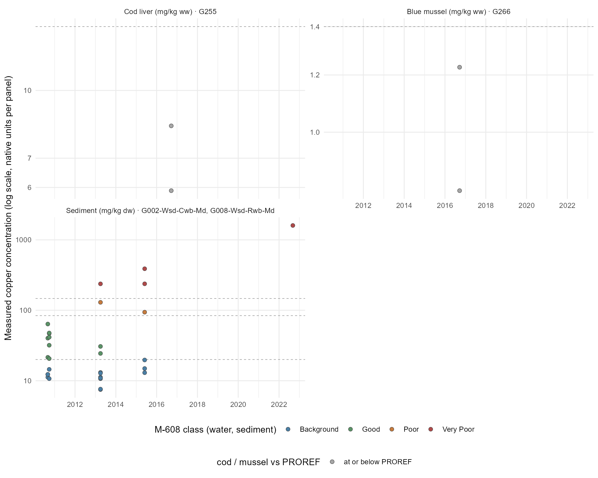

# Results

```{r}
#| label: setup-results
#| include: false
#| warning: false
#| message: false

# Lets this section render on its own (`quarto render _03-results.qmd`).
# Redundant when the file is spliced into index.qmd, which has already run its
# own setup.
library(targets)
library(here)
library(tidyverse)
library(flextable)

# summarise_groups(), build_sample_groups_table(), sample_groups_flextable() and
# node_report_flextable() are STOPAEP functions. Skip the reload when index.qmd
# already did it: load_all() is one of the slower steps in a render.
if (!"STOPAEP" %in% loadedNamespaces()) {
  pkgload::load_all(quiet = TRUE)
}
```

```{r}
#| label: dep-figures
#| include: false
# Dependency edges for figures this section embeds by path (CLAUDE.md 4.4.2).
# figures/fig03-study-area.png, figures/fig06-aep1-concentrations.png and
# figures/fig07-aep2-concentrations.png come from docs/NBXX-rfjord-2.qmd via
# render_nbxx_rfjord; the two matrix time series are their own file targets.
# Values unused.
invisible(targets::tar_read(render_nbxx_rfjord))
invisible(targets::tar_read(aep_matrix_timeseries_a001))
invisible(targets::tar_read(aep_matrix_timeseries_a002))
```

## Aggregate Exposure Pathways

### AEP 1: Hammerfest Inner Coastal System

Exposure data for the study area was filtered to the Hammerfest coastal area bounding box (insert coords here). 13 groups were returned, with data dominated by national monitoring campaigns (see [@tbl-groups-a001], SI for more information).

Mapping measured copper concentrations in the Hammerfest area (@fig-aep1-conc) revealed a highly localised pattern of both monitoring and exceedance of background/threshold levels. Most measurements were conducted at aquaculture facilities or in the Hammerfest harbour area. Marine sediment concentrations were largely at Background/Good levels across the area, although points in the vicinity of aquaculture facilities at Eidvåget and Kommagnes showed occasional Poor or Very Poor concentrations. Copper concentrations in *G. morhua* livers and *M. edulis* above provisional high reference contaminant concentrations (PROREF) were detected around Hammerfest harbour, and on the NW coast of Melkøya, home to Hammerfest LNG plant. No pattern of contamination from the Repparfjord to the south was observed. Occasional freshwater sampling sites were also present (e.g. the site marked "lufthavn" to the east of Hammerfest, which despite the name is not an airport). These points were excluded from consideration, as freshwater lake ecosystems represent a considerably different system to Hammerfest's coast.

{#fig-aep1-conc}

A simple assessment of copper concentrations in key sampling groups (*G. morhua* liver, Blue mussels, coastal water and marine sediment) showed no obvious time trend. Cod liver concentrations only occasionally exceed PROREFs (in 2014, 2015 and 2024). Blue mussel whole body concentrations are orders of magnitude higher in 2011 and likely the result of a unit conversion error in the source data; however, measurements in 2019 and 2024 continue to show many PROREF exceedances. Measurements of copper in coastal water are few enough that no trend is detectable. Sediment concentrations appear roughly steady over the measured time period; a lack of Very Poor copper concentrations after 2022 is notable. 

{#fig-a001-timeseries}

[@fig-hammerfest-aep] shows a proposed AEP for the Hammerfest coastal system. Copper flows to the environment from a variety of anthropogenic and natural sources, of which only WWTP discharge, aquaculture and emissions from industrial facilities are qualified to some degree. Flows of copper to receiving water and sediment are generally highly plausible but poorly evidenced, and insufficient information is available to assess their essentiality (i.e. if interrupting any specific source would change measured concentrations). Sediment concentrations are well-described by existing data and predominantly below adverse effect thresholds; water concentration data are sparse but also largely below thresholds (of 13 data points, a single point falls within the Good-Moderate effect class). Tissue copper concentrations are available for *G. morhua* livers (largely below PROREF), *M. edulis* soft tissues (distributed around the PROREF boundary, but with some exceedances), and a handful of macroalgae (shoot tip) samples. Full node-level evidence and Weight-of-Evidence scores underlying [@fig-hammerfest-aep] are available in [@tbl-nodes-a001] (SI).

![Hammerfest Coastal System Aggregate Exposure Pathway (AEP). This AEP represents emissions from a variety of copper sources (orange Key Exposure States (KES)) to receiving marine water and sediment (blue KES), and eventually to Target Sites of Exposure (pink KES), linked by Key Transitional Relationships (black and grey lines). Each KES reports a mean concentration emission (if available), sample size, number of references, date range, and a Weight of Evidence (WoE) assessment. WoE includes the Essentiality, Plausibility, Evidence, and Quantification of a given KES or KTR, scored 1-3 and colour-coded. Pin/globe icon in KES top-right corner indicates that a node is based on local (i.e. Hammerfest) or whole-Arctic data. Displayed quantities rounded to 3 s.f.](figures/fig08-aep1-hammerfest.png){#fig-hammerfest-aep}


### AEP 2: Repparfjord System

<!-- TODO: CC: Stop calling it Inner Repparfjord(en). Use term Repparfjord consistently throughout. -->

Exposure data for the study area was filtered to the Repparfjord bounding box (insert coords here). 8 groups were returned, reflecting both national monitoring and two studies specifically scoped to the Repparfjord (see [@tbl-groups-a002], SI for more information). Although sediment contamination of the Repparfjord was very well-defined, data on concentrations in water in the fjord were unavailable, and a mean value for fjord water in the Arctic was used in place. Available data for the Repparfjord river and its sediment were also unusually high, and thus Arctic-wide river water and sediment data were used here.

Spatial patterns [@fig-aep2-conc] of copper concentrations in the Repparfjord represent an extremely localised distribution of highly contaminated (Poor or Very Poor) sediment samples to the inner fjord. Sediment samples in the mid and outer fjord are entirely classified as Background/Good, while none of the samples of species with PROREF values (which are extremely few) show exceedance of these reference values.

<!-- TODO (CC)\\\\: Move Tailings displosal label up so it no longer covers circle, change image title text -->

{#fig-aep2-conc}

[@fig-a002-timeseries] shows insufficient ongoing monitoring of key sample groups to determine trends (although note that @sternalImpactSubmarineCopper2017 extracted sediment cores that give a historical overview of concentrations). Most sediment sampling captured occurred between 2010 and 2016, with only a single data point (recording an extremely high sediment concentration), while *G. morhua* and *M. edulis* tissue concentrations were only recorded in 2016.

{#fig-a002-timeseries}

The Repparfjord AEP ([@fig-repparfjord-aep]) includes a small number of source KES, most notably the presence of almost 900 tonnes of copper in mine tailings at the floor of the inner fjord. Natural run-off to both the Repparfjord river (SE corner of the AEP) and the fjord itself is likely an important source of copper, but could not be quantified from available data. Anthropogenic run-off may also be a contributing source, although the area is sparsely populated, both sides of the fjord are bracketed by roads and the E6, Norway's main north-south highway, runs across the Repparfjord river plain. Data for the whole of Norway above the Arctic Circle were used to provide a rough estimate of likely copper concentrations in river water, river sediment, and fjord water. Measured copper levels in fjord sediment are, on average, much higher (74 +- 86.6 mg/kg (dry)) than those from Hammerfest (27.5 +- 59.9 mg/kg (dry)), driven by extremely high concentrations measured in the inner fjord.

A larger number of biota tissue concentrations are available for this system, sourced from @kogelUsingAtlanticHaddock2026, although they represent sampling across a narrow time period. Fish liver concentrations of copper were on average higher (8.28 +- 6.94 mg/kg (wet)) than those measured in Hammerfest (6.22 +- 3.25 mg/kg (wet)), although the Repparfjord KES represents a wide range of species, none of which exceed the (*G. morhua*-specific) PROREF. Mussel data for Repparfjord are extremely sparse (n = 6) but give no indication that tailings disposal has affected tissue copper concentrations, which are lower (mean 1.04 +- 0.283 mg/kg (wet)) than those seen at Hammerfest (3.85 +- 8.92 mg/kg (wet)), albeit with the latter's mean driven by a pattern of occasional extremely high outliers. Crab muscle and hepatopancreas copper concentrations are consistently higher than mean tissue concentrations seen anywhere in Repparfjord or Hammerfest.

![Repparfjord system Aggregate Exposure Pathway (AEP). This AEP represents emissions from a variety of copper sources (orange Key Exposure States (KES)) to receiving marine water and sediment (blue KES), and eventually to Target Sites of Exposure (pink KES), linked by Key Transitional Relationships (black and grey lines). Each KES reports a mean concentration emission (if available), sample size, number of references, date range, and a Weight of Evidence (WoE) assessment. WoE includes the Essentiality, Plausibility, Evidence, and Quantification of a given KES or KTR, scored 1-3 and colour-coded. Pin/globe icon in KES top-right corner indicates that a node is based on local (i.e. Hammerfest) or whole-Arctic data. Displayed quantities rounded to 3 s.f.](figures/fig10-aep2-repparfjord.png){#fig-repparfjord-aep}

Full node-level evidence and Weight-of-Evidence scores underlying [@fig-repparfjord-aep] are tabulated in [@tbl-nodes-a002] (SI).

@tbl-groups-a002 (Supplementary Information) summarises the sample groups with at least one measurement inside the AEP-002 (Repparfjord inner) bounding box.

