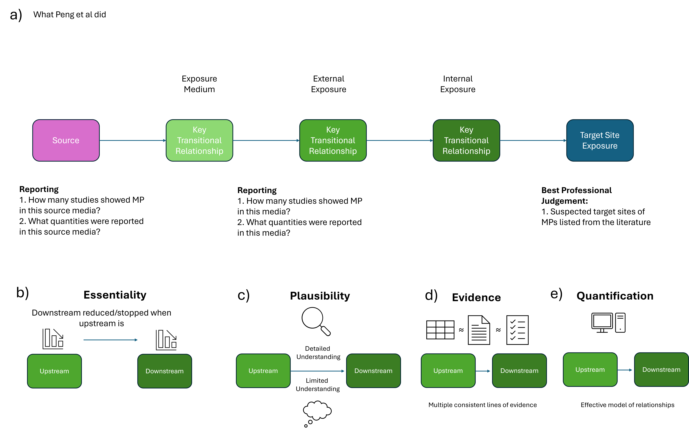

Gradually copying from word doc.

# Summary

-   This review will use a Weight of Evidence assessment to screen, assess, weigh and integrate evidence for the presence and movement of copper to and in Norwegian marine Arctic ecosystems
-   We will use the EFSA Weight of Evidence assessment guidelines (Hardy et al., 2017), PRISMA 2020 systematic literature review framework (Page et al., 2021), and Criteria for Reporting and Evaluating Exposure Datasets (CREED) (Di Paolo et al., 2024) to assess the quality, plausibility and complementarity of evidence in the open literature.
-   We will use Covidence, an online systematic review platform to screen and review papers. Sam and either Maj or Pierre will screen papers based on the CREED gateway criteria and the specific domain of the study, with Richard and Knut Erik to act as arbitrators in case of disagreement.
-   Once screening is complete, Sam and Maj/Pierre will extract relevant data using Covidence’s built in Data Extraction and Data Quality templates, following the CREED question battery (20-30 questions) o Sam will also conduct the same exercise with the Norwegian Environmental Agency’s water pollution database Vannmiljø and sector source/emissions data from the same
-   Reported copper concentrations will be compared to background/reference concentrations for copper in various media in Norway to identify elevated levels compared to expected natural concentrations
-   Sam/Maj/Pierre will assess a small subset of papers (10?) through the full screening and extraction pipeline first, to identify any issues or ambiguities in this protocol.
-   As quality evidence becomes available, Sam will construct a network diagram to graphically display the occurrence, flows, and weight of evidence for the presence of copper.
-   If no evidence is available for suspected flows/matrix occurrences of copper are found, targeted literature searches may be added to the protocol. It will be clearly indicated in methods if this is the case.
-   Additional background material on the local ecological, economic, global change, geographical, enviro-chemical, and other relevant factors will be provided by Sam on an ad-hoc basis to be reviewed by co-authors.
-   At regular intervals (2-4 weeks) through the review process Sam will call meetings of available co-authors to review progress, evidence, and evaluate if any changes need to be made to protocols. Current plans aren’t set in stone, if we can justify a deviation.
-   Once all papers, Vannmiljø data, and copper emission data have been screened and had data extracted, results will be synthesised, graphed, and discussed in the broader environmental context.

# Methodological Design

| Title | Comments | Citation |
|------------------------|------------------------|------------------------|
| Guidance on the use of the weight of evidence approach in scientific assessments | EFSA 60-page guidelines on WoE. Probably the most comprehensive guide to WoEs, but not very comprehensive. Framework for synthesising diverse lines of evidence. | @hardyGuidanceUseWeight2017 |
| Preferred Reporting Items for Systematic reviews and Meta-Analyses (PRISMA) statement | Checklist and principles for planning and reporting systematic reviews. Methodological framework for literature review and data review. | @pagePRISMA2020Statement2021 |
| Implementation of the CREED approach for environmental assessments | Framework for developing questions to qualify relevance and reliability of a source in assessing chemical exposure | @dipaoloImplementationCREEDApproach2024 |

: Table of primary methodological sources


# Paper Sections and PRISMA Questions

## PRISMA-1: Identify the report as a systematic review

Working title: Copper Pollution in the Arctic - An Aggregate Exposure Pathway for Understanding Sources, Sinks, and Bioavailability

## PRISMA-2: Abstract

To follow. Make sure to check out PRISMA abstracts checklist.

## PRISMA-3: Describe the rationale for the review in the context of existing knowledge

Copper is an important resource, nutrient, and pollutant; its demand is expected to increase significantly in coming decades

The Arctic and near-Arctic are important ecosystems and will likely undergo significant shifts in economic use and ecological status as the climate changes

The is a need to understand the sources, emission, fate, behaviour, speciation, bioavailability, and uptake of copper in the Arctic to assess current and potential future scenarios



TODO: Insert list of selected/included oceans/seas from Covidence output here.

## PRISMA 4: Provide an explicit statement of the objective(s) or question(s) the review addresses

This paper aims to address the following question:

-   How does anthropogenic (and natural) copper reach target sites in predatory fish, algae, zooplankton and mussels in the Arctic and Sub-Arctic oceans/seas?

This question was selected on the following basis:

-   The stressor and study region were selected by the EXPECT project before this protocol was written. Project partners have already conducted experiments with copper.

-   Patterns of stress on the Norwegian Arctic ecosystem is likely to change considerably over coming decades, likely to the detriment of existing biota

-   Although copper is unlikely to be a risk driver for Arctic ecosystems, its status as a well-studied classical stressor and shared ROS-based (partial) mode of action makes it an ideal test subject for AEP construction

## PRSIMA-5: Specify the inclusion and exclusion criteria for the review and how studies were grouped for the syntheses

## PRISMA-6: Specify all databases, registers, websites, organisations, reference lists, and other sources searched or consulted to identify studies. Specify the date when each source was last searched or consulted.

#### Databases and Search Terms

The following search string was used in the literature sources Web of Science (Core Collection) and PubMed.

``` txt
(copper OR Cu OR cuprous OR cupric OR kobber OR coper OR 7440-50-8) 
AND (Barents OR Norwegian OR Arctic OR Svalbard OR North Atlantic OR Greenland*)
AND (wildlife OR ecotox* OR biota OR environment* OR animal OR ecosystem*) 
AND (emission OR exposure OR fate OR behaviour OR concentration OR dose OR chem* OR bioaccumul* OR trophic) 
AND (aqua* OR water* OR marine OR river OR lake OR fjord OR estuary OR sea OR ocean OR sediment* OR soil)
```

Web of Science returned 478 hits. PubMed returned 438 hits.


#### Inclusion, Exclusion, Deduplication and Screening

Once a dataset of potentially relevant papers was compiled, the web review platform Covidence [@veritashealthinnovationHowCanCite2025] was used to coordinate screening between the spatially separate reviewers.

1)  111 duplicates were automatically matched and removed
2)  5 duplicates were manually matched and removed
3)  800 studies were screened at the title and abstract level by two reviewers. 540 were excluded as irrelevant.
4)  260 studies were screened at the full text level by one of two reviewers. 46 were excluded as irrelevant.
5)  The remaining 214 studies were ranked informally from 1-5 (5 being highest) based on their perceived quality and relevance. The 58 papers given a score of 4 or 5 were selected as an initial batch of studies for extraction.
6)  Of these 58 papers, 32 had data extracted. 18 were rejected based on missing data or irrelevance.
7)  Extraction was carried out by one of three reviewers using the eData application. No blinding was conducted, and reviewers were free to discuss and reach consensus.

The full PRISMA-derived flow is shown in @fig-prisma. Study screening was conducted using the following exclusion criteria. Where a study met multiple criteria for inclusion, only the first criterion was recorded. Some criteria were based on the Criteria for Reporting and Evaluating Exposure Datasets (CREED) Gateway Criteria [@dipaoloImplementationCREEDApproach2024]. These have been coded as CREED-n.

1)  CREED-1: sampling medium/matrix not specified
2)  CREED-2: copper-based analytes/chemistry parameters not specified
3)  CREED-3: spatial location not specified
4)  CREED-4: sampling period not specified
5)  CREED-5: measurement units not specified
6)  CREED-6: data source not specified
7)  out of geographical study area
8)  paper not in English
9)  full text not available


#### Study Ranking

Study ranking was conducted by a single reviewer. Study abstracts and full-texts were skim-read (roughly 5 minutes per manuscript), and evaluated on the following criteria (in rough order of importance):

```         
1. Did the study report novel data on relevant copper concentrations?
2. How much data were reported in the study?
3. Were data directly available (preferred), via a third party (such as a repo), or on request?
4. Were such data reported as individual data points (preferred), or as summarised/aggregated data?
5. Were reported data in a machine-readable format (text or tables preferred), or as graphics?
6. What proportion of the sites sampled were in the Norwegian Arctic?
7. Were the matrices sampled marine (preferred), or could they reasonably be expected to be a copper source for marine environments?
8. What level of detail were methodologies reported to (cf. Di Paolo et al., 2024)?
```

Based on these criteria, a subjective score between 5 (most useful) and 1 (least useful) was assigned to each study. As all scoring was conducted by a single reviewer, no inter-reviewer statistics were calculated and no calibration was conducted.