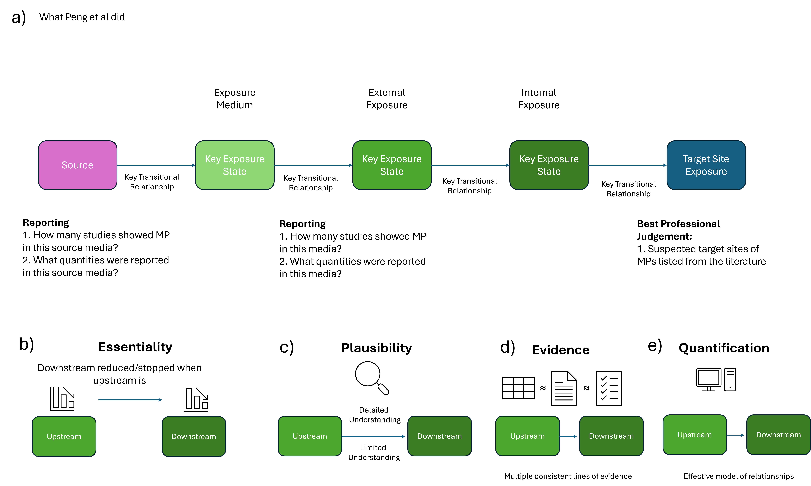

# Establishing a Weight of Evidence Framework

## The State of the Art

The synthesis and integration of diverse scientific evidence requires the understanding and comparison of diverse lines of evidence. The reliability of a line of evidence, its relevance to a given research question, and the consistency between evidence are key factors in weighting its value to an assessment. For it to be reproducible, transparent and comprehensive, the methodology used in making these judgements must be systematic and follow best practice.

Weight of Evidence (WoE) has been identified as an important component of environmental assessments for some time [@agerstrandWeightEvidenceEvaluation2016]. In the European Union, the European Food Safety Authority (EFSA) has been at the forefront of developing a regulatory basis for the use of WoE assessments [@hardyGuidanceUseWeight2017]. At present, this consists of guidance rather than any legal requirement; however, it provides a useful guide for the state of the art of WoE assessment.

## EFSA WoE Framework

[@hardyGuidanceUseWeight2017] breaks down scientific assessment into the following steps:

1)  Problem formulation
2)  WOE:
    1)  Assembling the evidence,
    2)  Weighing the evidence,
    3)  Integrating the evidence.
3)  Uncertainty analysis
4)  Conclusions

## Problem Formulation

(See PRISMA statement)

## Assembling the Evidence

(See lit review protocol)

## Weighting Diverse Evidence

All but the narrowest WoE assessments will likely have to compare different kinds of evidence.

[@hardyGuidanceUseWeight2017] cites [@linkovWeightofevidenceEvaluationEnvironmental2009]'s ranking of WoE approaches, from worst to best:

1.  Listing evidence: Presentation of individual lines of evidence without attempt at integration
2.  Best professional judgement: Qualitative integration of multiple lines of evidence
3.  Causal criteria: A criteria-based methodology for determining cause and effect relationships
4.  Logic: Standardised evaluation of individual lines of evidence based on qualitative logic models
5.  Scoring: Quantitative integration of multiple lines of evidence using simple weighting or ranking
6.  Indexing: Integration of lines of evidence into a single measure based on empirical models
7.  Quantification: Integrated assessment using formal decision analysis and statistical methods.

To the authors' knowledge, no formal WoE framework exists in categories 6-7. However, the report identifies a number of approaches belonging to the different categories. Below, we discuss these approaches and our methodology.

### Causal Criteria

The Bradford Hill considerations [@hillEnvironmentDiseaseAssociation1965] are "widely used, especially in epidemiology", and have been adapted for use in Adverse Outcome Pathway development [@beckerIncreasingScientificConfidence2015] to assess the biological plausibility, empirical support, and essentiality of a given relationship. Within each of these categories an association can be strongly, moderately, or weakly confident, based on the understanding of the underlying mechanism and its role within the wider organism.

The most sophisticated implementation of WoE assessment is in the interactive AOP-helpFinder 3.0 tool [@jayletAOPhelpFinder30Text2025], which assesses quantity of evidence (number of relevant papers) and quality (degree of confidence in the connection, as measured by using Fisher's exact text to compare the representation of a relationship in the overall corpus of relevant papers [@jayletAOPhelpFinder20Integration2023]).

No specific set of WoE guidelines have been developed for Aggregate Exposure Pathways, but the modified Bradford-Hill criteria have been further adapted to the construction of marine microplastic pollution AEPs. [@pengAggregateExposurePathways2022] developed their AEPs by first constructing a putative network based on expert knowledge, then qualifying WoE along the following lines:

- What is the essentiality of a KES (node)

- What is the for a KTR (edge)

  - Theoretical plausibility

  - Empirical support

  - Quantitative understanding



Ok, so clearly "just CREED" isn't going to fly. How do we evaluate our diverse types of evidence against these different criteria?

- Net weights and emissions probably need to be considered as two lines of evidence for the same thing

- Essentiality is tricky - only in few cases can we confidently state "this copper concentration is because of emissions and not natural levels". but we can compare values to background criteria

- Most of our proposed flows are extremely plausible because of the nature of the system we're trying to understand\]

- There are probably models for lots of this stuff, but spending a lot of time looking up i.e. copper emissions models is not something we have time for.

| Evidence Type/Line of Evidence | Essentiality | Plausibility | Empirical Evidence | Quantitative Understanding |
|---------------|---------------|---------------|---------------|---------------|
| Copper Net Weights (REACH) | N/A |  |  |  |
| Copper Emissions (REACH) |  |  |  |  |
| Copper Concentrations (Scientific Literature) | KES~downstream~ will be reduced/will not take place if KES~upstream~ is reduced/stopped.\* | Theoretical knowledge supporting dependent and sequential change of two adjacent KESs. | Empirical data supporting dependent and sequential change of two adjacent KESs, with temporal, spatial and incidence concordance. \* | Quantitative model describing dependent and sequential change of two adjacent KESs. \* |
| Copper Concentrations (Monitoring Data) |  |  |  |  |

: Tabel adapted from Peng et al, in turn adapted from OECD Guidance Document on Developing and Assessing Adverse Outcome Pathways ([OECD, 2018](https://www.sciencedirect.com/science/article/pii/S0043135421010678#bib0054)). \*: criteria directly copied.

### Scoring

Beyond the Bradford Hill criteria used above, we can also draw the recent publication of Criteria for reporting and evaluating exposure datasets (CREED), a framework for the assessment of evidence used in an exposure assessment [@dipaoloImplementationCREEDApproach2024] designed as a counterpart to the toxicity-focused CRED [@moermondCREDCriteriaReporting2016]. By virtue of being recent CREED is relatively unproven (15 citations as of 01.2026), but it has been developed and field tested by an experienced team of ecotoxicologists under the aegis of SETAC, and in any case is better than anything we could reasonably develop ourselves.

CREED presents a set of 19 reliability and 11 relevance questions (with some overlap between questions), that address to what extent a study has been reported with the necessary context, methods, and metadata to interpret the results in the context of a given exposure assessment or research question. (There are other sections: Gateway criteria and Dataset details - but we don't use them here).

At the conclusion, the study is scored on both its Relevance and Reliability. With the aim of not the vast majority of studies, CREED includes two levels, Gold - for papers that report a very high level of data and Silver - for those that report the minimum required quantity. The underlying logic (used in the attached CREED report card spreadsheet) is simple. A study is scored per question from 1-4, and the highest (i.e. worst) score is used for each combination of metal and reliability/relevance.

Although reasonable this means that the final score of a study is slightly difficult to interpret - a study can be Silver or Gold x Reliable and/or Relevant x Not met, with Restrictions, or without Restrictions.

If we want to use these labels quantitatively - and we do - the easiest option is to convert them to numerical scores.

| Score | Reliability | Relevance |
|:----------------:|:----------------------------|:------------------------|
| 5 | GOLD: Reliable without restrictions | GOLD: Relevant without restrictions |
| 4 | GOLD: Reliable with restrictions | GOLD: Relevant with restrictions |
| 3 | SILVER: Reliable without restrictions | SILVER: Relevant without restrictions |
| 2 | SILVER: Reliable with restrictions | SILVER: Relevant with restrictions |
| 1 | SILVER: Not usable | SILVER: Not usable |

: Table for converting CREED reliability and relevance scores into one numeric score per category. Ref: scratchpad_CREED.R.

It would make our lives even easier if we could convert this into a single number. We reach, therefore, for that old standby of the ecotoxicologist: dividing things by other things, even when it doesn't necessarily make sense to do so.

$$\text{CREED Score} = \frac{\text{Reliability Score + Relevance Score}}{10}$$ {#1}

We have, thus created a scoring method. It doesn't cover essentiality, theoretical support, or plausibility of a node... but it does give us a way to score evidence. I think we can call it an incremental improvement on [@pengAggregateExposurePathways2022], if not a paradigm shift.

# Programatic Implementation

Here is a plot of pieces of evidence we have so far.

```{r}
#| label: fig-CREED-scatter
#| fig-cap: Plot of included studies, Relevance score x Reliability score, and sample size.
#| include: false

suppressPackageStartupMessages({
  library(ggrepel)
  library(targets)
  library(tidyverse)
})
tar_load(names = c(creed_scores_data, measurements_data))
creed_sample_size <- creed_scores_data |>
  left_join(
    measurements_data |>
      group_by(REFERENCE_ID) |>
      reframe(Sample_Size = sum(MEASURED_N, na.rm = TRUE))
  ) |>
  select(-source_file, -read_timestamp)

woe_summary <- creed_sample_size |>
  mutate(
    highest_reliability = case_when(
      GOLD_RELIABILITY == "Reliable without restrictions" ~ 5,
      GOLD_RELIABILITY == "Reliable with restrictions" ~ 4,
      SILVER_RELIABILITY == "Reliable without restrictions" ~ 3,
      SILVER_RELIABILITY == "Reliable with restrictions" ~ 2,
      SILVER_RELIABILITY == "Not usable" ~ 1,
      .default = NA
    ),
    highest_relevance = case_when(
      GOLD_RELEVANCE == "Relevant without restrictions" ~ 5,
      GOLD_RELEVANCE == "Relevant with restrictions" ~ 4,
      SILVER_RELEVANCE == "Relevant without restrictions" ~ 3,
      SILVER_RELEVANCE == "Relevant with restrictions" ~ 2,
      SILVER_RELEVANCE == "Not usable" ~ 1,
      .default = NA
    ),
    creed_quotient = (highest_reliability + highest_relevance) / 10,
    log_sample_size = log10(Sample_Size),
    reference_pretty = str_replace(
      REFERENCE_ID,
      "^(\\d{4})([A-Z][a-z]*).*",
      "\\2\n(\\1)"
    )
  )

woe_summary |>
  group_by(highest_relevance, highest_reliability) |>
  mutate(
    n_in_cell = n(),
    cell_id = row_number(),
    # Create a grid within each cell
    grid_cols = ceiling(sqrt(n_in_cell)),
    x_offset = ((cell_id - 1) %% grid_cols) / (grid_cols + 1) - 0.3,
    y_offset = floor((cell_id - 1) / grid_cols) / (grid_cols + 1) - 0.3
  ) |>
  ungroup() |>
  ggplot(aes(
    x = highest_relevance + x_offset,
    y = highest_reliability + y_offset,
    size = Sample_Size,
    color = creed_quotient,
    label = reference_pretty
  )) +
  # Background rectangles for categories (drawn first so points appear on top)
  # Silver zone: 2-3 (inclusive on both ends based on your description)
  annotate(
    "rect",
    xmin = 2,
    xmax = 3,
    ymin = 0.5,
    ymax = 5.5,
    fill = "grey70",
    alpha = 0.3
  ) +
  annotate(
    "rect",
    xmin = 0.5,
    xmax = 5.5,
    ymin = 2,
    ymax = 3,
    fill = "grey70",
    alpha = 0.3
  ) +
  # Gold zone: >3 to 5
  annotate(
    "rect",
    xmin = 3,
    xmax = 5.5,
    ymin = 0.5,
    ymax = 5.5,
    fill = "gold",
    alpha = 0.3
  ) +
  annotate(
    "rect",
    xmin = 0.5,
    xmax = 5.5,
    ymin = 3,
    ymax = 5.5,
    fill = "gold",
    alpha = 0.3
  ) +

  geom_point(alpha = 0.8) +
  geom_text_repel(size = 3, max.overlaps = 20, color = "black") +

  scale_size_continuous(range = c(2, 12), trans = "log10") +
  scale_color_viridis_b(begin = 0, end = 1) +
  scale_x_continuous(breaks = 1:5, limits = c(0.5, 5.5)) +
  scale_y_continuous(breaks = 1:5, limits = c(0.5, 5.5)) +

  labs(
    x = "Relevance",
    y = "Reliability",
    size = "Sample Size",
    color = "CREED Quotient \n(Relevance + Reliability)/10"
  ) +
  theme_minimal()

```