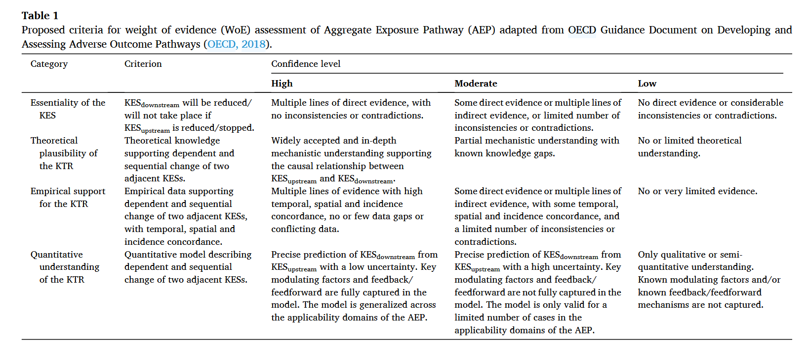

I wanna aim for [ES&T](https://pubs.acs.org/journal/esthag), with IEAM as a backup. Honestly, I hate the IEAM submission experience.

ES&T:

1.  Has a publication agreement with NIVA
2.  Has a good IF
3.  Has ecotox, data science, and occurence/fate/transport of aquatic contaminants in scope

The downside is that it's rather slow to review manuscripts. But I don't think I'm in a great hurry. According to Kanalregisteret:

I think this is fine?

# Guidelines/Requirements

- Figures, charts, tables, schemes, and equations should be embedded in the text at the point of relevance (hell yes)

- References can be provided in any style

- Title, Abstract, Authors, Refs, SI

- There's a submission checklist, but the requirements are generally a lot less awkward than SETAC journals

- multi-panel figures exceeding 4 panels should be avoided

- Some additional notes for research articles:

  - 7000 words

  - "An **assessment of uncertainty or sensitivity analysi**s should be included in reported data where applicable, with adequate quality assurance/quality control reported. New analytical methods should be thoroughly developed and quality ensured."

  - **findings should not be location specific representing a case study**, but rather generalizable and/or transferable to other contexts.

- and review articles:

  - 10,000 words

- abbreviations

- double spacing