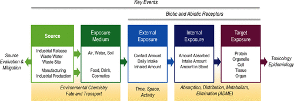
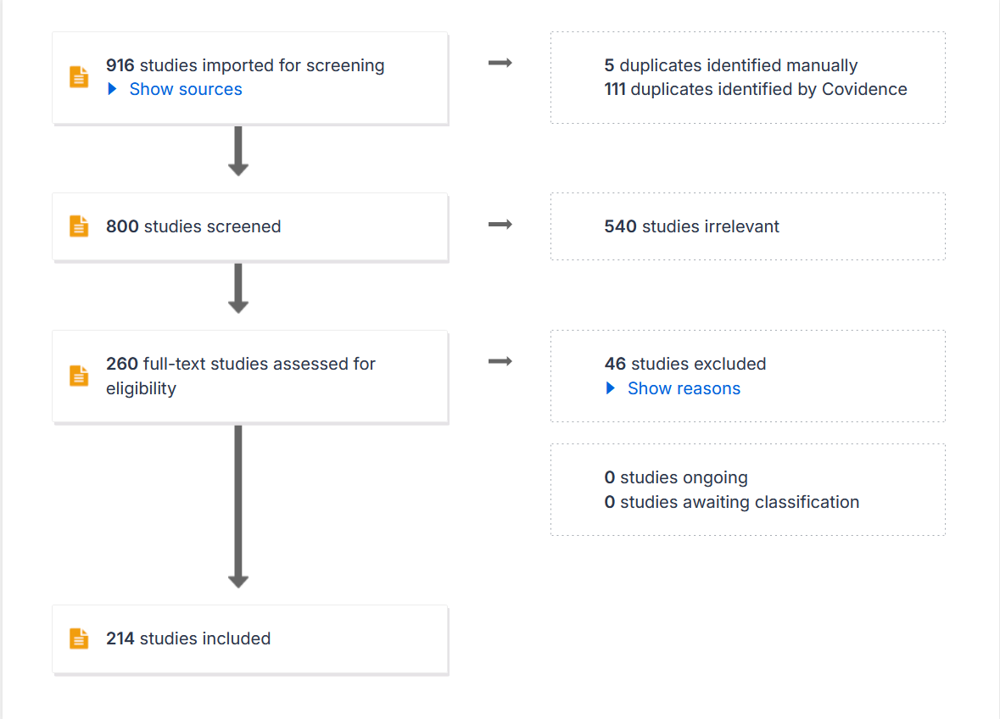

# Introduction

::: callout-important
## Please see the notebooks (especially Visualisation) for the most up-to-date changes.

I've taken the slightly unusual step of sharing this manuscript as a website. I know we're all used to word documents, but this spares me the effort of having to paste in new graphs every time I update the analysis (which is often). As most of the work is currently (mid Jan 2026) technical, the most frequently updated sections are the various notebooks (in the sidebar). Once I feel an area of analysis is mature, I'll choose the most informative bits and write up a summary in the main manuscript.

If you want to leave a comment on something, you can do so using the panel to the far right (click the little eye button). I've never used this service before but I hope it will be a satisfactory alternative to Word's comments feature.
:::

Copper is a vital resource in both biology and engineering due to its useful chemical and biological properties. Demand for copper is likely to grow significantly in coming decades due to demand in manufacturing and infrastructure [@schipperEstimatingGlobalCopper2018].

Biota sensitivity to copper is highly variable and depends on diverse factors including water chemistry, availability of biological material, salinity, pH, and individual organism physiology, metabolism, and behaviour. In addition to its natural occurence, copper is emitted to the environment in a wide range of products and forms, which may be of greater or lesser relevance to the environment depending on their transport in the environment.

Norway's economically important Arctic region is likely to come under increased pressure in coming years. Demand for copper is likely to drive increased mining in mineral rich zones. Melting sea ice will increase the feasibility of cross-Arctic shipping [@smithNewTransArcticShipping2013], likely increasing exposure to copper from antifoulant paints, while a growing demand for aquaculture may also drive use of copper-based antifoulants. Terrestrial biocides, brake dust, and natural weathering will likely also continue to add to pollution. In addition, changes to ecology, nutrient cycling, organic material, and the overall stressor landscape are likely to add to the challenges faced by the wildlife of the Norwegian sea and the industries and people that rely on them.

## The Aggregate Exposure Pathway

The Aggregate Exposure Pathway [@teeguardenCompletingLinkExposure2016] concept was developed in 2016 as an exposure, fate and behaviour-based counterpart to the Adverse Outcome Pathway [@ankleyAdverseOutcomePathways2010] for organising and analysing the total exposure of a given stressor to an organism of interest in a specific spatial and temporal context. AOPs are conceptualised as a network connecting exposure to a toxicant (a Molecular Initiating Event, MIE) to a deleterious biological effect (Adverse Outcome, AO) through a series of mediating Key Events (KEs, network nodes) and Key Event Relationships (KERs, network edges).

The AEP then ends where the AOP begins, logically completing the chain of events that (potentially) caused the MIE to begin with. AEPs consist of a series of Key Exposure States (KES, the state of a stressor in space and time) linked by Key Transitional Relationships (KTR, the transport or transformation of stressors) that link the source and Target Site Exposure (TSE), a biological entity (biomolecules, cells, tissues, etc.) where an MIE may occur.



A few key differences:

-   AOPs are generally stressor-agnostic. AEPs aren't.

-   

AOPs have seen a rapid uptake in the ecotoxicological community at both the grass-roots and international scale, and to date 561 AOPs are available on the AOP Wiki of which (42) have been endorsed (what does WHPA... endorsed mean?) [@societyforadvancementofaopsAOPwikiV272026]. The OECD offers a program for AOP creation (details needed), while the EU/Norwegian government does... what do they do?

By contrast, the AEP concept has seen less adoption, with 21 (?) papers mentioning and 15? employing the concept ([@tbl-aep-review]) found in 2025. This is perhaps due to the signficant scale and uncertainty of AEPs compared to AOPs, as in any ecotoxicological setting they may have to deal with geographically massive and kinetically homogenous KES and KTR. The small number of relevant papers we found may also be an artifact of people doing very similar things in a different methodological framework - or with different vocabulary - but if this is the case, we're not aware of it. Certainly the AEP is not the first conceptual model to treat the environment as a series of nodes and edges, and it may be a solution looking for a problem.

```{r}
#| label: tbl-aep-review
#| tbl-cap: Table condensed from the output of an mini literature review on the use of the AEP concept. Uncertain whether to keep it here in its current form, as it's rather bulky. May summarise in text and move to SI.

suppressPackageStartupMessages({
  library(readr)
  library(gt)
  library(dplyr)
})

aep_literature_review_table <- read_csv(
  "data/clean/aep_literature_summary_claude.csv",
  show_col_types = FALSE
) |>
  select(-`Paper ID`)

aep_literature_review_table |> gt::gt()
```

The Source to Outcome Pathway concept attempts to unify these two models by... KET is probably best-placed to write this section.

## Weight of Evidence and Uncertainty

The diverse range of uncertainties intrinsic to such a large-scale project deserve focused discussion. The concept of Weight of Evidence (WoE) has been formalised (cite) to provide a consistent terminology for discussing the relative value of difference types and pieces ("lines") of evidence.

Within ecotoxicology, the primary

We identify the following types of uncertainty in this work: - missing data: areas where insufficient data is available on a KES or KTR to know if it exists - weak data: data on a KES or KTR is insufficiently reliable or relevant to

Although uptake has not yet matched that of the AOP, AEPs are a valuable tool for understanding complex patterns of exposure such as copper's. Properly integrated, AOPs and AEPs together can provide deep insight into the current and potential evolution of chemical risk.

## Copper's Environmental Chemistry

-   Speciation chemistry
-   Bioavailability
-   Dynamics in terrestrial, marine and freshwater environments
-   Air?

## Copper as a Nutrient and Toxicant

Life on Earth has evolved alongside copper as both a stressor and potentially useful element, and a wide variety of both copper-containing proteins and copper-protective proteins have been found across the kingdoms of life [@festaCopperEssentialMetal2011]. Both its utility and toxicity stem from its oxidation and binding dynamics, which make it both a useful structural element in protein design, as well as a source of oxidative stress in the cell [@festaCopperEssentialMetal2011]. This long and consistent exposure has driven organisms to develop a diverese range of effective mechanisms for controlling internal copper concentrations in response to a changing external environment. By precise control of copper concentrations in different tissues or parts of the cell, organisms reduce oxidative stress in sensitive areas but increase it where a "hostile environment" can be useful, such as within bacteriacidal macrophages [@focarelliCopperMicroenvironmentsHuman2022]. This rich, nuanced and complex set of interactions make copper both an interesting and difficult object of study. Organisms have been shown to regulate copper uptake and detoxification to maintain homeostasis along a copper gradient [@vandenberghePosttranslationalRegulationCopper2010, @penaDelicateBalanceHomeostatic1999], which in a ecotoxicological context makes linear assumptions of bioaccumulation hard to justify.

However, the relative ease of sourcing, working with, and analysing copper has made it a popular "classical" stressor in ecotoxicology.

-   Cite some of those AOP papers about copper toxicity, the BLM, etc.

-   Different species tolerance, different stratgegies (maybe)

-   But there are some that are surprisingly sensitive to copper

-   Metallotheins [@amiardMetallothioneinsAquaticInvertebrates2006]

-   Interactions with other stressors e.g. @lealCopperPollutionExacerbates2018

## The Near Arctic

-   The Arctic has long been the home to relatively few people, terra nulla or w/e
-   How biodiverse is it?
-   Resource extraction - especially mining - has long been one of the key pillars of the arctic economy \[\@arcticcouncilEconomyNorthECONOR2025\]

### Global Change in Arctic Regions

-   <https://www.vannportalen.no/miljotiltak/nedlagte-gruver/>First technological development and now also climate change are opening arctic regions up to exploitation
-   Also more activity in near arctic
-   War?

## Drivers of Copper Demand, Extraction, and Emission

-   Copper is very useful because it's very conductive and easy to extract
    -   Also used in:
    -   Pipes
    -   Roofing
    -   Antifoulants [@brooksCopperBiocidesMarine2009]
    -   Fruit orchards
    -   Cars
    -   Old mine waste @nedlagte
    -   Infrastructure
    -   Also a naturally occuring nutrient in soil/rock & therefore in ocean
    -   etc. (need to cite Stien's paper loads here)
-   How many tonnes of copper are embedded in our current stuff?
-   I've got to guess that recycling copper from microcircuitry is expensive
-   Cite that paper that uses LMs to extrapolate future copper demand
-   Electrification, more stupid gadgets
-   Growing interest in indigenous copper resources as a strategic asset - c.f. horse trading over Nussir in Norway @nussirasaNUSSIRProjectOverview2024
-   Historically copper hasn't been mined in Norway since 1980s (?), but there's still a legacy of pollution

# Materials and Methods

An exhaustive version of the materials and methods are provided in the notebooks and appendices included. These are summarised below.

## Data Selection

### Literature Review Protocol

A systematic literature review framework was developed from the PRISMA2020 framework (@pagePRISMA2020Statement2021). As PRISMA2020 is primarily concerned with intervention-based studies, some work was required to adapt to the scope and exigencies of an ecotoxicological exposure assessment. For the full PRISMA checklist of this paper please consult (the relevant Notebook), but in summary: ...

#### Databases and Search Terms

| Source | Date Searched | Hits | Comments |
|----------------|-------------------------|----------------|----------------|
| [Crossref](https://www.crossref.org/) | Excluded |  | Doesn't support Booleans. |
| [Scopus](https://www.scopus.com/home.uri) | Excluded |  | No institutional access. |
| [Web of Science](https://www.webofscience.com) | 2025.06.24 | 218 | [Query link](https://www.webofscience.com/wos/woscc/summary/9c9af98d-7ee8-4163-9d48-93dd4cb52b6f-0166a1b51b/relevance/1). Topic (title, abstract, keyword plus, and author keywords) search. Searching all fields returned 750 hits. |
| [PubMed](https://pubmed.ncbi.nlm.nih.gov/26759916/) | 2025.06.24 | 284 | Keyword search [Query link](https://pubmed.ncbi.nlm.nih.gov/?term=((copper%20OR%20Cu%20OR%20copper%20OR%20cuprous%20OR%20cupric%20OR%20kobber%20OR%20coper%20OR%207440-50-8)%20%0D%0AAND%20(Barents%20OR%20Norwegian%20OR%20Arctic%20OR%20Svalbard%20OR%20Greenland*)%0D%0AAND%20(wildlife%20OR%20ecotox*%20OR%20biota%20OR%20environment*%20OR%20animal%20OR%20ecosystem*)%20%0D%0AAND%20(emission%20OR%20exposure%20OR%20fate%20OR%20behaviour%20OR%20concentration%20OR%20dose%20OR%20chem*%20OR%20bioaccumul*%20OR%20trophic)%20%0D%0AAND%20(aqua*%20OR%20water*%20OR%20marine%20OR%20river%20OR%20lake%20OR%20fjord%20OR%20estuary%20OR%20sea%20OR%20ocean%20OR%20sediment*%20OR%20soil)%0D%0A)%20AND%20((%222010%2F01%2F01%22%5BDate%20-%20Publication%5D%20%3A%20%223000%22%5BDate%20-%20Publication%5D))&sort) |
| Semantic Scholar | Excluded | 1 | Issues with search, only returned 1 hit. Dropped as is unlikely to include papers not already covered by PubMed and Web of Science. |
| OpenAlex | Excluded |  | Doesn't support OR Boolean. |

: nb: not up to date

#### Inclusion and Exclusion Criteria

Once a dataset of potentially relevant papers was compiled, the web review platform Covidence [@veritashealthinnovationHowCanCite2025] was used to coordinate screening between the spatially separate reviewers. Of the 916 imported papers, 116 duplicates were removed, 540 studies marked as irrelevant based on abstract screening, and 46 studies were excluded after full text screening, resulting in a set of 214 manuscripts for data extraction. The decision was then taken to reduce this set of papers further to the most useful subset; papers were rated arbitrarily on a scale of 1 (least relevant) to 5 (most relevant) based on a single reviewer's holistic assessment of their relevance and utility to the research question. The reviewers then proceeded from the highest-ranked papers (ordered by score then alphabetically), began data extraction from all papers with a score of 4 or 5 (n in total, y% of ...).

{width="500"}

#### Screening

#### Data Extraction

### Weight of Evidence Assessment

A need to compare diverse types of evidence was identified... @hardyGuidanceUseWeight2017.

### CREED Assessment

-   Cite CRED also @moermondCREDCriteriaReporting2016
-   Has anyone else cite CREED yet?

### Other datasets

Maybe a big table for these?

#### Regional Geography & Boundaries

-   IHO Oceans
-   RNatural Earth maps

#### Copper Sources

-   Norske utslipp
-   Kværnes et al STP data
-   Fiskerdirektoriet data

#### Ecosystems & Trophic Levels

## Data Processing and Validation

## Data Analysis

# Results

# Discussion

# Conclusion

# References