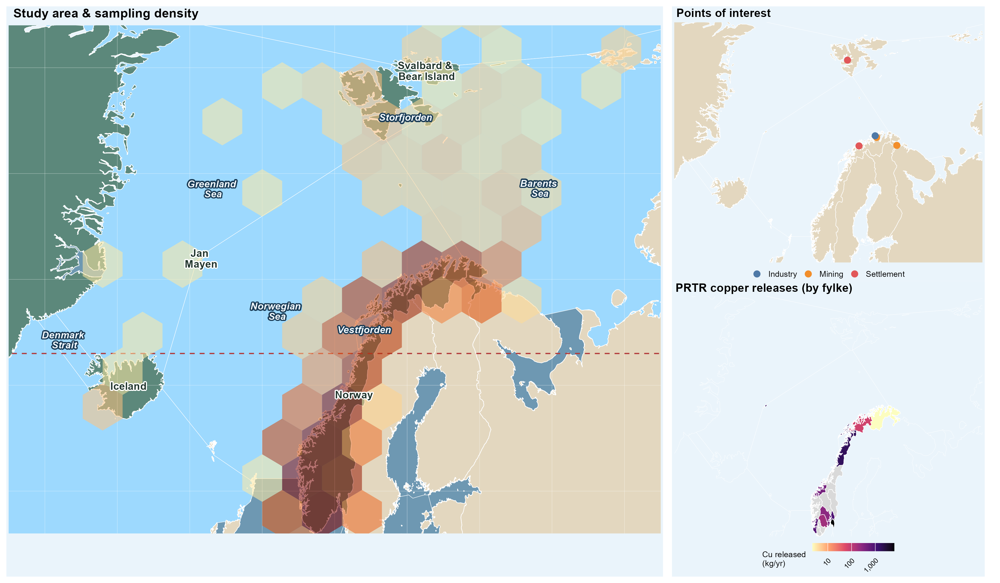
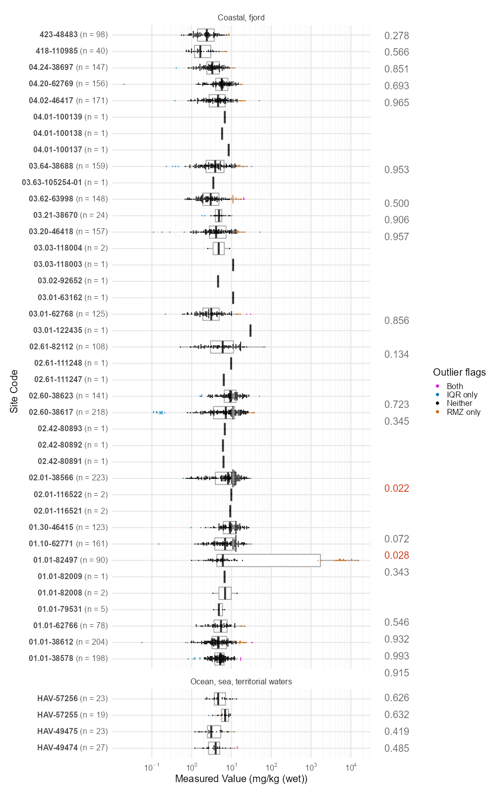
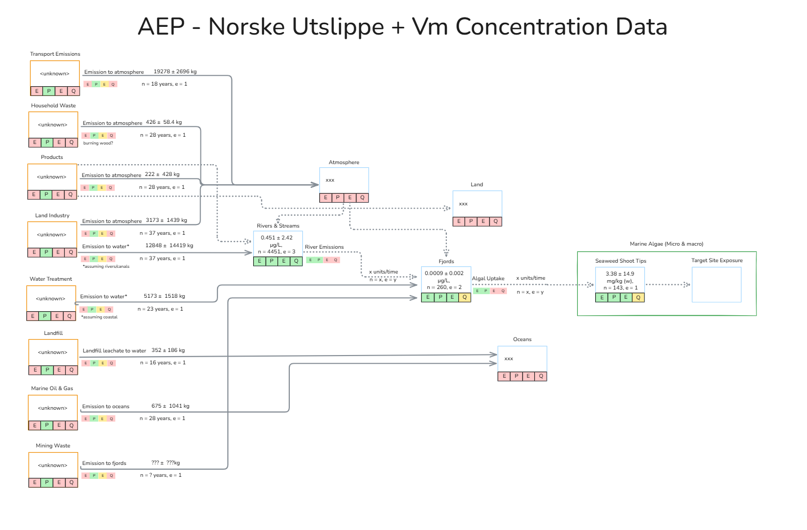

# Introduction

```{r}
#| label: setup
#| include: false
#| warning: false

library(targets)
library(here)
library(tidyverse)
library(flextable)
pkgload::load_all(quiet = TRUE) # sample_groups_flextable() etc.

here::i_am("index.qmd")
```

**Comment: Based on the eData manuscript I imagine a lot of this should be in the discussion. Would welcome your guidance on the most important messages here, I will summarise and move the rest. Language will be made more formal in time.**

Copper is a vital nutrient across the tree of life (cite), a much needed raw resource in manufacturing and infrastructure (especially electrical), and a potentially serious environmental pollutant (cite). Demand for copper is likely to grow significantly in coming decades [@schipperEstimatingGlobalCopper2018], while climate change will open new regions for resource exploitation (cite), industry (cite), and transport [@smithNewTransArcticShipping2013].

Copper is a well-studied pollutant, and has been the subject of numerous monitoring campaigns in and around the Arctic for many years (cite), as well as extensive laboratory and modelling work (cite). In general, copper is viewed as a low-priority stressor compared to persistent organic pollutants and mercury (cite), due to its generally lower toxicity (cite) and weak bioaccumulation. Some hotspots have been identified where due to emissions and/or physico-chemical properties copper may have adverse effects on organisms. However, much existing data are focused on more southerly species and regions. As Artic regions undergo rapid warming, land use change, and potentially increased anthropogenic stress, copper's adverse effects as a pollutant may grow. Identifying existing distributions and data gaps is crucial to protecting this rapidly changing wilderness.  

## Aggregate Exposure Pathways

**A lot of background on AEPs *and* AOPs here. unnecessary? on the other hand, most people haven't heard of AEPs but probably have heard of AOPs. not sure how to balance audience between exposure scientists, ecotoxicologists**

The Aggregate Exposure Pathway (AEP) [@teeguardenCompletingLinkExposure2016, @tanAggregateExposurePathways2018] concept was developed in 2016 as an exposure-based counterpart to the Adverse Outcome Pathway. AOPs assemble evidence to causally link the biological effects of stressors in organisms. AEPs do the same for the emission, transport and fate of stressors in the environment, up until the point they reach sensitive tissues or organs in selected organisms [@fig-aep-intro].

{#fig-aep-intro}

AEPs consist of a series of Key Exposure States (KES, the state of a stressor in space and time) linked by Key Transitional Relationships (KTR, the transport or transformation of stressors) that link the source and Target Site Exposure (TSE), a biological entity (biomolecules, cells, tissues, etc.) where an MIE may occur. No specific set of WoE guidlines have been developed for AEP , but the modfied Bradford-Hill criteria have been further adapted to the construction of marine microplastic pollution AEPs [@pengAggregateExposurePathways2022].

Linkages between nodes are created on from a putative relationship by applying a number of Weight of Evidence (WoE) criteria. [@beckerIncreasingScientificConfidence2015] advises the use a modified form of the Bradford-Hill epidemiological criteria [@hillEnvironmentDiseaseAssociation1965] to assess the biological plausibility, empirical support, and essentiality of a given KER. Within each of these categories an association can be strongly, moderately, or weakly confident, based on the understanding of the underlying mechanism and its role within the wider organism.

<!-- Messy at the moment, needs rewrite -->


A few key differences:

-   AOPs are generally stressor-agnostic. AEPs aren't.
-   Existing AEPs (cite sources from mini-review) are generally human-based and often focus on specific scenarios (e.g. Korean humidifier disinfectant case)
-   Adapted-Bradford-Hill doesn't apply so well to environental dynamics as it does to cellular stuff

AOPs have seen a rapid uptake in the ecotoxicological community at both the grass-roots and international scale, and to date 561 AOPs are available on the AOP Wiki of which (42) have been endorsed (what does WHPA... endorsed mean?) [@societyforadvancementofaopsAOPwikiV272026]. 

By contrast, the AEP concept has seen less adoption, withn a mini-review in 2025 (see SI) finding 21 papers mentioning and 15 employing the concept. This is perhaps due to the signficant scale and uncertainty of AEPs compared to AOPs, as in any ecotoxicological setting they may have to deal with geographically massive and kinetically homogenous KES and KTR. The small number of relevant papers we found may also be an artifact of people doing very similar things in a different methodological framework - or with different vocabulary - but if this is the case, we're not aware of it. 

The Source to Outcome Pathway concept attempts to unify these two models by... 

**KET: Please draft some bullet points on STOP**.

## Copper as a stressor

Life on Earth has evolved alongside copper as both a stressor and potentially useful element, and a wide variety of both copper-containing proteins and copper-protective proteins have been found across the kingdoms of life [@festaCopperEssentialMetal2011]. Both its utility and toxicity stem from its oxidation and binding dynamics, which make it both a useful structural element in protein design, as well as a source of oxidative stress in the cell [@festaCopperEssentialMetal2011]. This long and consistent exposure has driven organisms to develop a diverese range of effective mechanisms for controlling internal copper concentrations in response to a changing external environment. By precise control of copper concentrations in different tissues or parts of the cell, organisms reduce oxidative stress in sensitive areas but increase it where a "hostile environment" can be useful, such as within bacteriacidal macrophages [@focarelliCopperMicroenvironmentsHuman2022]. This rich, nuanced and complex set of interactions make copper both an interesting and difficult object of study. Organisms have been shown to regulate copper uptake and detoxification to maintain homeostasis along a copper gradient [@vandenberghePosttranslationalRegulationCopper2010, @penaDelicateBalanceHomeostatic1999], which in a ecotoxicological context makes linear assumptions of bioaccumulation hard to justify.

However, the relative ease of sourcing, working with, and analysing copper has made it a popular "classical" stressor in ecotoxicology.

-   Cite some of those AOP papers about copper toxicity, the BLM, etc.

-   Different species tolerance, different stratgegies (maybe)

-   But there are some that are surprisingly sensitive to copper

-   Metallotheins [@amiardMetallothioneinsAquaticInvertebrates2006]

-   Brief mention of interactions with other stressors e.g. @lealCopperPollutionExacerbates2018

Copper's biological properties are a consequence of its speciation/electrochemistry - this also makes its environmental behaviour very variable:

-   Speciation chemistry
-   Bioavailability (dissolved, LLM fractions, etc.)
-   Dynamics in terrestrial, marine and freshwater environments
    - Average/background copper in oceans, rock
    - Sedimentation as main sink for oceanic copper

## Global Change and Resource Use in Arctic Regions

- Arctic new geopolitical flashpoint, source of raw resources, open to transport
-   Resource extraction - especially mining - has long been one of the key pillars of the arctic economy [@arcticcouncilEconomyNorthECONOR2025\]
- Biodiverse, lots of species that are only found in this area, long generation times (cite some of the sources to EXPECT)
- Copper crucial for green shift, potentially also transport, infrastructure, antifoulant [@schipperEstimatingGlobalCopper2018]
-   Growing interest in indigenous copper resources as a strategic asset - c.f. horse trading over Nussir in Norway @nussirasaNUSSIRProjectOverview2024


# Materials and Methods

An exhaustive version of the materials and methods are provided in the notebooks and appendices included. Materials and methods are summarised below.

**Probably too many section headers. Will keep them for now as they help me organise my thoughts, and remove once closer to final version. Some sections copied from eData MS, will be written to avoid auto-plagiarism.**

## Exposure Dataset

### Literature Review Protocol

A systematic literature review framework was developed from the PRISMA2020 framework (@pagePRISMA2020Statement2021). As PRISMA2020 is primarily concerned with intervention-based studies, some work was required to adapt to the scope and exigencies of an ecotoxicological exposure assessment. 

### Databases and Search Terms

The following search string was used in all open literature sources. The * character is a wildcard and is used to match against common prefixes. The software Publish or Perish 7 was used to assist in database searches. 

```txt
(copper OR Cu OR cuprous OR cupric OR kobber OR coper OR 7440-50-8) 
AND (Barents OR Norwegian OR Arctic OR Svalbard OR North Atlantic OR Greenland*)
AND (wildlife OR ecotox* OR biota OR environment* OR animal OR ecosystem*) 
AND (emission OR exposure OR fate OR behaviour OR concentration OR dose OR chem* OR bioaccumul* OR trophic) 
AND (aqua* OR water* OR marine OR river OR lake OR fjord OR estuary OR sea OR ocean OR sediment* OR soil)
```

Web of Science returned 478 hits.
PubMed returned 438 hits.

### Inclusion, Exclusion, Deduplication and Screening

**Text on explicit inclusion criteria/study area will go here.** The study area is shown in @fig-study-area.

{#fig-study-area}

Once a dataset of potentially relevant papers was compiled, the web review platform Covidence [@veritashealthinnovationHowCanCite2025] was used to coordinate screening between the spatially separate reviewers. 

1) 111 duplicates were automatically matched and removed
2) 5 duplicates were manually matched and removed
3) 800 studies were screened at the title and abstract level by two reviewers. 540 were excluded as irrelevant.
4) 260 studies were screened at the full text level by one of two reviewers. 46 were excluded as irrelevant.
5) The remaining 214 studies were ranked informally from 1-5 (5 being highest) based on their perceived quality and relevance. The 58 papers given a score of 4 or 5 were selected as an initial batch of studies for extraction.
6) Of these 58 papers, 32 had data extracted. 18 were rejected based on missing data or irrelevance. 8 papers remain in the progress of extraction at the time of writing. 
7) Extraction was carried out by one of three reviewers using the eData application. No blinding was conducted, and reviewers were free to discuss and reach consensus.

The full PRISMA flow is shown in @fig-prisma. Study screening was conducted using the following exclusion criteria. Where a study met multiple criteria for inclusion, only the first criterion was recorded. Some criteria were based on the Criteria for Reporting and Evaluating Exposure Datasets (CREED) Gateway Criteria [@dipaoloImplementationCREEDApproach2024]. These have been coded as CREED-n. 

1) CREED-1: sampling medium/matrix not specified
2) CREED-2: copper-based analytes/chemistry parameters not specified
3) CREED-3: spatial location not specified
4) CREED-4: sampling period not specified
5) CREED-5: measurement units not specified
6) CREED-6: data source not specified
7) out of geographical study area
8) paper not in English
9) full text not available

{#fig-prisma width="500"}

### Screening

Of the 916 imported papers, 116 duplicates were removed, 540 studies marked as irrelevant based on abstract screening, and 46 studies were excluded after full text screening, resulting in a set of 214 manuscripts for data extraction. The decision was then taken to reduce this set of papers further to the most useful subset; papers were rated arbitrarily on a scale of 1 (least relevant) to 5 (most relevant) based on a single reviewer's holistic assessment of their relevance and utility to the research question. The reviewers then proceeded from the highest-ranked papers (ordered by score then alphabetically), began data extraction from all papers with a score of 4 or 5 (n in total, y% of ...).

### Data Extraction & Validation

- Data were extracted from manuscripts using the *eData* shiny application (cite paper once ready)
- LLM extraction, human validation
- Raw data pointblank-validated to final version (cite eData MS), then manually QC'd by a review
- All tables merged together into single one
- organised as unique compartments and sites

### Data Post-Processing

Samples were grouped by *Environmental compartment*, *environmental subcompartment*, *Site geographical feature* and *sub-feature*, and, in the case of biota, *species* and *tissue*. For each sample grouping, sample size, mean, median, standard deviation, number of outliers meeting *both* Tukey Fences ($Z >= 1.5$) and Robust-Modified Z-Score ($Z >= 3.5$), and Hartigan's dip test statistics ($P <= 0.05$) were calculated.

#### Tests for Outliers

The Tukey fence method (@schwertmanIdentifyingOutliersSequential2007, originally @tukeyExploratoryDataAnalysis1977 but latter not available online) flags values that fall more than $1.5 \times IQR$ beyond the first or third quartile of the log-transformed values, where $IQR = Q_3 - Q_1$. Specifically, a value $x_i$ is flagged if:

$$
\log_{10}(x_i) < Q_1 - 1.5 \cdot IQR \quad \text{or} \quad \log_{10}(x_i) > Q_3 + 1.5 \cdot IQR
$${#eq-tukey}

We apply fences to log-transformed values because concentrations are approximately log-normally distributed (cite).

Tukey recommends using 1.5 or 3 times the IQR as thresholds depending on the desired degree of conservatism. We elect to use 1.5, as although this may increase the false positive rate, it is also more sensitive to outliers when the distribution is largely log-normal but with a long right tail.

The Robust Modified Z-Score (RMZ) is a median-based analogue of the standard Z-score that is more resistant to the influence of extreme values [@iglewiczHowDetectHandle1993; @leysDetectingOutliersNot2013], at the cost of being less appropriate for truly normal distrubtions.

For a value $x_i$ in a group with median $\tilde{x}$, it is defined as:

$$
\text{RMZ}_i = \frac{x_i - \tilde{x}}{\text{MAD}}
$${#eq-rmz}

where $\text{MAD} = \text{median}(|x_i - \tilde{x}|)$ is the median absolute deviation. In R, `mad()` already scales MAD by a consistency factor ($\approx 1 / 0.6745$) to make it comparable to the standard deviation under normality

@iglewiczHowDetectHandle1993 recommends a threshold of $|\text{RMZ}| > 3.5$ for outliers, and we have no reason to depart from this recommendation.

#### Test for Non-Unimodal Distributions

To identify groups whose distribution may be multimodal, which can indicate a mixture of genuinely distinct populations rather than a single skewed distribution, we apply Hartiigan's Dip Test via the R package `diptest` [@maechlerDiptestHartigansDip2025]. This provides a statistical adjunct to visual inspection of distributions useful for flagging. Its precise description can be found in @HartiganDipTestUnimodality1985, but in essence it compares the difference between the cumulative density function of a normal distribution and the sample distribution; with a larger "dip" between the former and the latter indicating the "wobbly" cumulative distribution indicative of a multimodal distribution.

The test returns a p-value for the null hypothesis of unimodality; small p-values suggest the distribution is not unimodal. We use $p < 0.05$ as a standard threshold. 

Data were grouped by combinations of , date, study, and in the case of biotic samples, Species and tissue, and distributions plotted, in order to visually review data. 


- Outliers were visually inspected
- Metadata and comments were reviewed
- Unless there was a convincing argument not to, outliers were removed
- We report both robust and non-robust summary statistics (median, mean ± sd) below, and use them for comparisons 

## Other Lines of Evidence

- REACH emissions data
- REACH PRTR
- Background copper concentrations & thresholds
- Potentially a table summarising sources and processing, depending on needs/table limits
- Gap-filling evidence: ad hoc manuscript used to fill gaps where copper presence was suspected but not described in our dataset

### Weight of Evidence Assessment

- A need to compare diverse types of evidence was identified... @hardyGuidanceUseWeight2017.

- WoE allows integration of multiple lines of evidence
  - Our primary one was our literature exposure dataset
  - Secondaries: REACH emissions data, REACH product transfer registry, etc.

- Ultimate question to answer: does a measured copper concentration distribution accurately represent the matrix in question?
- Does that matrix represent "pollution"?
  - both on the basis of: is it a natural occurence? and does it reach thresholds of concern (not the focus of this paper, but included)
  - For KTRs: is this flow a relevant source of copper for the receiving matrix? is it a relevant sink of copper for the upstream matrix?

We adapted [@pengAggregateExposurePathways2022]'s WoE criteria (based on [@oecdUsersHandbookSupplement2018; @hillEnvironmentDiseaseAssociation1965]) to score each of our putative KES and KTRs. CREED's in there somewhere, too. The criteria are summarised in @tbl-woe-criteria.


```{r}
#| label: tbl-woe-criteria
#| tbl-cap: "Weight of Evidence criteria adapted from Peng et al. (2022), OECD (2018), CREED, and Bradford Hill (1965). **Work in progress.**"
#| echo: false

tibble::tribble(
  ~Criterion                    , ~Category , ~Description , ~`Strength levels`         ,
  "Biological plausibility"     , ""        , ""           , "Weak / Moderate / Strong" ,
  "Empirical support"           , ""        , ""           , "Weak / Moderate / Strong" ,
  "Essentiality"                , ""        , ""           , "Weak / Moderate / Strong" ,
  "Dose/concentration response" , ""        , ""           , "Weak / Moderate / Strong" ,
) |>
  knitr::kable()
```

# Results

*Below table is obviously very big. Can be split into biota and non-biota? Or could summarise again? Also, do we need to add/remove any checks, e.g. AIC of normal vs. log-normal distributions*

## Group Summary Statistics.

<!-- TODO: n thresholds for Hartigans. Also dynamic update group/sample n slice reporting-->

```{r}
#| label: tbl-groups-summary
#| tbl-caption: tbc

# Same target as docs/NBXX-Sample-Groups.qmd, filtered to the large groups.
# Highlight indices are recomputed inside sample_groups_flextable(), so they
# stay aligned after this filter.
tar_read(sample_groups_table) |>
  filter(n >= 100) |>
  sample_groups_flextable()
```


## Distributions

- Overall top-down view of dataset and general distribution patterns
- More detailed, broken-down versions of plots will be in SI

An example KTR plot is shown in @fig-ktr-example.

{#fig-ktr-example}

## AEPs

# Fish AEP

- Depending on how the fish distributions look I may lump them all together
- I assume there's not going to be a lot of variance between species, and we already know most of our data is cod livers
- If it's relevant to distinguish between fish with different life styles/types of feeding I will cross that bridge when we get to it
- What are the most important sources of copper to fish? Spatial, temporal patterns, etc (Based on cod liver data I don't expect to see anything interesting, but if we do there's plenty of room to discuss)

The fish AEP is shown in @fig-fish-aep.

{#fig-fish-aep}

# Invert AEP

- I may lump or split zooplankton and filter feeders depending on how similar they are

The invertebrate AEP is shown in @fig-invert-aep.

{#fig-invert-aep}

# Algae AEP

- Algae aren't the most interesting, but they are key food chain species, and ecotox test species
- Conversely, if we see something interesting for mammals they could go here instead

The algae AEP is shown in @fig-algae-aep.

{#fig-algae-aep}

## Geographical Case Studies

- These are competing for space with the more ecological AEPs above
- If the above turn out to be extremely boring, we can cut ecological AEPs and increase focus on geography
- Sites will be Repparfjorden and, probably, Sørfjorden

AEPs for the two case study sites are shown in @fig-repparfjord-aep and @fig-sorfjorden-aep.

{#fig-repparfjord-aep}

{#fig-sorfjorden-aep}


# Discussion

- Lots of the detail currently in the introduction will need to be moved here
- There are a few threads to address and wrap up:
  - Is copper exposure important? My feeling is "probably not", and if this MS doesn't tip the balance either way I won't focus on this angle
  - I think we'll find that even the highly copper-contaminated sites we already have (Repparfjorden) that copper's not a big deal, and is unlikely to be a big deal even if the mine re-opens
  - AEP/LR angle - I feel that AEPs with proper WoE are going to turn out to be a good way to organise AEP results. but they're still a great deal of work, and we only scratched the surface of our dataset. we can make recommendations for future work.
  - If any of the ecologic or site AEPs are interesting obviously we can focus on that
  - How much do we want to tie in to our/others AOP work? This is a good idea in theory, but I fear doing it properly would require a bunch more methodological work 

# Conclusion

- Although this isn't going to be the strongest paper in the world, I think it can be an interestingly broad-ranging review of copper pollution with a good WoE approach and an intuitive conceptual model (the AEP) to make it a bit novel
- We can decide how much to mention future modelling work here based on how it turns out (but I don't imagine we'll get a lot done on that by Sept 14th)
- Likewise, we can tie into AOP work, or not.

# References