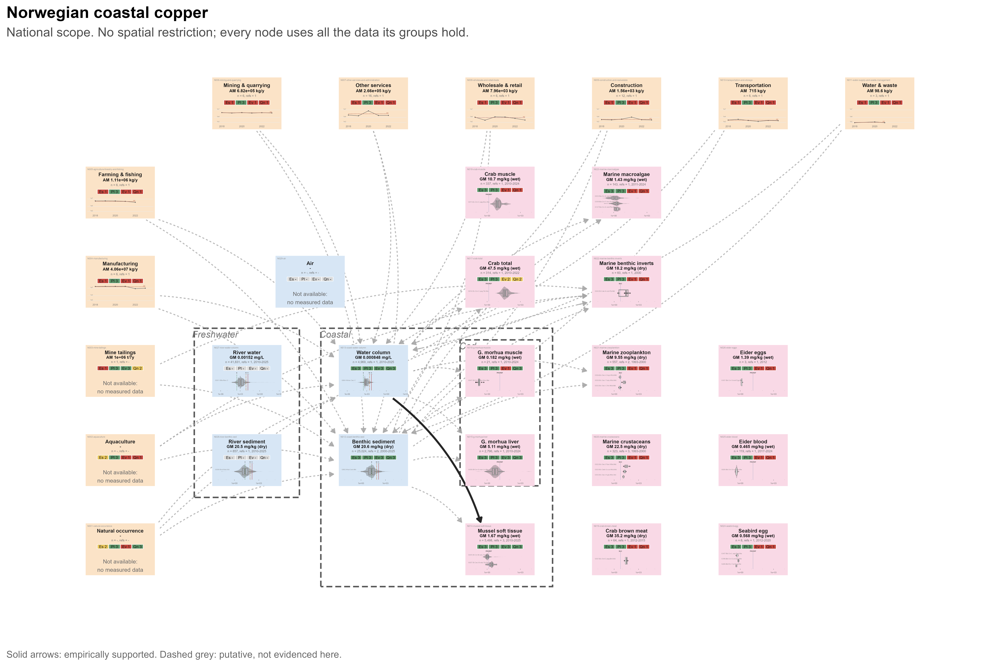
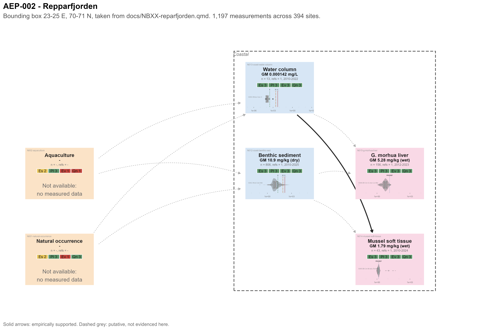
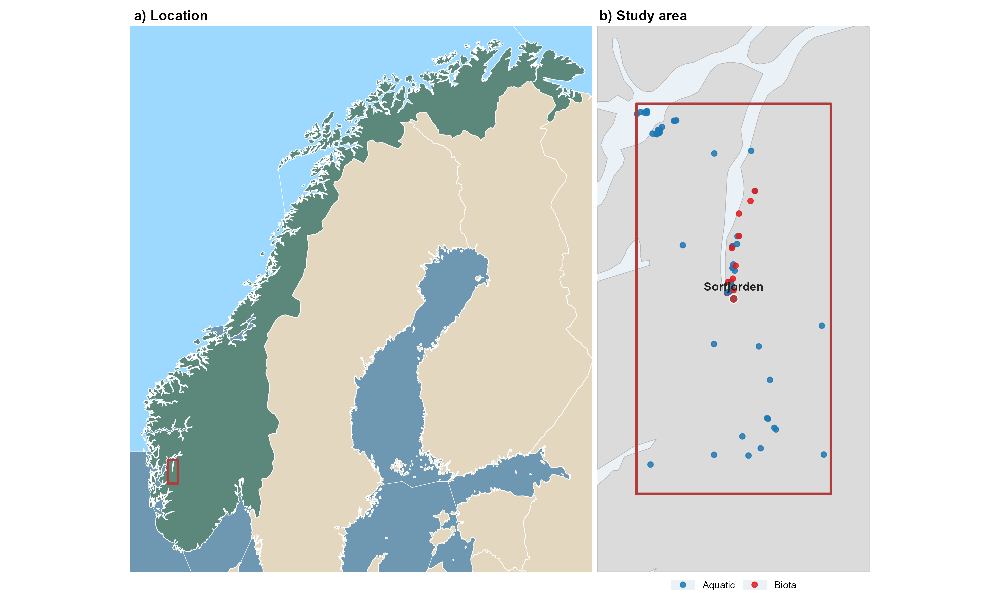
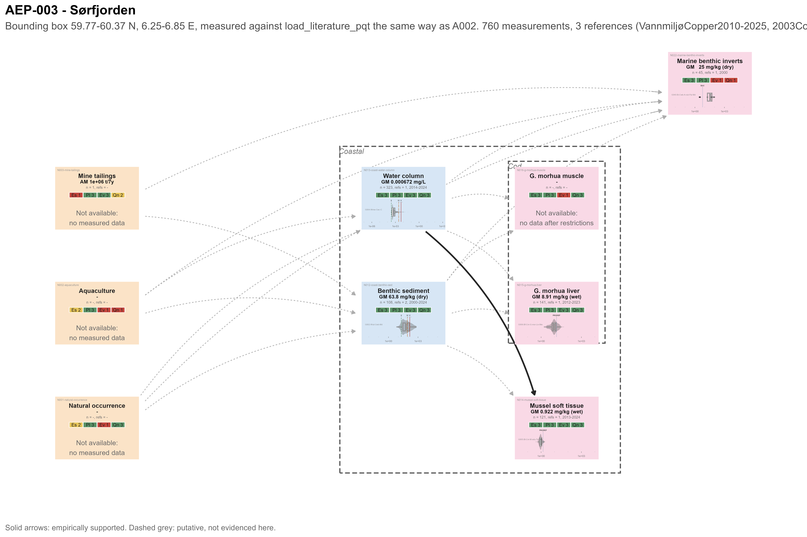
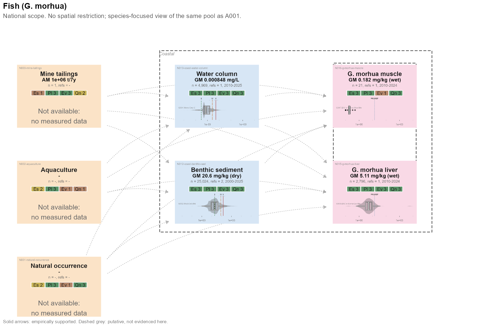
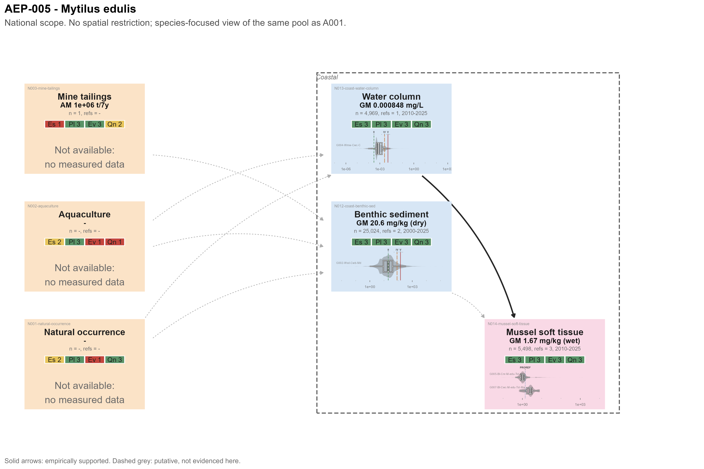
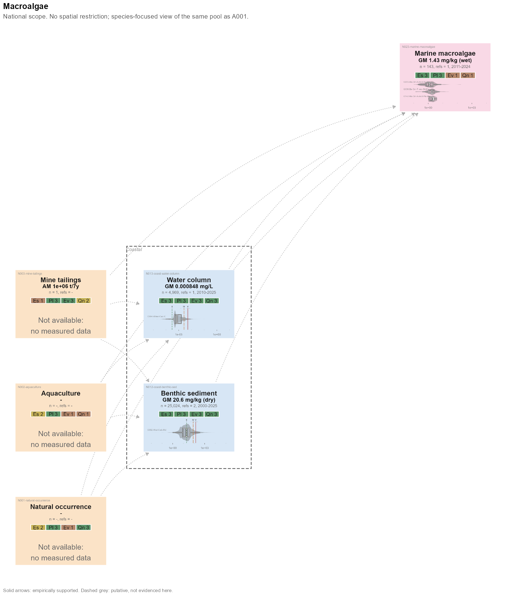

# Introduction

```{r}
#| label: setup
#| include: false
#| warning: false

library(targets)
library(here)
library(tidyverse)
library(flextable)
pkgload::load_all(quiet = TRUE) # sample_groups_flextable() etc.

here::i_am("index.qmd")
```

Copper is a vital nutrient across a broad variety of taxa and biomolecules [@wrightBacterialEvolutionaryPrecursors2021; @tangMolecularEvolutionCu2025; @lutsenkoMammalianCopperHomeostasis2025], a much needed raw resource in manufacturing and infrastructure, and a potentially serious environmental pollutant. Demand for copper is likely to grow significantly in coming decades [@schipperEstimatingGlobalCopper2018], while climate change will open new regions for resource exploitation (cite), industry (cite), and transport [@smithNewTransArcticShipping2013].

Copper, as a common and is a well-studied pollutant, and has been the subject of numerous monitoring campaigns in and around the Arctic for many years [@amapHeavyMetalsArctic01.06.04], as well as extensive laboratory and modelling work. In general, copper is viewed as a low-priority stressor compared to persistent organic pollutants and mercury, due to its generally lower toxicity (cite) and weak bioaccumulation. Some hotspots have been identified where due to emissions and/or physico-chemical properties copper may have adverse effects on organisms. However, much existing data are focused on more southerly species and regions. As the Artic undergoes rapid warming, land use change, and potentially increased anthropogenic stress, copper pollution may grow. Identifying existing distributions and data gaps is crucial to protecting this rapidly changing wilderness.

## Aggregate Exposure Pathways

The Aggregate Exposure Pathway (AEP) [@teeguardenCompletingLinkExposure2016, @tanAggregateExposurePathways2018] concept was developed in 2016 as an exposure-based counterpart to the Adverse Outcome Pathway. AOPs assemble evidence to causally link the biological effects of stressors in organisms. AEPs do the same for the emission, transport and fate of stressors in the environment, up until the point they reach sensitive tissues or organs in selected organisms [@fig-aep-intro].

{#fig-aep-intro}

An AEP is a directed graph: Nodes are Key Exposure States (KESs), which represent the state of stressor(s) in space and time. KES are linked by by Key Transitional Relationships (KTR), the transport or transformation of said stressor(s). An AEP has two specialised (types of) KES, a stressor Source and a Target Site Exposure (TSE), representing the state of a stressor at its origin and site of action respectively [@tanAggregateExposurePathways2018]. The TSE corresponds to the initiating Key Event of an AOP (the Molecular Initiating Event or MIE); thus, an AEP and AOP that cover the same stressor can be integrated to create a full Source-to-Outcom Pathway (STOP). AOPs have seen a rapid uptake in the ecotoxicological community at both the grass-roots and international scale: at time of writing, 561 AOPs have been drafted or published [@societyforadvancementofaopsAOPwikiV272026]. Conversely, the AEPs have seen less adoption, within a mini-review in 2025 (see SI) finding only 21 papers mentioning and 15 employing the concept. This is perhaps due to the significantly larger scale of AEPs compared to AOPs, as in any ecotoxicological setting they may have to deal with geographically massive and kinetically homogeneous KESs and KTRs.

The conceptual papers describing the AEP [@teeguardenCompletingLinkExposure2016, @tanAggregateExposurePathways2018] state that both the AEP and AOP are "supported by [...] weight of evidence", although no specific approach is laid out. Consensus and standards have emerged in the AOP community on how Weight of Evidence (WoE) should be assessed, and @beckerIncreasingScientificConfidence2015 advises the use a modified form of the Bradford-Hill epidemiological criteria [@hillEnvironmentDiseaseAssociation1965] to assess the biological plausibility, empirical support, and essentiality of a given KER. @pengAggregateExposurePathways2022, which represents the most sophisticated and relevant (that it, it focuses on pollution of the environment and wildlife) AEP of which we are aware, adapts OECD guidance on AOP development [@oecdUsersHandbookSupplement2018] to AEPs.

## Copper: Environmental Chemistry and Ecotoxicology

Life on Earth has evolved alongside copper as both a stressor and potentially useful element, and a wide variety of both copper-containing proteins and copper-protective proteins have been found across the kingdoms of life [@festaCopperEssentialMetal2011]. Both its utility and toxicity stem from its oxidation and binding dynamics, which make it both a useful structural element in protein design, as well as a source of oxidative stress in the cell [@festaCopperEssentialMetal2011]. This long history of chronic exposure has driven organisms to develop a diverse range of effective mechanisms for controlling internal copper concentrations.

By precise control of copper concentrations in different tissues or parts of the cell, organisms reduce oxidative stress in sensitive areas, but increase it where a "hostile environment" can be useful, such as within bactericidal macrophages [@focarelliCopperMicroenvironmentsHuman2022]. This rich, nuanced and complex set of interactions make copper both an interesting and difficult object of ecotoxicological study.

Organisms have been shown to regulate copper uptake and detoxification to maintain homeostasis along a copper gradient [@vandenberghePosttranslationalRegulationCopper2010, @penaDelicateBalanceHomeostatic1999], which in a ecotoxicological context makes linear assumptions of bioaccumulation hard to justify.

However, the relative ease of sourcing, working with, and analysing copper has made it a popular "classical" stressor in ecotoxicology.

- Cite some of those AOP papers about copper toxicity, the BLM, etc.

- Different species tolerance, different strategies (maybe)

- But there are some that are surprisingly sensitive to copper

- Metallotheins [@amiardMetallothioneinsAquaticInvertebrates2006]

- Brief mention of interactions with other stressors e.g. @lealCopperPollutionExacerbates2018

Copper's biological properties are a consequence of its speciation/electrochemistry - this also makes its environmental behaviour very variable:

- Speciation chemistry
- Bioavailability (dissolved, LLM fractions, etc.)
- Dynamics in terrestrial, marine and freshwater environments
  - Average/background copper in oceans, rock
  - Sedimentation as main sink for oceanic copper

## Global Change and Resource Use in Arctic Regions

- Arctic new geopolitical flashpoint, source of raw resources, open to transport
- Resource extraction - especially mining - has long been one of the key pillars of the arctic economy [@arcticcouncilEconomyNorthECONOR2025]
- Biodiverse, lots of species that are only found in this area, long generation times (cite some of the sources to EXPECT)
- Copper crucial for green shift, potentially also transport, infrastructure, antifoulant [@schipperEstimatingGlobalCopper2018]
- Growing interest in indigenous copper resources as a strategic asset - c.f. horse trading over Nussir in Norway @nussirasaNUSSIRProjectOverview2024

# Materials and Methods

An exhaustive version of the materials and methods are provided in the notebooks and appendices included. Materials and methods are summarised below.

+------------------------------+--------------------------+--------------------------------------------+--------------------------------------------------------------------+
| Line of Evidence             | AEP Class                | Data Type                                  | Notes                                                              |
+==============================+==========================+============================================+====================================================================+
| Systematic Literature Review | Matrix Node, Tissue Node | (Exposure) Matrix Concentrations           | Big dataset, hence many sub-notebooks                              |
+------------------------------+--------------------------+--------------------------------------------+--------------------------------------------------------------------+
| Vannmiljø Database           | Matrix Node, Tissue Node | Matrix Concentrations                      | Folded into SLR, as data of same type                              |
+------------------------------+--------------------------+--------------------------------------------+--------------------------------------------------------------------+
| Copper Emissions             | Emissions Edge           | Mass/year by industry and receiving matrix | Data resolution/quality generally lower than matrix concentrations |
+------------------------------+--------------------------+--------------------------------------------+--------------------------------------------------------------------+
| Copper PRTR                  | Source Node              | Mass/year by industry                      | As above                                                           |
+------------------------------+--------------------------+--------------------------------------------+--------------------------------------------------------------------+

: lines of evidence

## Exposure Dataset

### Literature Review Protocol

A systematic literature review framework was developed from the PRISMA2020 framework (@pagePRISMA2020Statement2021). As PRISMA2020 is primarily concerned with intervention-based studies, some work was required to adapt to the scope and exigencies of an ecotoxicological exposure assessment.

### Databases and Search Terms

The following search string was used in all open literature sources. The \* character is a wildcard and is used to match against common prefixes. The software Publish or Perish 7 was used to assist in database searches.

``` txt
(copper OR Cu OR cuprous OR cupric OR kobber OR coper OR 7440-50-8) 
AND (Barents OR Norwegian OR Arctic OR Svalbard OR North Atlantic OR Greenland*)
AND (wildlife OR ecotox* OR biota OR environment* OR animal OR ecosystem*) 
AND (emission OR exposure OR fate OR behaviour OR concentration OR dose OR chem* OR bioaccumul* OR trophic) 
AND (aqua* OR water* OR marine OR river OR lake OR fjord OR estuary OR sea OR ocean OR sediment* OR soil)
```

Web of Science returned 478 hits. PubMed returned 438 hits.

<!-- TODO: vannmiljø  - how many rows, etc? -->

In addition, data were extracted from the Norwegian Environmental Ministry (Miljødirektoratet, MD) database Vannmiljø ("Aquatic Environment", Vm) based on the following search criteria:

+-----------------+----------------------+------------------------------------------------------+------------+
| Norwegian Term  | English Translation  | Selected Options                                     | Comments   |
+=================+======================+======================================================+============+
| Nedlastingsdato | Download Date        | 2025-12-05                                           |            |
+-----------------+----------------------+------------------------------------------------------+------------+
| Datoperiode     | Date Period          | 2025-01-01 to 2025-12-05                             |            |
+-----------------+----------------------+------------------------------------------------------+------------+
| Kommune         | Municipality         | All municipalities                                   |            |
+-----------------+----------------------+------------------------------------------------------+------------+
| Medium          | Medium/Matrix        | All media                                            |            |
+-----------------+----------------------+------------------------------------------------------+------------+
| Kampanje        | Campaign             | All campaigns                                        |            |
+-----------------+----------------------+------------------------------------------------------+------------+
| Stressorer      | Stressors/Parameters | Kobber (Copper) & Kobberpyrition (Copper pyrithione) |            |
+-----------------+----------------------+------------------------------------------------------+------------+

Extracted data were processed and converted to the eData format (see [NB02-vannmiljø](docs/NB02-vannmiljo.qmd)), and validated against the format. Data from Vm covers a variety of monitoring campaigns conducted by a variety of contractors and sub-contractors across Norwegian territory. Metadata on the campaign goal (for example, monitoring reference rivers, or sites known to be contaminated) was retained and is used as a grouping variable in downstream analysis in order to understand observed variation.

### Inclusion, Exclusion, Deduplication and Screening

**Text on explicit inclusion criteria/study area will go here.** The study area is shown in @fig-study-area.

{#fig-study-area}

Once a dataset of potentially relevant papers was compiled, the web review platform Covidence [@veritashealthinnovationHowCanCite2025] was used to coordinate screening between the spatially separate reviewers.

1)  111 duplicates were automatically matched and removed
2)  5 duplicates were manually matched and removed
3)  800 studies were screened at the title and abstract level by two reviewers. 540 were excluded as irrelevant.
4)  260 studies were screened at the full text level by one of two reviewers. 46 were excluded as irrelevant.
5)  The remaining 214 studies were ranked informally from 1-5 (5 being highest) based on their perceived quality and relevance. The 58 papers given a score of 4 or 5 were selected as an initial batch of studies for extraction.
6)  Of these 58 papers, 32 had data extracted. 18 were rejected based on missing data or irrelevance. 8 papers remain in the progress of extraction at the time of writing.
7)  Extraction was carried out by one of three reviewers using the eData application. No blinding was conducted, and reviewers were free to discuss and reach consensus.

The full PRISMA flow is shown in @fig-prisma. Study screening was conducted using the following exclusion criteria. Where a study met multiple criteria for inclusion, only the first criterion was recorded. Some criteria were based on the Criteria for Reporting and Evaluating Exposure Datasets (CREED) Gateway Criteria [@dipaoloImplementationCREEDApproach2024]. These have been coded as CREED-n.

1)  CREED-1: sampling medium/matrix not specified
2)  CREED-2: copper-based analytes/chemistry parameters not specified
3)  CREED-3: spatial location not specified
4)  CREED-4: sampling period not specified
5)  CREED-5: measurement units not specified
6)  CREED-6: data source not specified
7)  out of geographical study area
8)  paper not in English
9)  full text not available

{#fig-prisma width="500"}

### Screening

Of the 916 imported papers, 116 duplicates were removed, 540 studies marked as irrelevant based on abstract screening, and 46 studies were excluded after full text screening, resulting in a set of 214 manuscripts for data extraction. The decision was then taken to reduce this set of papers further to the most useful subset; papers were rated arbitrarily on a scale of 1 (least relevant) to 5 (most relevant) based on a single reviewer's holistic assessment of their relevance and utility to the research question. The reviewers then proceeded from the highest-ranked papers (ordered by score then alphabetically), began data extraction from all papers with a score of 4 or 5 (n in total, y% of ...).

### Data Extraction & Validation

- Data were extracted from manuscripts using the *eData* shiny application (cite paper once ready)
- LLM extraction, human validation
- Raw data pointblank-validated to final version (cite eData MS), then manually QC'd by a review
- All tables merged together into single one
- organised as unique compartments and sites

### Data Post-Processing

Samples were grouped by *Environmental compartment*, *environmental subcompartment*, *Site geographical feature* and *sub-feature*, (for biota) , *species* and *tissue*, and standardised unit (i.e. dry and wet weights, where both units were present for a single group). Any remaining invalid (i.e. value = NA) rows of data were dropped, and the proportion of dropped rows recorded. Each group was given a sequentially-numbered ID (GXXX); these IDs are used throughout these manuscript to refer to specific groups

For each sample grouping, sample size, mean, median, standard deviation, number of outliers meeting *both* Tukey Fences ($Z >= 1.5$) and Robust-Modified Z-Score ($Z >= 3.5$), and Hartigan's dip test statistics ($P <= 0.05$) were calculated (@tbl-groups-summary).

#### Tests for Outliers

The Tukey fence method (@schwertmanIdentifyingOutliersSequential2007, originally @tukeyExploratoryDataAnalysis1977 but latter not available online) flags values that fall more than $1.5 \times IQR$ beyond the first or third quartile of the log-transformed values, where $IQR = Q_3 - Q_1$. Specifically, a value $x_i$ is flagged if:

$$
\log_{10}(x_i) < Q_1 - 1.5 \cdot IQR \quad \text{or} \quad \log_{10}(x_i) > Q_3 + 1.5 \cdot IQR
$$ {#eq-tukey}

We apply fences to log-transformed values because concentrations are approximately log-normally distributed [@ottPhysicalExplanationLognormality1990].

Tukey recommends using 1.5 or 3 times the IQR as thresholds depending on the desired degree of conservatism. We elect to use 1.5, as although this may increase the false positive rate, it is also more sensitive to outliers when the distribution is largely log-normal but with a long right tail.

The Robust Modified Z-Score (RMZ) is a median-based analogue of the standard Z-score that is more resistant to the influence of extreme values [@iglewiczHowDetectHandle1993; @leysDetectingOutliersNot2013], at the cost of being less appropriate for truly normal distributions.

For a value $x_i$ in a group with median $\tilde{x}$, it is defined as:

$$
\text{RMZ}_i = \frac{x_i - \tilde{x}}{\text{MAD}}
$$ {#eq-rmz}

where $\text{MAD} = \text{median}(|x_i - \tilde{x}|)$ is the median absolute deviation. In R, `mad()` already scales MAD by a consistency factor ($\approx 1 / 0.6745$) to make it comparable to the standard deviation under normality

@iglewiczHowDetectHandle1993 recommends a threshold of $|\text{RMZ}| > 3.5$ for outliers, and we have no reason to depart from this recommendation.

#### Test for Non-Unimodal Distributions

To identify groups whose distribution may be multimodal, which can indicate a mixture of genuinely distinct populations rather than a single skewed distribution, we apply Hartiigan's Dip Test via the R package `diptest` [@maechlerDiptestHartigansDip2025]. This provides a statistical adjunct to visual inspection of distributions useful for flagging. Its precise description can be found in @HartiganDipTestUnimodality1985, but in essence it compares the difference between the cumulative density function of a normal distribution and the sample distribution; with a larger "dip" between the former and the latter indicating the "wobbly" cumulative distribution indicative of a multimodal distribution.

The test returns a p-value for the null hypothesis of unimodality; small p-values suggest the distribution is not unimodal. We use $p < 0.05$ as a standard threshold.

#### Visual Exploration of Data

Sample groups were ordered based on sample size and flagged for inspection where they met one of the following criteria:

1.  The group represented a matrix that was essential for the construction of aquatic Arctic AEPs (e.g. matrices that are both receiving compartments for copper and habitats for organisms of interest, such as marine and freshwater water columns and sediment, or algae (due to their trophic position)
2.  The group's distribution was flagged as potentially multimodal (see above)
3.  Over 5% of the group's total sample size (based on `MEASURED_N`) was double-flagged as an outlier based on Tukey fences and Robust-Modified Z-Score

In these cases,

- Outliers were visually inspected by constructing heatmaps
- Metadata and comments were reviewed
- Unless there was a convincing argument not to, outliers were removed
- We report both robust and non-robust summary statistics (median, mean ± sd) below, and use them for comparisons

### Weight of Evidence Assessment

Construction of the AEP required the quantitative assessment and comparison of diverse lines of evidence on copper occurrence, emissions, and dynamics [@hardyGuidanceUseWeight2017]. Evidence quality for both KESs and KTRs was assessed and scored according to the entity's Essentiality, Plausibility, Evidence, and Quantitative Understanding (abbreviated to EPEQ), based on the AOP WoE assessment guidelines [@oecdUsersHandbookSupplement2018] adapted by @pengAggregateExposurePathways2022.

In some cases, KESs and KTRs were given high EPEQ scores despite a lack of evidence in the available data due to the extreme degree of consensus on occurrence. For example, the natural occurrence of copper in the Earth's crust and sea water are both considered common knowledge and beyond all doubt, and were thus scored as highly essential, plausible, and evidence-based despite the absence of e.g. geological data in the lines of evidence.

CREED's in there somewhere, too. The criteria are summarised in @tbl-woe-criteria.

NB: Peng et al. concern themselves with the EPEQ of *relationships* between nodes, whereas the nodes themselves only get an Essentiality score. I don't think this would be appropriate here; in fact I have some issues with applying Essentiality to KES at all. But we'll do it anyway, for the time being:

```{r}
#| label: tbl-woe-criteria
#| tbl-cap: "Weight of Evidence criteria adapted from Peng et al. (2022), OECD (2018), CREED, and Bradford Hill (1965). **Work in progress.**"
#| echo: false
```

+----------------------------+----------------------------------------------------------------------------------------------------------+------------------------------------------------------------------------------------------------------------------+----------------------------------------------------------------------------------------------------+---------------------------------------------------------------------------------------------------------------------------------------------------------------------------------------+
| Criterion                  | KES                                                                                                      | KTR                                                                                                              | Score                                                                                              | Comments                                                                                                                                                                              |
+============================+==========================================================================================================+==================================================================================================================+====================================================================================================+=======================================================================================================================================================================================+
| Essentiality               | Copper presence in downstream KES will be reduced/stopped if copper presence in this KES reduced/stopped | Copper presence in downstream KES will be reduced/stopped if this KTR reduced/stopped                            | 3: Diverse, consistent evidence                                                                    | Less applicable with copper than xenobiotic stressors.                                                                                                                                |
|                            |                                                                                                          |                                                                                                                  |                                                                                                    |                                                                                                                                                                                       |
|                            |                                                                                                          |                                                                                                                  | 2: Some, potentially inconsistent evidence\                                                        |                                                                                                                                                                                       |
|                            |                                                                                                          |                                                                                                                  | \                                                                                                  |                                                                                                                                                                                       |
|                            |                                                                                                          |                                                                                                                  | 1: Weak or no evidence                                                                             |                                                                                                                                                                                       |
+----------------------------+----------------------------------------------------------------------------------------------------------+------------------------------------------------------------------------------------------------------------------+----------------------------------------------------------------------------------------------------+---------------------------------------------------------------------------------------------------------------------------------------------------------------------------------------+
| Plausibility               | Theoretical knowledge supports dependent and sequential change of two adjacent KESs                      | Theoretical knowledge supports KTR as mechanism of sequential change between KESs                                | 3: Diverse, consistent evidence                                                                    | Environment-level occurrence and transport of stressors is far more intuitively and widely understood than metabolism. Most copper KESs and KTRs will be scored as highly plausible.  |
|                            |                                                                                                          |                                                                                                                  |                                                                                                    |                                                                                                                                                                                       |
|                            |                                                                                                          |                                                                                                                  | 2: Some, potentially inconsistent evidence\                                                        |                                                                                                                                                                                       |
|                            |                                                                                                          |                                                                                                                  | \                                                                                                  |                                                                                                                                                                                       |
|                            |                                                                                                          |                                                                                                                  | 1: Weak or no evidence                                                                             |                                                                                                                                                                                       |
+----------------------------+----------------------------------------------------------------------------------------------------------+------------------------------------------------------------------------------------------------------------------+----------------------------------------------------------------------------------------------------+---------------------------------------------------------------------------------------------------------------------------------------------------------------------------------------+
| Evidence                   | Empirical data showing occurrence of copper at KES.                                                      | Empirical data on transfer along KTR between KESs                                                                | 3: Diverse, consistent evidence, including contaminated and non-contaminated examples.             | Vast majority of available evidence is occurrence rather than transport/flows. CREED Reliability score (1-5) and quantity of relevant evidence used in calculation of Evidence score. |
|                            |                                                                                                          |                                                                                                                  |                                                                                                    |                                                                                                                                                                                       |
|                            |                                                                                                          |                                                                                                                  | 2: Some, potentially inconsistent evidence\                                                        |                                                                                                                                                                                       |
|                            |                                                                                                          |                                                                                                                  | \                                                                                                  |                                                                                                                                                                                       |
|                            |                                                                                                          |                                                                                                                  | 1: Weak or no evidence                                                                             |                                                                                                                                                                                       |
+----------------------------+----------------------------------------------------------------------------------------------------------+------------------------------------------------------------------------------------------------------------------+----------------------------------------------------------------------------------------------------+---------------------------------------------------------------------------------------------------------------------------------------------------------------------------------------+
| Quantitative Understanding | Quantitative models exist permitting prediction of downstream KESs from upstream KESs                    | Quantitative models exist permitting prediction KTR rates of transfer based on KESs and environmental parameters | 3: High-quality quantitative prediction of downstream KESs occurrence from upstream KES occurrence | A full-scale review of available models has not been carried out. KES and KTR will be scored based on expert knowledge of available models.                                           |
|                            |                                                                                                          |                                                                                                                  |                                                                                                    |                                                                                                                                                                                       |
|                            |                                                                                                          |                                                                                                                  | 2: Limited or only partially applicable prediction                                                 |                                                                                                                                                                                       |
|                            |                                                                                                          |                                                                                                                  |                                                                                                    |                                                                                                                                                                                       |
|                            |                                                                                                          |                                                                                                                  | 1: Qualitative predictions only                                                                    |                                                                                                                                                                                       |
+----------------------------+----------------------------------------------------------------------------------------------------------+------------------------------------------------------------------------------------------------------------------+----------------------------------------------------------------------------------------------------+---------------------------------------------------------------------------------------------------------------------------------------------------------------------------------------+

### AEP Construction

An AEP was constructed using all available data for the study area (AEP-001). Several sub-AEPs [@tbl-aeps] were constructed to depict pollution exposure in specific geographical areas (AEP-002, AEP-003), or to specific organisms/tissues of interest (AEP-004, -005, -006). Specific sites (Repparfjorden and Sørfjorden) were selected as areas in Norway with known heavy metal contamination due to mining and industry. *Gadus morhua*, *Mytilus edulis*, and Macroalgae were selected due to their high degree of representation across lines of evidence.

```{r}
#| label: tbl-aeps
#| tbl-cap: "Table of AEPs. Can be collapsed to text or moved to SI as needed."
#| echo: false
#| 
table <- read_csv("data/clean/aep/aep_manifest.csv")

table |> select(label, scope_note) |> knitr::kable()
```

How were AEPs constrcuted:

1. Review groups where n >= 100, generate nodes
2. Where appropriate (due to sample sizes, ecological/matrix similarity, etc.), put multiple groups into one node
3. Assemble a "whole-system" AEP from all avaialable nodes (from above)
4. For AEPs 2-3, build a subset of AEP 1 based on known sources and evidence in the given areas.
5. For 4-6, start with a known MIE locations (from other papers) and work backwards based on AEP 1 & 2.

Nodes are based on available evidence. What counts as a node is slightly arbitrary - depending on what data we have and what makes sense, we may use coarser or finer resolution.

Putative edges are created between nodes based on expert opinion rather than individual pieces of evidence. In general we have a lot less direct evidence for edges (as opposed to general/plausible stuff), and a lot less quantification.

# Results

*Below table is obviously very big. Can be split into biota and non-biota? Or could summarise again? Also, do we need to add/remove any checks, e.g. AIC of normal vs. log-normal distributions*

## Group Summary Statistics

<!-- TODO: n thresholds for Hartigans. Also dynamic update group/sample n slice reporting-->

<!-- TODO: Add cumulative proportion to this v of table, use that for filtering rather than n-->

@tbl-groups-summary displays all sample groups where $n \ge 100$ (regardless of measured unit), including summary statistics, date coverage, probability of multimodal distribution, number of distinct standardised units per group, and the proportion of dropped

```{r}
#| label: tbl-groups-summary
#| tbl-caption: tbc

# Same target as docs/NBXX-Sample-Groups.qmd, filtered to the large groups.
# Highlight indices are recomputed inside sample_groups_flextable(), so they
# stay aligned after this filter.
tar_read(sample_groups_table) |>
  filter(n >= 100) |>
  sample_groups_flextable()
```

## Distributions

- Overall top-down view of dataset and general distribution patterns
- More detailed, broken-down versions of plots will be in SI

An example KTR plot is shown in @fig-ktr-example.

{#fig-ktr-example}

## AEPs

### Kitchen Sink AEP

- Includes all nodes from any spatial area

- Probably too complicated to include in the final MS, but useful overview during editing

{#aep-A001-all}

### Geographical Case Studies

AEPs for the two case study sites are shown in @fig-repparfjord-aep and @fig-sorfjorden-aep.

#### AEP-002: Reppafjorden

{#fig-repparfjorden-map}

{#fig-repparfjord-aep}

#### AEP-003: Sørfjorden

{#fig-sorfjorden-map}


{#fig-sorfjorden-aep}

### Biological Case Studies

#### AEP-004: Gadus morhua

- Depending on how the fish distributions look I may lump them all together
- Currently specifically G. morhua - we have a lot of data for this species
- I assume there's not going to be a lot of variance between species, and we already know most of our data is cod livers
- If it's relevant to distinguish between fish with different life styles/types of feeding I will cross that bridge when we get to it
- What are the most important sources of copper to fish? Spatial, temporal patterns, etc (Based on cod liver data I don't expect to see anything interesting, but if we do there's plenty of room to discuss)

The fish AEP is shown in @fig-fish-aep.

{#fig-fish-aep}

#### AEP-005: Mytuli...

- Mussels are our next most common species after G. morhua, so I think it makes sense to do an AEP for them.

The invertebrate AEP is shown in @fig-mussels-aep.

{#fig-mussels-aep}

#### AEP-006: Macroalgae

- Algae aren't the most interesting, but they are key food chain species, and ecotox test species
- Conversely, if we see something interesting for mammals they could go here instead
- We only have data for macroalgae, so this'll have to do

The algae AEP is shown in @fig-algae-aep.

{#fig-algae-aep}

# Discussion

- Lots of the detail currently in the introduction will need to be moved here
- There are a few threads to address and wrap up:
  - Is copper exposure important? My feeling is "probably not", and if this MS doesn't tip the balance either way I won't focus on this angle
  - I think we'll find that even the highly copper-contaminated sites we already have (Repparfjorden) that copper's not a big deal, and is unlikely to be a big deal even if the mine re-opens
  - AEP/LR angle - I feel that AEPs with proper WoE are going to turn out to be a good way to organise AEP results. but they're still a great deal of work, and we only scratched the surface of our dataset. we can make recommendations for future work.
  - If any of the ecologic or site AEPs are interesting obviously we can focus on that
  - How much do we want to tie in to our/others AOP work? This is a good idea in theory, but I fear doing it properly would require a bunch more methodological work

# Conclusion

- Although this isn't going to be the strongest paper in the world, I think it can be an interestingly broad-ranging review of copper pollution with a good WoE approach and an intuitive conceptual model (the AEP) to make it a bit novel
- We can decide how much to mention future modelling work here based on how it turns out (but I don't imagine we'll get a lot done on that by Sept 14th)
- Likewise, we can tie into AOP work, or not.

# References