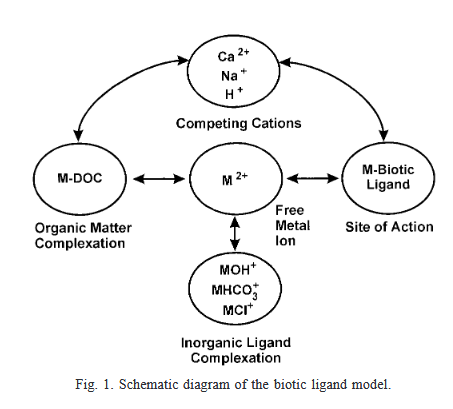

Copper to fish gills. Not species specific. Let's look at the literature.

[WOS Search](https://www.webofscience.com/wos/woscc/summary/2b7ebd59-617a-421f-a8b4-535c9aac10b6-01c769a503/times-cited-descending/1):

``` txt
gill* AND fish AND copper AND exposure
```

695 results.

What's the AOP angle?

> "Compared with other endpoints, sensory function (e.g., olfactory, lateral line hair cells and neuromasts) and behavior are the most sensitive indicators of Cu toxicity to aquatic organisms"
>
> "Evidence has suggested that most of the acute metal toxicity to fish in fresh water is caused by increasing loss of ions (e.g., Na+, Cl−) and gross morphological damage to gills"

@liaoToxicityMechanismsBioavailability2023

# Fish Copper Models

Obviously the BLM occupies most of the model space, but are there any specific fish models for copper?

## Fish PBPK Model 

[WOS Search](https://www.webofscience.com/wos/woscc/summary/a3eb3d71-dc34-402c-a11f-76a5fd36fcfe-01c76ac4be/times-cited-descending/1) (1 hit)

``` txt
fish AND pbpk AND copper
```

- *Terapon jarbua, "has a wide Indo-Pacific distribution"*[^1]

- This model models uptake via gills and diet (which I presume is 99% of copper uptake, although I assume there's the potential for tissue-level damage at e.g. sensory cells without requiring copper to be transported there through the body)

- Uptake rate for both routes depends on overall exposure:

[^1]: <https://en.wikipedia.org/wiki/Terapon_jarbua>

> The contribution of branchial Cu uptake is dependent on the dietary Cu availability and overall Cu status Cu uptake from gills contributed to 60% of whole-body accumulation under Cu-deficient conditions, whereas it was reduced to less than 1% at elevated dietary Cu levels ([Grosell, 2011](https://www.sciencedirect.com/science/article/pii/S026974911631048X?getft_integrator=clarivate&pes=vor&utm_source=clarivate#bib11)).

- Liver is downstream of both gills and digestive system

{width="396"}

## BLM 

Via @ditoroBioticLigandModel2001

> The model is based on the idea that mortality (or other toxic effect) occurs if the concentration of metal on the biotic ligand reaches a critical concentration $C^*_{M_{i-}}$:

- So you run your experiments and get a LC/EC50 for concentration of the free metal ion?

- It seems to me that because the entire biological fish system is collapsed to a single point in the model, it's difficult to apply it to an AEP

- It does account for MoA:

> For fish, the metal binding results in the disruption of ionoregulatory processes of the organism (e.g., sodium transfer across the gill is restricted), which leads to mortality \[22\].



# AEP KTR/KER

| KES/KTR | Type | Essential | Plausible | Evidence | Quantification | Notes |
|----------------|----------|----------|----------|----------|----------|----------|
| Copper Emissions | KES (Source) | 3 (Axomatic) | 3 (Axomatic) | 3 (Axomatic) | 1 (Models out of scope?) |  |
| Emission to Marine Water | KTR (Emission) |  |  |  |  |  |
| Marine Water | KES (Exposure Medium) |  |  |  |  |  |
| Water to Gill Interface | KTR |  |  |  |  |  |
| Gill-Water Interface | KES (External Exposure) |  |  |  |  |  |
| Gill Uptake | KTR |  |  |  |  | Gill uptake dynamics are complex and mediated by variety of physico-chemical and biological parameters. |
| Gill Tissue | KES (Internal Exposure) |  |  |  |  |  |
| Cellular Uptake of Cu |  |  |  |  |  |  |
| Gill Cells | KES (TSE) |  |  |  |  |  |
| Effects | MIE |  |  |  |  | Disruption of ionoregulation at gills |

